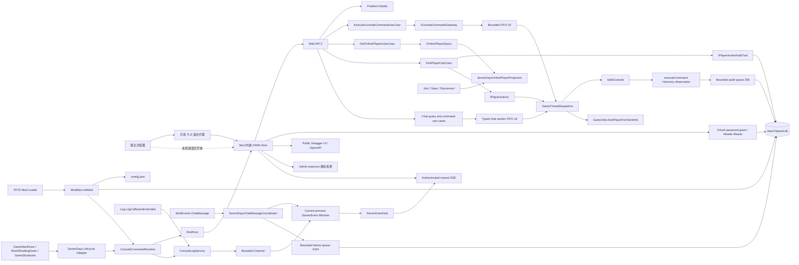

# 7DPanel 系统架构

## 背景与驱动因素

本文档只描述当前已经存在并有代码、配置或验证证据支持的系统架构。当前后端是可构建、可测试的 `net48` 最小运行切片，由 Bootstrap、Hosting、Application、Web Adapter、SevenDays Adapter 和 SQLite Persistence Adapter 六个产品项目组成，覆盖 Mod 初始化与关闭、组合运行时生命周期、独立游戏就绪边界、控制台日志采集与当前进程命名事件窗口、监听配置、Katana OWIN、健康 API、统一 Problem Details、配置引导 `Owner`、SQLite 持久用户、password grant、Access Token/API Key 两类 Header Bearer 凭据、认证生产 SSE、Admin 静态资源托管、综合概览聚合、Owner 重启脚本启动与固定关服，以及认证后通过容量 32 的有界 FIFO 在游戏主线程执行动态控制台命令、由 Join/Save/Disconnect 事件维护的固定 25 字段在线玩家 observation 和以类型化原生 API 踢出在线玩家的 Application 纵向切片。最终 `SdtdConsole.executeCommand` 由独立 Harmony Patch 尽力观察，完整原文、参数、输出、来源和结果通过容量 256 的异步队列写入 SQLite；审计失败不会改变命令结果，并以告警和 gap 记录缺失。游戏聊天切片现已实现原始 `ModEvents.ChatMessage` 协调、统一 `chat-message` SSE、SQLite 历史/设置/Profile/操作审计、类型化全局与私聊发送和同步彩色重写。Admin 已提供综合概览、API Key 的创建/列表/撤销、在线玩家紧凑列表、只读详情抽屉、Owner 踢出确认流程、`Owner`/`Admin` 控制台工作台，以及仅 `Owner` 可访问的实时聊天、历史、聊天设置和彩色聊天四页。控制台和聊天复用单一认证 SSE；聊天按 `sequence` 合并当前进程最近消息与实时事件，历史另由 SQLite keyset cursor 分页。`Admin`/`Viewer` 用户管理、封禁、禁言、传送、审计查询页面、备份、公告、其他游戏状态/动作链路和后台作业仍未实现；产品不采用 Basic、Cookie、CSRF Token 或 refresh token。

产品目标和验收合同见[产品需求文档](PRD.md)，当前验证策略和证据见[测试策略](test.md)。尚未实现的批准后端链路和生产文件职责见[后端目标架构蓝图](architecture/backend-target-blueprint.md)；尚未实现的 Admin 应用边界和依赖方向见[Admin 前端目标架构蓝图](architecture/admin-frontend-target-blueprint.md)。两个 Target 蓝图都不是当前实现证据。

当前切片直接支持 `CAP-01` 的面板存活与状态诚实基础、`CAP-02` 的在线玩家快照、Owner 踢出、动态控制台命令与命令审计写入、`CAP-05` 的配置引导 Owner、网站 Access Token、用户 API Key 与认证 SSE 基础，以及 `CAP-06` 的完整代码切片，并落实 `NFR-01`、`NFR-02`、`NFR-04` 的自托管、未知结果不得显示为成功和管理凭证失败关闭约束。`CAP-06` 尚缺真实 7DTD 和浏览器人工验收，不能据此宣称与第三方聊天 Mod、实际广播顺序或窄屏浏览器行为已经验证。当前实现也不代表 `CAP-01` 的完整游戏状态、`CAP-02` 的其他玩家动作/日志页面、`CAP-05` 的审计查询或完整身份管理，以及其他 P0 能力已经完成。

### Admin 综合概览第一阶段

- Application 层聚合面板、游戏、主机、近期活动和注意事项的独立概览快照，并保留各分区的可用状态与采样时间；
- SevenDays Adapter 在受控游戏主线程复制游戏侧不可变快照，不把游戏活对象带出该边界；
- Hosting 在 Windows 与 Linux 分别采样主机平台、进程与容量信息，并保留平台差异和分区失败；
- SQLite Persistence Adapter 保存固定用途的近期活动及服务器操作审计，不把它们扩展为通用事件总线；
- Web Adapter 依据服务端角色裁剪敏感主机字段，拒绝浏览器提交命令、脚本路径、参数或环境值；
- Admin 只在页面局部拥有综合快照、部分失败、过期、确认和操作反馈，不能把服务器快照复制为新的全局权威状态；
- Owner 启动预配置脚本时，`Process.Start` 仅表示脚本进程已创建，不能表示脚本已完成、服务器已重启或健康检查已成功；固定关服保持独立的权限、审计和结果语义。
- `GET /api/v1/overview` 的 Admin 生产请求使用 OpenAPI 生成的 Pinia Colada Query；重启使用生成的 Mutation，成功后精确失效概览查询。生成 DTO 仍必须经过 Feature 的严格运行时 parser，Colada 状态不替代 `Fresh`、`Partial`、`Stale`、`Offline` 和危险操作状态机。
- Pinia Colada 全局使用 `staleTime: 0` 和 `refetchOnWindowFocus: false`。综合概览可见时每 3 秒强制刷新，隐藏时暂停并在恢复可见后立即刷新；失败保留最后成功快照和原始采样时间，但进入 `Stale` 或首次失败的 `Offline`。
- `serverEvents` 使用生成的 `serverEventsGet()` 建立单一 Header Bearer Fetch SSE，处理 Welcome、heartbeat、`game-ready`、`server-stopping`、`gap` 和 `Last-Event-ID` replay。事件只触发综合概览 REST `refetch()`，不直接改写快照。
- Auth Store 继续拥有网站会话与 Bearer Token；Token 由生成客户端请求拦截器附加，不进入查询键。登出、到期、401 或会话替换会停止 SSE、清除 replay 游标，并取消和移除 Query 缓存及 Mutation 缓存。

后续阶段的完整未来职责分别由[后端目标架构蓝图](architecture/backend-target-blueprint.md)和[Admin 前端目标架构蓝图](architecture/admin-frontend-target-blueprint.md)拥有；这些蓝图中的未实现条目仍不是当前事实。

### 游戏聊天完整切片

`CAP-06` 的实现遵循[游戏聊天完整功能设计](superpowers/specs/2026-07-26-game-chat-design.md)：

- Application 定义 canonical `ChatMessage`、聊天/彩色设置、Profile、历史 keyset 条件、发送结果、操作审计及对应查询和命令用例。设置与 Profile 先写 Store，成功后才原子替换进程内运行时快照；发送审计只保存操作者、频道、目标、时间、结果和正文长度，配置审计只保存业务键与变化字段。
- `SevenDaysChatRuntime` 位于 `IModRuntime` 装饰链最外层。它启动容量 1024 的单消费者历史 writer、加载 `ChatRuntimeState`、注册一个原始 `ModEvents.ChatMessage` handler，再启动内层运行时；停止时先注销 handler，再停止并限时排空 writer，最后停止内层运行时。
- `SevenDaysChatMessageCoordinator` 在游戏回调中立即复制实体 ID、`ClientInfo?.CrossplatformId?.CombinedString`、名称、`EChatType` 和正文。回调不访问 SQLite、网络或请求 scope，不等待后台工作，也不逐消息创建 `Task.Run`；canonical 消息先进入现有事件窗口，再以 `TryWrite` 尽力进入历史队列。
- `ColoredChatRenderer` 使用六类默认色、管理员/系统优先级、跨平台业务键 Profile、四个受控模板变量和标签权限。命令绕过彩色；成功替换通过线程内窄重入抑制只重发一次并返回 `StopHandlersAndVanilla`，任何处理异常记录脱敏诊断、发布原始 canonical 消息并返回 `Continue`。
- 当前进程的 `console-log`、生命周期事件和 `chat-message` 共用一个 `ServerEventLiveWindow` sequence。最近聊天只读取该内存窗口；持久历史读取 SQLite，跨进程稳定分页只依赖 `(occurred_utc, id)`，不会伪装 sequence 跨重启连续。
- `ServerEventSseSession` 只向 `Owner` 输出聊天 replay/live；`Admin` 和 `Viewer` 过滤聊天内容，但过滤事件仍推进连接内部游标。REST 的 14 条 `/api/v1/chat` 路由同样为 Owner-only，并使用稳定 Problem Details。
- `SevenDaysChatMessageSender` 使用独立容量 16 的 FIFO，经现有 `GameThreadDispatcher` 和 `NetPackageChat` 类型化发送全局或私聊消息；私聊在投递前和主线程执行时都按 `targetCrossplatformId` 精确确认在线身份，不拼接控制台命令。
- migration `006_GameChat.sql` 创建 `chat_messages`、`chat_history_gaps`、`chat_settings`、`colored_chat_settings`、`colored_chat_profiles` 和 `chat_operation_audit` 六张表及查询索引。历史队满、Store 失败和排空超时形成 gap，不阻塞或撤回游戏聊天。
- Admin 的 `features/game-chat` 拥有严格 Valibot parser、实时页面局部窗口、发送 Mutation、历史 URL 筛选、设置与 Profile Query/Mutation 及纯文本 UI；四个 `/game-chat/*` 页面、父导航和搜索入口只对 `Owner` 可见。所有正文和预览使用文本节点，不使用 `v-html`；在线私聊目标复用 Players 公开查询且要求稳定跨平台身份。
- 前端未新增包或第二条 SSE。Pinia Colada 继续使用全局 `staleTime: 0`、`refetchOnWindowFocus: false`；实时消息不进入 Colada/Pinia/Storage，设置、历史和 Profile 通过查询层管理，Mutation 不做乐观成功。

上述代码边界已有聚焦自动化证据，但真实 `v3.0.1-b4` 中的字段分类、广播顺序、第三方聊天 Mod 冲突、关服排空，以及桌面/窄屏浏览器主路径仍待人工验收，详见[测试策略](test.md#游戏聊天完整切片)。

目标运行环境是 7DTD Dedicated Server `v3.0.1-b4` 随附的 Unity Mono 进程。运行时与反编译行为证据来自根目录只读私有子模块 `7dtd-reference/`；该子模块不是产品源码或发布内容。

## 系统边界



- 后端 DLL 和 Admin 构建资源随同一个 Mod 目录部署，并在 7DTD 进程内提供 HTTP 服务。
- 7DTD 拥有 Mod 生命周期；当前 SevenDays Adapter 把 `GameStartDone` 转换为 `IModRuntime.MarkGameReady()`，并把两个关闭事件转换为 `IModRuntime.Stop()`。
- 默认配置提供唯一引导 `Owner` 的启动同步来源；password grant 实际验证 SQLite 中固定 `Subject=owner` 的当前用户，并在成功 OAuth 响应中附加服务端确认的 `username` 和 `role`，同时签发跨进程持久化的 8 小时默认不透明 Access Token。Bearer 验证按结构严格分流 Access Token 与 API Key、重新读取当前用户状态和角色；静态资源和健康 API 保持匿名，浏览器不能直接访问 7DTD 对象、Mod 配置文件或数据库。
- 当前身份切片只有 `Owner` claims 和引导同步，不提供 `Admin`/`Viewer` 管理、Cookie、refresh token 或完整权限管理；健康 `ok` 不能推导游戏已经就绪或可管理。
- 首版目标仍是单服自托管，但当前切片只验证所在 Mod 进程的 HTTP 存活。

## 组件与职责

| 项目或应用 | 当前职责与实现证据 | 当前依赖 |
|---|---|---|
| `backend/src/Bootstrap/LSTY.SevenDPanel/` | 唯一 `IModApi` 入口、进程期 `Assembly.Location` 兼容补丁、配置文件 I/O、Microsoft DI 组合根与根 Provider 所有权、数据库路径、Admin 资源根目录选择和 Mod 发布入口 | Application、Hosting、Web Adapter、SevenDays Adapter、Persistence Adapter、`Microsoft.Extensions.DependencyInjection`、游戏提供的 `0_TFP_Harmony` 和编译期程序集 |
| `backend/src/Runtime/LSTY.SevenDPanel.Hosting/` | `ModHost` OWIN 生命周期状态机、独立 `GameReadinessState`、`IModRuntime`、`IPanelRuntimeStatus`、`IPanelWebHost`、监听选项、产品元数据、认证 Store 端口，以及 Web/SevenDays Adapter 之间受限的命名服务器事件契约 | .NET Framework BCL |
| `backend/src/Core/LSTY.SevenDPanel.Application/` | 控制台、在线玩家和踢出用例；游戏聊天 canonical 类型、设置/Profile、历史条件、发送/审计端口，以及查询、发送和配置变更用例 | .NET Framework BCL；当前不依赖 Domain |
| `backend/src/Adapters/LSTY.SevenDPanel.Adapters.Web/` | 健康、token、生产事件、动态控制台命令、Owner-only 在线玩家与 14 条聊天路由；公开运行时 OpenAPI JSON 与 Swagger UI；统一 Problem Details、认证、请求作用域、Katana Self Host、StaticFiles 和 SPA fallback | Application、Hosting、Web API/Katana、NSwag OWIN、Microsoft DI Abstractions、游戏提供的 JSON 兼容程序集 |
| `backend/src/Adapters/LSTY.SevenDPanel.Adapters.SevenDays/` | 隔离静态生命周期、日志、玩家和原始聊天事件；提供统一事件窗口、有界日志/命令/聊天队列、控制台审计、在线玩家投影、类型化踢出与聊天发送、彩色渲染和 `GameThreadDispatcher` | Application、Hosting、`Assembly-CSharp.dll`、游戏 `0Harmony.dll`/`LogLibrary.dll`/Unity 类型、`System.Threading.Channels` |
| `backend/src/Adapters/LSTY.SevenDPanel.Adapters.Persistence.Sqlite/` | `data/7dpanel.db` 短连接工厂、WAL、DbUp migration、持久身份/Token、玩家与命令审计，以及聊天历史/gap、聊天设置、彩色设置/Profile 和聊天操作审计 | Application、Hosting、Dapper、DbUp、Microsoft.Data.Sqlite、SQLitePCLRaw/e_sqlite3 |
| `frontend/apps/admin/` | 响应式应用壳、认证和双语运行时、综合概览、在线/历史玩家、API Key、控制台，以及 Owner-only 游戏聊天四页；游戏聊天包含严格 parser、单一 SSE 实时窗口、发送、URL 历史筛选、设置/Profile 管理和纯文本响应式视图 | Vue 3、Vue Router、Pinia、Pinia Colada、Vue I18n、Valibot、Nuxt UI、Hey API 生成客户端、Vite |

当前已由控制台命令纵向切片创建 Application 项目，但尚无 Domain 项目；SQLite Persistence Adapter 是首个 Local Adapter。只有 `LSTY.SevenDPanel.dll` 实现 `IModApi`；`DependencyRulesTests` 校验后端项目引用白名单、Adapter 方向、六个产品 DLL 的发布门禁和唯一入口约束。未来项目、目录和抽象只在真实纵向切片需要时按[后端目标架构蓝图](architecture/backend-target-blueprint.md)创建。

### Mod 生命周期

1. `ModMain.InitMod` 先保存非空 `ModInstance`，使用游戏提供的 `0_TFP_Harmony` 只应用 `AssemblyLocationPatch`，并在读取配置或创建运行时前验证 Bootstrap 程序集的 `Assembly.Location` 非空。补丁只在原结果为空且 `Mod.ContainsAssembly` 确认程序集属于当前 Mod 时返回 `<ModDirectory>/<AssemblyName>.dll`；候选启动失败会撤销本 Harmony id 的补丁。
2. `ModMain.InitMod` 读取或创建监听配置，并从 `modInstance.Path` 派生 `<ModDirectory>/data` 与 `<ModDirectory>/wwwroot`。
3. Bootstrap 通过 `PanelServiceProviderFactory` 显式注册 SQLite connection factory、DbUp bootstrapper、身份与审计 Store、控制台/玩家/聊天 Application 用例、`ConsoleCommandAuditService`、`SevenDaysConsoleCommandService`、`ConsoleLogService`、同一实例的在线玩家投影、聊天 Store、`ChatRuntimeState`、`ChatHistoryWriteService`、`SevenDaysChatMessageSender`、`ModHost` 和 scoped `ServerEventSseSession`，以 `ValidateOnBuild=true`、`ValidateScopes=true` 构建唯一根 Provider。具体 `SevenDaysChatRuntime` 位于现有组合运行时最外层。DbUp upgrade 在任何事件观察或 HTTP 接收前完成；随后 Bootstrap 安装独立命令 Harmony runtime，并让 `SevenDaysGameLifecycleAdapter` 驱动该代理。完成注册与启动后才发布字段，异常路径按 adapter、DI runtime、命令 Harmony、位置 Harmony 的逆序 best-effort 清理。
4. `RegisterAndStart` 依次通过 `ISevenDaysLifecycleEvents` 注册 `WorldShuttingDown`、`GameShutdown` 和 `GameStartDone`，全部成功后再调用 `runtime.Start()`。注册失败按逆序注销；`runtime.Start()` 抛出时还会 best-effort 调用 `runtime.Stop()`，清理失败不遮蔽原始启动异常。
5. `SevenDaysModEvents` 在 SevenDays Adapter 程序集内保存精确游戏 delegate，返回幂等订阅 token 负责注销，保持 `ModEvents.RegisterHandler` 对调用程序集的识别语义。
6. `SevenDaysChatRuntime` 先启动聊天历史 consumer、加载设置/Profile 快照并注册聊天 handler，再启动内层玩家历史、玩家投影、命令和日志运行时；任一阶段失败会逆序清理已启动资源。SQLite 标准 Batteries、WAL、DbUp migration 和引导 `Owner` 已在 Patch 安装前完成；当前代码不包含自定义 native loader、ResourceManager shim、`SQLite3Provider_dynamic_cdecl.Setup`、`raw.SetProvider`、程序集扫描、业务 service locator 或通用组件注册表。
7. `GameStartDone` 依次转发到命令审计、HTTP 命令、日志和 `ModHost`，只有日志窗口写入一次 `game-ready`。任一关闭事件按 `ModHost`/console-log、HTTP 命令、命令审计的逆序停止并聚合失败；随后命令 Harmony 代理调用 `UnpatchSelf()`，根 Provider 最后释放。未开始命令完成为 unavailable，已开始命令和已接受审计限时排空；并发或晚到就绪事件不能覆盖 `Stopping`。

2026-07-18 的 Windows 7DTD `v3.0.1-b4` 人工 smoke 是旧启动时序的历史基线。2026-07-19 的同版本真实进程 smoke 验证 OWIN 在 `GameStartDone` 前启动。2026-07-20 在引入事件隔离与就绪状态后再次验证：OWIN 在启动后 `8.576` 秒启动，`StartGame done` 在 `119.732` 秒出现，日志没有 ModEvent 注册或回调错误；正常关服记录 OWIN stopped，进程退出且 18080 端口释放。测试层级和证据限制见[测试策略](test.md)。

### 7DTD 控制台日志采集边界

- `ConsoleLogService` 直接保存精确的 `Log.LogCallbackExtendedDelegate`，把 Unity `LogType` 的数值映射为 Adapter 自有的 `ConsoleLogType`，并由嵌套的幂等 token 注销同一个 delegate。没有额外的 callback/source 接口层；只有该生产订阅方法接触 Unity 类型，进程内模型和单元测试不会加载或复制 Unity 运行时程序集。
- 回调只构造尚未分配 sequence 的不可变 `ConsoleLogEntry` 并调用一次 `ConsoleLogService.TryPublish`。服务使用 `BoundedChannelFullMode.Wait`、`SingleReader = true`、`SingleWriter = false`、`AllowSynchronousContinuations = false`，生产路径只调用非等待的 `TryWrite`，不会逐条创建 `Task.Run` 或执行文件、数据库和网络 I/O。
- 当前默认 queue capacity 为 `1024`，live window capacity 为 `5000`，drain timeout 为 `5s`。一个 tracked consumer 按接受顺序写入固定容量窗口；成功写入窗口的 `console-log`、`game-ready` 和 `server-stopping` 共享从 1 开始的进程内 `long sequence`。窗口按 `afterSequence` 有界读取，只有 `afterSequence < OldestSequence - 1` 才报告 gap。
- 服务用最小的一次性 started/stopped/accepting 状态和内部计数管理 accepted、consumed、dropped-full、rejected-stopping、consumer-failure、当前深度和 high-water，不再为状态、配置或统计创建公开类型。停止时先禁止接收并注销游戏 delegate，再完成 writer 并限时排空；只有存在有效订阅时才在注销后通过现有 Mod 日志输出一次停止摘要，避免摘要递归进入自身。
- 当前窗口只覆盖本次 7DTD 进程，不写 SQLite，也不提供 WebSocket 或公共同步 .NET event。7DTD 每次启动生成的 `output_log_dedi__*.txt` 继续承担原始持久证据。
- `ServerEventHub` 位于窗口之后，通过 Hosting 的只读 `IServerEventStream`/`IServerEventSubscription` 契约向 Web Adapter 提供窗口 replay 和每客户端独立的 256 项有界 mailbox；默认最多 8 个订阅者。慢订阅者 mailbox 溢出只结束自身，不阻塞采集 consumer 或其他订阅者；服务停止会完成全部订阅。
- scoped `ServerEventSseSession` 只允许 Controller 完成一次持久身份复验和一次订阅预留，随后捕获 `product`、`version`、`hostState`、`gameReadiness` 和 `connectedAtUtc` Welcome 快照，再负责 Welcome、replay/live 去重、gap、15 秒 comment heartbeat、Access Token/API Key 与用户状态/角色周期复验、取消、输出关闭和幂等清理。任一凭据到期、撤销、用户禁用或角色不再被允许后，连接最迟在下一复验边界关闭；容量不足返回 503 Problem Details `stream_capacity_exhausted`。
- 2026-07-20 在实现收缩为 `ConsoleLogService` 和 `ConsoleLogRuntime` 后重新执行 Windows `v3.0.1-b4` smoke：`System.Threading.Channels` 从 Mod 目录加载，停止摘要为 `accepted=185`、`consumed=185`、`droppedFull=0`、`rejectedStopping=0`、`consumerFailures=0`、`highWater=3`，随后 OWIN 停止、进程退出且端口释放。真实负载没有达到容量上限；队满即时拒绝、计数、high-water 上限和排空超时由确定性单元测试覆盖。
- 旧的未认证开发 SSE 和配置开关已删除。2026-07-21 的 Windows `v3.0.1-b4` 真实进程 smoke 是移除 Basic 前的历史基线，曾验证 OAuth 程序集加载、Welcome、日志、`game-ready`、`server-stopping`、正常关服和端口释放；它不构成当前 Access Token/API Key 认证版本的真实进程证据。

### 在线玩家投影与 7DTD 主线程调度边界

- `POST /api/v1/console/commands` 要求 `Owner` 或 `Admin`，并在 `GameReadinessState.Ready` 前返回 503 Problem Details `game_not_ready`。Application 保留非空命令原文和认证主体，不维护内置或第三方命令白名单；命令名称、参数和未知命令语义由 7DTD 注册表解释。
- 7DPanel 对所有经过 `SdtdConsole.ExecuteSync`、`SdtdConsole.ExecuteAsync`、内部 `executeCommand` 或 `SdtdConsole.Output` 的控制台命令统一采用游戏主线程串行边界，不按具体命令是否只读放宽。`SdtdConsole` 在实例级复用命令分词列表和当前命令输出列表，`ExecuteSync` 只在调用线程同步进入 `executeCommand`，不负责线程切换；7DTD 自有的 `ExecuteAsync` 则把多线程生产请求交给 `SdtdConsole.Update` 串行消费。7DPanel 因此不得从 OWIN 工作线程直接调用 `ExecuteSync`，Gateway 自身的 single-flight 也不能替代该边界，因为它无法排除 Telnet、游戏内置 Web、GUI 或其他 Mod 同时使用同一控制台实例。
- `SevenDaysConsoleCommandService` 使用容量 32 的 bounded Channel 和唯一 consumer 严格按接收顺序把独立 HTTP 工作项送入 `GameThreadDispatcher`；正在执行项不占等待容量。队满立即返回 503 `console_command_queue_full`，停止或未启动返回 `console_command_unavailable`。等待中取消保证不执行；一旦进入 Running，HTTP 取消不替换真实同步结果。服务在游戏主线程内用 `ConsoleCommandSourceContext` 标记 `7dpanel-http`/actor，并在离开共享 `SdtdConsole` 前复制输出。
- 独立 Harmony id 只 patch 最终 `SdtdConsole.executeCommand`。Prefix 使用游戏 `tokenizeCommand` 并立即复制 token；Postfix/Finalizer 以一次完成门复制输出或异常类型，observer/tokenizer 故障均 fail-open。HTTP scope 优先成为来源，否则按 sender 映射 `local-game`、`remote-client` 或 `network`，不保存网络对象描述或远端对象字符串。Patch 不替换 `ExecuteAsync`、`Update()` 或命令注册。
- `ConsoleCommandAuditService` 使用独立容量 256 的 bounded Channel 和唯一 consumer，把完整原文、命令名、ordinal 参数、逐行输出、来源、可空 actor、起止时间和 `Completed/Threw` 写入 migration `003_ConsoleCommandAudit.sql` 的四张表。回调只 `TryWrite`，不在游戏线程执行 SQLite I/O；队满或 Store failure 只告警并累计 `queue_full`/`store_failure` gap，恢复后的下一次写入先持久化 gap。现有命名 SSE 包含 `console-log`、`game-ready`、`server-stopping` 和 Owner-only `chat-message`。
- `GET /api/v1/players/online` 只允许 `Owner`，游戏未就绪时返回 503 `game_not_ready`。`SevenDaysOnlinePlayerProjection` 在 `PlayerJoinedGame` 记录实体与主身份，在同一 `SavePlayerData` 回调中完成 25 个批准字段的验证和同步复制、最后捕获一次逐玩家 `observedAtUtc` 并整体更新不可变 observation，在 `PlayerDisconnected` 仅移除实体与主身份仍匹配的 membership 和 observation。复制包括原生/可选跨平台身份、设备、可选 IP/兼容版本/Discord 十进制字符串、综合权限、位置、状态、生命、等级、战斗计数及带单位的累计统计；IP getter 失败只降级该可选字段，其他必填复制或数值验证失败保留旧 observation，由后续 Save 事件自然重试。
- 查询不计算统一年龄、不产生列表级时间或 stale 标记，也不因旧 observation 或缺少首次 observation 拒绝其他可读结果；调用者可以按各自场景解释玩家数据年龄。查询不执行周期刷新、请求时回源或主线程协调。
- `POST /api/v1/players/{entityId}/kick` 只允许 `Owner`。`KickPlayerUseCase` 在写入 `Pending` 审计前获取踢出专属 single-flight；busy 请求不创建审计，审计意图失败不调用游戏动作。`SevenDaysPlayerActions` 只在 Dispatcher 委托内按 `entityId` 重新读取连接并比较 `combinedId + platform`，匹配后调用 `GameUtils.KickPlayerForClientInfo` 的 `ManualKick` 路径；它不拼接控制台命令，也不把 `ClientInfo` 暴露给 Application。
- 审计 migration `002_PlayerActionAudit.sql` 永久保存操作 id、固定 `kick` 类型、操作者、目标身份、trim 后原因、请求/完成时间、`Pending/Succeeded/Failed/Unknown` 和稳定失败码。终态更新只允许命中当前 `Pending` 一次；终态写入不可确认时保留 `Pending` 并返回未知结果，启动恢复使用 `process_interrupted` 标记遗留记录。
- `GameThreadDispatcher` 已在游戏主线程时直接执行，否则通过 `ThreadManager.AddSingleTaskMainThread` 投递。每个请求用原子 `Pending -> Running -> Completed` 状态竞争：排队取消或 5 秒启动截止时间到达会完成 Task 并保证委托不执行；一旦进入 `Running`，取消或截止时间不再伪造失败，而是等待同步游戏操作的真实结果或异常。
- 委托异常由 Dispatcher 写入 Task；`TaskCompletionSource` 使用 `RunContinuationsAsynchronously`，避免调用方 continuation 在游戏主线程内联运行。Dispatcher 本身不拥有通用队列、容量、逐帧 pump 或独立生命周期；动态命令 FIFO 和踢出 single-flight 分别由具体消费者拥有，在线玩家投影不使用 Dispatcher。只有完全绕过 `SdtdConsole`，且不访问 Unity 对象、游戏主线程集合或其他未证明线程安全状态的类型化操作，才能依据实际依赖单独决定线程边界。
- 2026-07-21 Windows `v3.0.1-b4` 真实进程 smoke 在 `GameStartDone` 前取得 9 次 `game_not_ready`，就绪后命令返回 HTTP 200 和 5 行真实输出，首行为 `Game version: V 3.0.1 (b4) Compatibility Version: V 3.0.1`；随后 Telnet 正常关服且监听释放。前一轮启动因 EOS `NoConnection` 在游戏就绪前退出，保留为外部失败证据；后续重试通过且服主三字段配置的 71 字节与 SHA-256 均未改变。
- 2026-07-22 在同版 Windows 真实进程和动态命令发布物上完成的追加人工 smoke 是移除 Basic 前的历史基线：健康端点与 Basic 认证正常，HTTP `version` 返回 200、5 行独立真实输出且首行仍为上述版本文本；HTTP 执行在 SQLite 形成 `source=7dpanel-http`、`actor_subject=owner`、`completion_kind=Completed` 的完整审计，Telnet/游戏控制台执行也形成非 HTTP 来源审计。受控测试还确认第三方 Mod 注册命令可直接执行、带空白与参数的命令原文可持久化、多行输出可按序保存，以及多个 HTTP 请求获得各自输出。本轮未关服，因此不提供当时二进制的排空、Patch 卸载或端口释放证据，也不能证明当前认证版本的真实进程行为。
- 2026-07-23 在同版 Windows 真实进程和合并提交 `a98ad6b` 上完成动态命令闭环 smoke。Telnet `version` 返回真实结果并形成 `source=network`、空 actor、`completion_kind=Completed` 的审计，证明 7DTD 原生 `SdtdConsole.ExecuteAsync -> SdtdConsole.Update -> executeCommand -> SendLines` 队列仍可工作。受控 `BEGIN IMMEDIATE` 写锁超过 SQLite 5 秒 default timeout 时，HTTP 命令仍返回游戏真实结果，日志记录 `Console command audit persistence failed; command execution continues.`；释放锁并执行下一条命令后，失败命令没有伪造审计，恢复命令与 `reason=store_failure`、`dropped_count>=1` 的 gap 成功持久化。正常关服摘要为 `accepted=9`、`consumed=8`、`droppedFull=0`、`rejectedStopping=0`、`consumerFailures=1`、`highWater=1`、`unrecoveredGaps=0`、`unrecoveredDropped=0`，随后 OWIN 停止、进程退出、listener 不可用；再次启动后健康、Swagger 和命令审计仍正常，并再次完成正常关服。该记录验证当时动态命令二进制的原生异步队列、SQLite fail-open/gap 恢复、审计排空、Patch 生命周期和重复启停；它发生在当前认证变更前，不能替代 Access Token/API Key 的真实进程验收。Linux 真实进程仍待验证。

### OWIN、Web API 与静态资源

- `OwinWebHost` 使用 `WebApp.Start(url, configure)` 创建宿主，并在 `Dispose` 中释放返回的 `IDisposable`。
- `OwinStartup` 要求 Bootstrap 显式传入根 `IServiceProvider`。当前顺序为请求关联标识、Problem Details 异常边界、认证限流、请求 scope、OAuth authorization server、Active Bearer、公开 OpenAPI/Swagger UI、Web API、Admin 文档 CSP、SPA fallback 和 StaticFiles；`/api`、`/api/*`、`/assets`、`/assets/*`、`/swagger` 和 `/swagger/*` 不参与 SPA fallback。
- OWIN middleware 为每个请求创建唯一 `IServiceScope`，其生命周期覆盖完整下游响应；bridging handler 把该 scope 的 non-owning Web API dependency scope 写入请求。正常路径只有 OWIN middleware 释放实际 scope；Web API resolver 的 fallback scope 只用于没有 OWIN scope 的非标准宿主路径。Controller 使用 `ActivatorUtilities` 构造，避免容器与 Web API 双重拥有 Controller。
- Admin 资源根目录由 Bootstrap 显式传入。目录缺失时记录日志并保留健康 API 可用；运行时不猜测仓库路径。
- `AdminDocumentSecurityHeadersMiddleware` 只为 Admin 根、`/index.html` 与无扩展名 SPA fallback 的 `GET`/`HEAD` 文档设置固定 `Content-Security-Policy`。策略只允许同源脚本、连接、字体和表单提交，样式仅额外允许 `unsafe-inline`；禁止对象、嵌入、第三方运行时脚本、`unsafe-eval`、`http:` 和 `https:` 来源。API、Swagger、SSE 和静态资源不会被附加该文档响应头。
- `OpenApiConfiguration` 分别注册 `/swagger/v1/swagger.json` 的运行时 OpenAPI 3 生成和 `/swagger` 的 Swagger UI，并把 UI 固定指向该 JSON 路径。Controller 路由由 NSwag 反射；`PanelOpenApiDocumentProcessor` 手工补充 OWIN 拥有的 password grant token operation 和唯一 Bearer scheme，`PanelOpenApiOperationProcessor` 按 Web API 授权 metadata 补充 Bearer 要求，并描述 SSE、API Key 管理、服务器操作 202/Problem Details、共享 Problem Details schema 与实际状态码。Katana 测试要求所有 `operationId` 非空且唯一，并在规范化动态同源地址后锁定 Admin 代码生成快照。两个公开入口不要求认证，也不调用 Application 或游戏/审计端口。
- `RequestCorrelationMiddleware` 只接受不超过 64 个允许字符的 `X-Request-ID`，并让响应 Header 与 Problem Details `traceId` 一致。非 OAuth 协议错误使用 `application/problem+json`；`instance` 只含 Path，未知 `/api/*` 也进入统一错误契约。三个 JSON body Controller 不使用 DataAnnotations 或全局验证 Filter：各 Action 在既有认证、凭据类型和游戏就绪优先级内显式检查 Web API `ModelState`，把 JSON 语法或字段类型绑定失败映射为安全的 400 `invalid_request_body`，再以端点稳定错误码处理已经成功反序列化的语义无效输入；Handler/Middleware 只规范化框架错误和未处理失败，不推断端点语义。
- Web API 以 `OwinPassThroughExceptionHandler` 清除顶层默认 500 Result，让 Controller、依赖解析、路由和 MessageHandler 中可继续选择响应的未知异常保留原始堆栈并传播到外层 OWIN；`OwinUnhandledExceptionLogger` 只记录已不能再选择响应的写出阶段异常，可处理异常仍只由外层 OWIN 记录，避免双重日志。`ApiProblemDetailsHandler` 只规范化已经形成的错误响应，不负责记录原异常。`OperationCanceledException` 继续作为宿主控制流传播，不生成 500 或错误日志。
- Problem Details 外层通过 non-owning write-tracking stream 区分尚未开始和已经写出的响应；只有前者能在记录完整异常与 traceId 后被改写为统一 500，SSE 或其他已开始 body 发生异常时由 Web API logger 记录原异常与 traceId，随后中止响应且不追加错误 JSON。
- `POST /api/v1/auth/token` 只支持 password grant，返回数据库只保存 secret hash 的不透明 Access Token，以及成功身份的 `username` 和 `role`；默认有效期为 8 小时（`28800` 秒），Token 跨 7DTD 进程重启保留，最多保留 128 个未到期 Token。限流只覆盖该密码登录端点，按远端地址限制为每分钟 20 次、最多 1024 个地址 bucket。
- `GET /api/v1/events/stream` 要求 `Owner`、`Admin` 或 `Viewer` 的 Header Bearer Access Token/API Key 身份，拒绝 Basic、QueryString Token 和 Cookie 凭据，并按 Welcome、replay、live 和 heartbeat 顺序输出命名事件。`Last-Event-ID` 只接受非负十进制整数。
- `GET /api/v1/api-keys` 列出当前主体的安全元数据；`POST /api/v1/api-keys` 只允许网站 Access Token 创建 1 至 80 个 Unicode 字符名称、可选 UTC 到期时间的 API Key，完整值只在 201 响应中返回并附带 `Cache-Control: no-store`；`DELETE /api/v1/api-keys/{keyId}` 也只允许网站 Access Token 撤销当前主体自己的 Key。API Key 验证使用 `7dp_k_` 格式与 SHA-256 secret 摘要，单个主体最多 32 个未撤销 Key，并最多每小时写入一次 `lastUsedAtUtc`。
- `POST /api/v1/console/commands` 接受任意非空原文 `{ "command": "..." }`，成功返回该原文及本次独立输出；畸形 JSON 或 `command` 类型错误返回 `invalid_request_body`，成功绑定后的缺少/空白命令返回 `console_command_required`。游戏未就绪、队满、服务不可用和主线程启动超时使用稳定 Problem Details，且未经认证的请求不会进入用例。未知命令作为 7DTD 的真实控制台输出返回，不由 Web 层维护第二套注册表。
- `GET /api/v1/players/online` 返回仅含 `{ players }` 的根对象；每个玩家固定返回 25 个 camelCase 字段：entity、名称、两类身份、设备、可选 IP/兼容版本/Discord、ping、权限、`position`、死亡/生命/等级、分数与击杀/死亡统计、以 `Minutes` 或 `Meters` 明示单位的累计值，以及 `observedAtUtc`。Web DTO 显式映射产品快照，Discord 保持十进制字符串，设备只输出 `linux`、`mac`、`windows`、`playStation`、`xbox` 或 `unknown`；不返回离线历史、根级捕获时间或服务端 stale 标记。无玩家是 200 空数组；可读投影始终返回 200，仅游戏未就绪返回 503 `game_not_ready`。
- `POST /api/v1/players/{entityId}/kick` 接受预期主平台身份、1 至 200 字符原因和精确 `confirmed: true`；操作者只来自认证主体。成功仅返回 operation id、`succeeded`、主线程目标快照和 UTC 时间；离线、身份变化、busy、超时及审计不可用使用稳定 Problem Details。请求取消继续作为宿主控制流传播，不被统一异常边界伪造成 500。
- Web API 移除 XML formatter，并统一用 `CamelCasePropertyNamesContractResolver` 输出 camelCase JSON。
- 健康响应精确为 `{ status: "ok", product: "7DPanel", version: "0.1.0" }`。`ProductInfo` 是名称和版本来源，测试会与 `ModInfo.xml` 对齐。
- 默认 `bindAddress` 为 `0.0.0.0`，转换为 `http://*:18080/`。认证默认启用 `admin` / `password`，并允许在明文 HTTP 上传输 password grant；这是当前框架搭建阶段按 `NFR-04` 批准的暴露边界。

### Admin 健康、登录与在线玩家

```text
GET /
  -> OWIN StaticFiles -> wwwroot/index.html
  -> Vue Router /
  -> useServerHealth
  -> fetch /api/v1/health
  -> HealthController
```

- `fetchServerHealth` 始终使用相对同源 `/api/v1/health`，验证 `status`、非空 `product` 和非空 `version`，并区分取消、网络、HTTP 与无效响应错误。
- `app/i18n` 只接受内部语言 `en` 与 `zh-CN`。首次访问依次解析 `navigator.languages`：英文标签映射 `en`，简体中文标签映射 `zh-CN`，繁体中文标签继续检查下一首选；没有匹配时回退 `en`。显式选择以严格版本化 `{ version: 1, locale }` 写入独立的 `localStorage` 键 `7dpanel.locale.v1`，损坏记录被清理，登出不删除语言偏好。
- 同一个语言运行时同步 Vue I18n Composer、根文档 `lang`、Nuxt UI `UApp` locale 和 Valibot global `lang`。英语和简体中文产品文案集中在成对 JSON 目录，由 `@intlify/unplugin-vue-i18n` 构建期预编译；自动化要求叶子键、插值参数完全一致、值非空且不含 HTML。
- 登录、玩家和 API Key 当前界面在语言切换时不重建路由、Auth Store 或表单 state。日期通过 Composer 当前 locale 格式化；玩家名、Steam/EOS ID、API Key 名称与前缀、角色和版本等技术值保持原样。玩家踢出与 API Key controller 只保存稳定反馈 code，由组件在渲染边界翻译，不显示任意服务端异常文本。
- `useServerHealth` 只拥有页面局部状态。首次请求是 loading；成功后是 fresh；没有成功数据的失败是 offline；已有成功数据后失败或 60 秒未获得新样本是 stale。
- 新请求取消旧请求，组件卸载时取消当前请求并清理 stale timer。
- 开发期 Vite proxy 从 `.env.local` 的 `VITE_BACKEND_URL` 读取上游目标；生产代码和构建产物不包含该目标地址。
- `createAdminRouter` 显式接收与应用相同的 Pinia 实例；未认证访问带 `requiresAuth` 的 `/`、`/players` 或 `/api-keys` 时跳转 `/login`，已认证访问 `/login` 时跳转安全返回目标或 `/players`。它还订阅 Auth Store 的认证状态：到期、401 或其他标签页删除会话时，当前受保护路由立即带完整站内返回目标跳转登录。安全返回目标只接受生成路由表中存在的站内路径。
- Auth Setup Store 保存 Token、到期时间及服务端确认的用户名和角色，按到期时间清理会话并计算 `Authorization` Header。其 Feature 自有的严格 codec 和 Browser Repository 只接受版本化 `{ version, token, expiresAt, username, role }` 记录：默认会话只写 `sessionStorage`，显式“保持登录”只写 `localStorage`；有效 local 记录优先，损坏、到期、登出、401 和同源 `storage` 删除事件清除相关状态。每次 Storage getter 与操作都可失败并降级为当前页面内存会话，不安装通用持久化插件。密码只存在于登录表单局部 state 和请求调用栈，提交结束后清空。
- `shared/api/requestJson` 继续服务尚未迁移的手写 API。综合概览、重启与 SSE 使用 `src/shared/api/generated/` 中由受控 OpenAPI 快照生成的类型、SDK 和 Pinia Colada definitions；`generatedClient` 固定同源 `/api/v1/`、`credentials: 'omit'`、Bearer Header 与脱敏 Problem Details。普通请求使用 10 秒超时，显式 `Accept: text/event-stream` 的长连接免除此超时但仍服从调用者 `AbortSignal`。生成目录禁止手工修改，Feature parser 与领域状态仍是浏览器运行时信任边界。
- `ApiKeysView` 只接受 Auth Store 当前 Access Token 的 Authorization Header，维护 API Key 列表、创建、撤销与会话过期状态；完整 Key 只存于一次性创建结果对话框，关闭后清除，复制反馈不包含该值。`/api-keys` 已加入受保护生成路由、侧栏导航和 `g-k` 快捷键。
- `useOnlinePlayers` 首次进入立即请求，每 10 秒刷新；页面隐藏时暂停，恢复后立即刷新；请求使用 single-flight 与取消。任何通过完整 25 字段严格 DTO 校验的成功响应进入 Fresh；Admin 以 90 秒作为自己的行级展示策略，只对旧 observation 标记“数据可能已过期”。401 或本地会话到期清除会话并回到登录页；403 映射 Forbidden、暂停自动轮询但保留手动刷新；有旧快照的刷新失败映射 Stale 并提示正在显示上次结果，无旧快照映射 Offline。
- `PlayerSnapshot` 已扩充为 31 字段。每个有效 `crossplatformIdentity.combinedId` 的 Save observation 经容量 `1024`、单消费者的有界 Channel 尽力写入 SQLite 摘要、快照和 gap 三表；生产者只 `TryWrite`，不会等待 SQLite 或为单次 Save 创建任务。`GET /api/v1/players/history`、`/{crossplatformId}` 和 `/snapshots` 均为 Owner-only、只读且不依赖游戏 ready。历史列表与详情页面使用页面局部 Composition API 状态、严格冻结 DTO、取消过期请求和 keyset 分页；不轮询、不查询在线状态，也没有危险操作。`lastLoginUtc` 仅表示持久玩家记录的最近登录时间，不能推导持续在线。
- 玩家桌面表格和移动列表只呈现高频比较字段并向 `OnlinePlayersView` 上抛完整玩家快照；详情抽屉按身份、连接、当前状态和累计统计分区显示完整 observation。`OnlinePlayersView` 在页面局部持有 `{ entityId, combinedId }` 选择键、最后 observation 和 unavailable 锁存：Fresh 刷新只更新同一实体与主身份；缺失或身份变化时保留最后值并禁用详情踢出直到关闭，不会把重用的 entity ID 偷换为新目标。`useKickPlayer` 在页面局部维护单次 HTTP 提交、`AbortController` 和稳定反馈；确认对话框固定目标，原因 trim 后限制为 1 至 200 字符，提交期间不可关闭。成功关闭并通知后刷新；离线、身份变化和 403 关闭旧目标；busy、未就绪、超时和审计意图不可用保留输入；网络或审计终态不可确认显示未知且不自动重试。
- 生成的客户端路由表当前包含 `/`、`/login`、`/players` 和 `/api-keys`。OWIN 会为其他无扩展名路径返回 `index.html`，但不存在的客户端路由仍不会成为有效页面。

## 数据与接口

### HTTP 接口

| 方法与路径 | 当前所有者 | 当前语义 |
|---|---|---|
| `GET /health` | `HealthController` | 兼容健康入口，返回面板 HTTP Host 存活信息 |
| `GET /api/v1/health` | `HealthController` | Admin 使用的版本化健康入口，返回同一精确契约 |
| `GET /swagger` | NSwag Swagger UI middleware | 公开同源 API 文档页面，固定读取 `/swagger/v1/swagger.json` |
| `GET /swagger/v1/swagger.json` | NSwag OpenAPI middleware | 公开运行时 OpenAPI 3 文档；Controller 反射加集中处理器补充 OWIN 与协议 metadata |
| `POST /api/v1/auth/token` | OAuth authorization server middleware | 只接受 password grant；协议错误保持 OAuth JSON，成功返回 SQLite 持久的不透明 Bearer Token 与服务端确认的 `username`、`role` |
| `GET /api/v1/events/stream` | `ServerEventsController` | Header Bearer Access Token/API Key 认证的 Welcome、replay 和多命名 live SSE；建流前错误使用 Problem Details |
| `GET /api/v1/api-keys` | `ApiKeysController` | 返回当前主体 API Key 的安全元数据，不返回完整 Key 或 secret 摘要 |
| `POST /api/v1/api-keys` | `ApiKeysController` | 仅网站 Access Token 可创建当前主体的 API Key；完整 Key 仅在本次 201 响应返回 |
| `DELETE /api/v1/api-keys/{keyId}` | `ApiKeysController` | 仅网站 Access Token 可撤销当前主体自己的 API Key |
| `GET /api/v1/players/online` | `PlayersController` | Owner-only 当前在线玩家 25 字段事件投影；每个玩家返回同次 Save observation、自己的 `observedAtUtc` 和显式单位字段，空服务器返回 200 空数组 |
| `POST /api/v1/players/{entityId}/kick` | `PlayersController` | Owner-only 类型化踢出；主线程身份重验、持久审计和同步可信结果 |
| `GET /api/v1/chat/messages/recent`、`GET /api/v1/chat/messages` | `ChatController` | Owner-only 当前进程最近聊天与 SQLite 历史；历史筛选使用绑定条件的 Base64Url keyset cursor |
| `POST /api/v1/chat/messages/global`、`POST /api/v1/chat/messages/private` | `ChatController` | Owner-only 类型化全局/私聊发送；私聊目标按当前跨平台身份精确确认，稳定失败使用 Problem Details |
| `GET/PUT/DELETE /api/v1/chat/settings` | `ChatController` | Owner-only 读取、保存和重置聊天设置；Store 成功后更新运行时快照 |
| `GET/PUT/DELETE /api/v1/chat/colored/settings` | `ChatController` | Owner-only 读取、保存和重置六类彩色聊天默认设置 |
| `GET/POST /api/v1/chat/colored/profiles`、`PUT/DELETE /api/v1/chat/colored/profiles/{crossplatformId}` | `ChatController` | Owner-only Profile keyset 查询与 CRUD；跨平台 ID 是稳定业务键 |
| `GET /` | StaticFiles | 返回 Admin `index.html` |
| `GET/HEAD` 无扩展名、非 API 且非 `/assets` 路径 | SPA fallback + StaticFiles | 服务端返回 `index.html`；客户端是否存在该路由由 Vue Router 决定 |
| `/assets/*` | StaticFiles | 返回构建资源；缺失资源保持 404 |
| 未知 `/api/*` | Web API | 返回 404 Problem Details，不回退到 Admin 页面 |

### 本地配置与状态

- `PanelHostConfigurationLoader` 在 Mod 目录读取 `config.json`；文件不存在时写入默认配置。
- `PanelHostOptions` 验证并规范化监听地址和端口。`config.example.json` 与运行时默认值由测试保持一致。
- 当前过渡阶段的 `authentication` 默认启用，使用已知引导凭据 `admin` / `password` 和 8 小时（480 分钟）Access Token 生命周期；服主可以在 `config.json` 中替换凭据，用户名和密码仍必须非空，Token 生命周期限制为 5 到 1440 分钟。密码用 PBKDF2-HMAC-SHA256、1000 次迭代与随机盐验证。每次启动按稳定 `Subject=owner` 同步唯一 SQLite 用户；凭据不变时保留 Access Token，用户名或密码变化时同事务更新并撤销该 Owner 的 Access Token。无效认证配置失败关闭但不替换有效监听配置，受保护 API 不会退化为匿名访问。
- `allowInsecureHttp` 当前默认 true，与默认 `http` 监听共同允许明文 HTTP 上的 password grant；这是当前阶段按 `NFR-04` 接受的运行假设，启动日志只输出不含凭据的风险警告。用户管理能力能够安全维护至少一个 `Owner` 后，必须删除配置引导、已知默认凭据和明文远程认证例外。
- `config.json`、`.env.local` 和运行时 `data/` 都不是发布模板内容。发布脚本不会覆盖已有 `config.json` 或 `data/`。
- 当前持久状态包括 `data/7dpanel.db` 中的引导用户、DbUp migration journal、Access Token、API Key 安全元数据与 secret 摘要、永久玩家踢出审计、完整控制台命令审计和审计 gap；尚无审计查询模型、通用作业或备份记录。

### 当前依赖兼容矩阵

| 领域 | 当前版本/来源 | 验证状态 | 当前约束 |
|---|---|---|---|
| 目标框架 | `.NET Framework 4.8` / `net48` | Release 构建通过 | 仍受游戏 Mono 可用 API 限制 |
| C# 编译基线 | C# `11.0`，启用 Nullable Reference Types 和 Implicit Usings | Release Rebuild 已完成；2026-07-24 发布 `online-player-details` 时 `SevenDaysOnlinePlayerProjection.cs` 报告一条 `CS8603` nullable warning | 语言分析与全局 using 只影响编译期；生产运行时仍为游戏 Mono；该警告尚待单独修复 |
| C# 旧框架语言 polyfill | `backend/Directory.Build.props` 为全部后端项目统一私有引用 `PolySharp 1.16.0` | 共享依赖归属结构测试、`required` 元数据反射测试和概览 HTTP 契约测试通过 | source-only build dependency，使全部后端项目均可在 `net48` 上直接使用 `required`、`init` 等所需兼容类型；不进入 Mod 发布目录，编译期约束不替代反序列化或领域运行时校验 |
| 游戏运行时 | 7DTD `v3.0.1-b4` Mono BCL `4.6.57.0` | Windows 真实进程已验证 | 编译参考来自固定 `7dtd-reference` 版本；运行时使用未修改官方服务端 |
| Mod 内存程序集定位 | 游戏提供的 `0_TFP_Harmony/0Harmony.dll`，程序集 `2.13.0.0` | Release 构建、源码顺序规则、本地发布排除和 Windows `v3.0.1-b4` 真实进程通过；Linux 待验证 | Bootstrap 以 `Private=false` 编译引用且 7DPanel 不发布 Harmony；补丁只修正当前 Mod 内原值为空的 `Assembly.Location`，必须先于 SQLite/OWIN 组合 |
| Web API 2 | Core/Owin `5.3.0`，Client `6.0.0` | 健康、Problem Details 和认证命名 SSE 通过 Katana 自动化与 Windows 真实进程 | 实现健康、统一错误和生产事件流；Linux Mono 仍待验证 |
| Katana/OWIN | `Microsoft.Owin`、Hosting、HttpListener、StaticFiles `4.2.3` | 静态托管、路由、认证、流式响应和启停通过 Katana 自动化与 Windows 真实进程 | 认证位于受保护 Web API 前，静态 Admin 和健康端点保持匿名 |
| OWIN 认证 | `Microsoft.Owin.Security.OAuth 4.2.3` + 自有持久 Bearer provider | password grant、严格 Access Token/API Key 分流、当前身份/角色重建、API Key 撤销/到期/禁用用户和 SSE 周期复验通过定向自动化；当前版本尚未在 Windows Mono 真实进程执行认证 smoke | 显式拒绝 authorization-code/refresh/self-contained ticket format；不支持 Basic、refresh token、JWT、QueryString Token、Cookie 或通配 CORS |
| OpenAPI | `NSwag.AspNet.Owin 14.7.1`，传递依赖 NJsonSchema `11.6.1` 与 Namotion.Reflection `3.5.0` | 公开 JSON/UI、Controller 与 OWIN token 路由、唯一 Bearer scheme、API Key 操作、SSE、Problem Details 和无业务副作用通过 Katana 自动化；精确运行时闭包通过本地发布脚本。`a98ad6b` 的旧二进制已在 Windows `v3.0.1-b4` Unity Mono 加载全部闭包并访问 JSON/UI；当前认证版本尚未复验 | 仅 Web Adapter 直接引用 NSwag；不安装 `NSwag.Annotations`；Linux Mono 仍待验证 |
| 组合根依赖注入 | `Microsoft.Extensions.DependencyInjection 10.0.10`、Abstractions `10.0.10` | Provider 验证、scope/bridge/释放自动化、net48 Release Rebuild 和隔离发布清单通过；二者的 net462 资产声明 Bcl AsyncInterfaces `10.0.10` 与 Tasks.Extensions `4.6.3` 最低依赖，当前发布闭包解析为这组已验证版本；升级发布物已在 Windows `v3.0.1-b4` 启动、提供健康/OpenAPI 并释放进程与 listener | implementation 只属于 Bootstrap，Web Adapter 只直接引用 Abstractions；根 Provider 后于 OWIN/运行时释放 |
| JSON | 游戏提供的 `Newtonsoft.Json 13.0.2` | 精确 camelCase 响应已在集成测试和真实进程验证 | 不随 Mod 发布另一份 `Newtonsoft.Json.dll` |
| SQLite 持久化 | Dapper `2.1.79`、DbUp Core `6.1.1`、DbUp SQLite `6.0.4`、Microsoft.Data.Sqlite `10.0.10`、SQLitePCLRaw bundle/native `2.1.12` | migration/store 集成测试、net48 Release Rebuild 和 Windows/Linux x64 隔离发布清单通过；升级发布物已在 Windows `v3.0.1-b4` 完成包含数据库组合的 Mod 启动，shutdown 后进程与 listener 已释放，但本轮未执行认证存储或写锁路径；Linux Mono 待验证 | 短连接、WAL、5 秒 default timeout、逐 migration 事务；Bootstrap 发布五个 Framework64 宿主兼容程序集，Persistence Adapter 显式布置两个 RID native asset，并由标准 bundle 初始化，不保留 shim、绝对路径加载或显式 provider 绑定 |
| Async interfaces | Mod 发布 `Microsoft.Bcl.AsyncInterfaces 10.0.10`（程序集 `10.0.0.10`） | Release 构建、发布清单和 Windows x64 Mono 真实进程加载通过 | 不再依赖游戏目录中的 6.x 文件；发布脚本要求 Mod 目录存在固定新版 |
| Unsafe | Mod 发布 `System.Runtime.CompilerServices.Unsafe 6.1.2`（程序集 `6.0.3.0`） | Release 构建、发布清单和 Windows x64 Mono 真实进程加载通过 | 不再排除 runtime；发布脚本要求 Mod 目录存在固定新版 |
| 有界日志与命令通道 | `System.Threading.Channels 10.0.10`、`System.Threading.Tasks.Extensions 4.6.3` | 控制台日志、HTTP 命令 FIFO、异步审计自动化、net48 Release Rebuild 和隔离发布清单通过；Channels 的 net462 资产声明 Bcl AsyncInterfaces `10.0.10` 与 Tasks.Extensions `4.6.3` 最低依赖，当前发布闭包解析为这组已验证版本。升级发布物已在 Windows `v3.0.1-b4` 完成启动，shutdown 后进程与 listener 已释放；本轮未重复真实命令、写锁恢复、容量路径或 acknowledgement 时序 | 三条通道容量和生命周期独立；发布 Channels、Tasks.Extensions 和 Unsafe，仍不复制 Harmony、LogLibrary 或 Unity 程序集；Linux Mono 仍待验证 |
| Admin | Vue `3.5.40`、Vue Router `5.2.0`、Pinia `3.0.4`、Pinia Colada `1.4.2`、Vue I18n `11.4.7`、Valibot `1.4.2`、`@valibot/i18n` `1.2.0`、Nuxt UI `4.10.0`、`@hey-api/openapi-ts 0.94.0`（开发期）、TypeScript `6.0.3`、Vite `8.1.5`（Rolldown/Oxc）、Vitest `4.1.6`、Vue Test Utils、happy-dom、Playwright `1.61.1`、`@types/node` `24.x`、pnpm `11.13.1`；开发/CI 基线为 Node.js `24+`，package engines 保留 `^20.19.0 || ^22.13.0 || >=24.0.0` | OpenAPI 快照与生成链、生成客户端安全适配、概览 Query、重启 Mutation、认证 SSE 生命周期、Auth 缓存/游标清理、严格 parser 和既有 Admin 行为由自动化覆盖；lint、typecheck、Vitest 和生产构建作为应用门禁 | `@hey-api/openapi-ts` 锁定 `0.94.0` 以兼容 Node.js `20.19` 下限；Fetch Client 与 SSE parser 由生成器内置，不安装独立 `@hey-api/client-fetch` 或其他 SSE 包。当前迁移概览、重启和服务器事件流，其他 API 保持既有边界；Node.js 只用于开发、构建和测试，生产静态托管不需要 Node.js |

未来通用后台工作队列、认证最近日志查询、控制台页面、完整角色/用户管理和其他候选依赖的批准状态只在目标蓝图和对应变更设计中维护，不属于当前依赖矩阵。

## 部署与运维

- 当前发布物包含六个产品 DLL、Dapper/DbUp/Microsoft.Data.Sqlite、固定新版 Bcl/Unsafe、NSwag/NJsonSchema/Namotion 运行时闭包、`SQLitePCLRaw.batteries_v2.dll` 及其 Linux `dllmap` 配置、core/dynamic provider、Mod 根目录中的 `Microsoft.CSharp.dll`、`System.Reflection.Emit.dll`、`System.Dynamic.dll`、`System.ComponentModel.DataAnnotations.dll`、`System.Runtime.InteropServices.RuntimeInformation.dll` 五个 Framework64 宿主兼容程序集、Windows/Linux x64 RID native、`config.example.json` 和 `wwwroot/`。Mod 根目录不包含 native `e_sqlite3.dll`、`0Harmony.dll`、System.Data.SQLite/SQLite.Interop、`7dtd-reference/`、游戏提供的 JSON/Unity/LogLibrary 程序集、服主 `config.json` 或运行数据；运行环境使用单独的游戏 `0_TFP_Harmony` Mod。
- `Publish-Mod.ps1` 要求 Admin `dist/index.html` 和资产存在，执行 `dotnet publish` 后递归移除并拒绝游戏提供的 Harmony/JSON/Unity/LogLibrary 同名程序集和旧 System.Data.SQLite/SQLite.Interop 资产，移除 Mod 根目录的 native SQLite，要求标准 Batteries、五个 Framework64 兼容程序集、Windows/Linux x64 RID native、持久化、DI、OAuth、Channels、Bcl/Unsafe，以及 `Namotion.Reflection.dll`、三个 NJsonSchema 程序集、三个 NSwag 核心/生成程序集、`NSwag.AspNet.Owin.dll`、`System.Text.Json.dll`、`System.Text.Encodings.Web.dll` 和 `System.IO.Pipelines.dll` 存在，只替换目标中的 `wwwroot/`，并再次校验发布资产。`NJsonSchema.Annotations.dll` 是该运行时闭包的一部分，不代表项目安装了 `NSwag.Annotations`。
- 发布脚本是增量的，不清空整个 Mod 目录；已有 `config.json` 和 `data/` 保持不变。
- 2026-07-24 的 `online-player-details` 工作树发布使用主仓库只读 `7dtd-reference` 作为显式 `SevenDaysReferenceRoot` 构建输入，因为该工作树的子模块 Gitlink 未初始化。`Publish-Mod.ps1` 成功写入已配置的远程 `Mods/7DPanel`，保留远端 `config.json` 与 `data/`；本地与远端 `wwwroot/index.html`、动态玩家 JavaScript 和 CSS 的 SHA-256 一致，且远端 `LSTY.SevenDPanel.dll` 存在。该发布/文件完整性证据不包含服务器重启或新的 7DTD 进程 smoke。
- 2026-07-21 较早的 Windows 7DTD `v3.0.1-b4` smoke 使用现已删除的自定义 loader 和 SQLitePCLRaw `2.1.11`，只保留为历史兼容证据。
- 同日标准 Batteries/SQLitePCLRaw `2.1.12` 二进制完成 Windows `v3.0.1-b4` 真实进程 smoke：游戏从独立 `0_TFP_Harmony` 加载 `0Harmony`，`Assembly.Location` 补丁在 `3.071s` 成功并先于 `3.388s` database upgrade，OWIN 在 `7.775s` 启动，`StartGame done` 在 `65.392s` 出现。健康端点返回精确三字段 200；移除 Basic 前的 Bearer SSE 以 Welcome 开始，replay 包含 `console-log` 和 `game-ready`，关服连接收到 `server-stopping`。正常停止摘要为 `accepted=188`、`consumed=188`、无丢弃或 consumer failure，OWIN 停止、进程退出且端点不可达；兼容性错误扫描为 0。该历史 smoke 不涵盖当前 API Key 认证，Linux 真实进程仍待验证。
- 2026-07-23 合并提交 `a98ad6b` 的 Windows `v3.0.1-b4` 发布物再次完成动态命令与 Swagger 真实进程 smoke：Namotion.Reflection、NJsonSchema 和 NSwag 运行时程序集均从 Mod 目录加载，`/swagger` 返回 UI，`/swagger/v1/swagger.json` 返回有效 OpenAPI 3 文档并包含 token 与动态命令路由；日志没有 `FileNotFoundException`、`TypeLoadException`、ModEvent 或 OWIN 启停错误。受控 SQLite 写锁验证命令执行 fail-open 与后续 `store_failure` gap 恢复，正常关服时没有 unrecovered gap；进程退出、端点不可达并可再次启动和关服。该记录是开发期历史证据，发生在当前认证变更前，未归档为候选发布证据，也不证明当前 API Key 认证。
- 开发期发布、启停和健康检查入口见[后端脚本指南](../backend/scripts/README.md)。辅助脚本不属于产品运行时。
- 当前生产关服流程先停止 `ModHost`/console-log，再停止 HTTP 命令 FIFO 并拒绝未开始项，最后排空命令审计；各阶段失败聚合且后续阶段仍执行。命令 Harmony 随后只卸载自身 id，根 Provider 在所有内部运行时成功停止后才释放并清空 SQLite 连接池；审计排空超时会保留 Provider 所有权并允许后续 Stop 重试，避免 consumer 访问已释放 Store。`GameThreadDispatcher` 没有独立生命周期；等待中的 HTTP 命令可取消，已经开始的同步命令返回真实结果。通用游戏动作排空和可观察 HTTP draining 仍未实现。

## 质量属性

### 可靠性

- `ModHost` 的启停/就绪状态、重复启停、停止后禁止重启和游戏就绪终态已有单元测试；`ConsoleLogRuntime` 另验证日志服务先启动、先停止并转发就绪状态。
- OWIN 集成测试使用真实 Katana Host 验证端口释放、API/静态资源优先级、SPA fallback、缺失资源、缺失资产目录、关联标识、统一 404、Web API 可处理异常到外层 OWIN 的原异常与 traceId 日志、安全 500 且响应不泄漏内部消息、已开始 SSE 的不可处理写出异常只记录一次并中止响应、Bearer challenge、OAuth password grant 与协议错误、限流 429、拒绝 Basic/QueryString/Cookie 凭据，以及生产 SSE 的 Welcome、命名 replay、gap、无效游标、建流前 503 和断开释放；同一主机还验证公开 OpenAPI JSON/UI、固定文档路径、完整路由、唯一 Bearer 方案、API Key 管理、SSE/Problem Details 契约、Swagger 路径不进入 SPA fallback，以及文档请求无业务端口副作用。
- `SevenDaysGameLifecycleAdapterTests` 通过可替换事件边界执行三个回调，并覆盖订阅顺序、逆序回滚、异常保留与订阅所有权；真实静态 `ModEvents` wrapper 仍由官方进程 smoke 提供兼容证据。
- 控制台日志测试覆盖六字段 entry、sequence/淘汰/gap、回调线程与 consumer 隔离、队满拒绝、保序消费、单项失败、订阅失败、停止排空和注销后摘要；生产 `Log.LogCallbacksExtended` delegate 与 Channels 加载由官方进程 smoke 验证。
- 主线程 Dispatcher 与命令 FIFO 的确定性测试覆盖接收顺序、等待容量、独立结果、排队取消/启动超时保证不执行、开始后取消不能替换真实结果、单项异常隔离及停止边界；Application/Katana 测试覆盖原文、actor、并发独立输出、队满/不可用 Problem Details 和无结构化命令事件。Patch/审计测试覆盖 token/output 快照、来源、异常透明、observer/tokenizer fail-open、Store failure、gap 恢复和正常关服卸载自身 Patch。
- Application 测试覆盖 25 字段不可变玩家快照、产品位置值、逐玩家观察时间和查询转发；SevenDays 投影测试覆盖 Join/Save/Disconnect、同次 Save 全字段替换、设备映射、Discord、可选 IP/诊断字段、生命截断、失败复制保留旧 observation、身份条件删除、排序、停止拒写与清空；Katana 测试覆盖玩家 API 的认证、就绪、固定 25 字段 camelCase 白名单、可空字段、位置、单位后缀、排序、逐玩家 `observedAtUtc` 和稳定 Problem Details。Admin 测试覆盖完整合同 parser、格式化、主表/移动列表详情入口、详情抽屉四分区及 unavailable 锁存和独立踢出目标。
- 历史玩家自动化覆盖 31 字段快照与 UTC/null/安全整数 parser、Owner-only Web 合同、cursor、Store 事务与降采样、Channel fail-open、页面局部状态的取消/stale/分页去重、历史只读详情与认证路由。当前环境未运行新的 OWIN `HttpListener` 历史路由用例、真实 7DTD 或浏览器 E2E，因此这些边界不能视为真实进程/浏览器证据。
- `DependencyRulesTests` 用源码规则保护当前项目依赖、Adapter 方向、唯一 `IModApi` 和 Bootstrap candidate 发布顺序。
- SQLite 集成测试覆盖 migration 幂等、WAL、引导 Owner 同步、PBKDF2-HMAC-SHA256 1000 次迭代、凭据轮换撤销、Access Token 跨 Store/connection factory 重建、到期、严格 128 容量、API Key 一次性完整值、SHA-256 摘要、到期/撤销/容量与明文不落盘，以及命令原文、ordinal 参数、逐行输出和幂等 gap 的事务往返；SSE 可控时钟测试覆盖失效后停止写出。
- 健康客户端保留最后成功样本并明确标记 stale/offline，不把失败或过期结果显示为 fresh。

### 安全性

- 健康 API 和 Admin 静态页面保持匿名；生产事件流和受保护 REST 只接受 Header Bearer Access Token/API Key，Basic、Cookie 和 QueryString 凭据不能建立身份。默认监听全部网络接口并提供已知引导凭据，当前阶段接受任何可访问 18080 端口的客户端作为持久 `Owner` 认证；服主仍可自行收窄监听、网络来源或替换凭据。
- 浏览器会话只在同源 `sessionStorage` 或经用户选择的 `localStorage` 中保存严格版本化记录；两者仍受同源 XSS 风险影响。Admin HTML 的 CSP、无第三方运行时脚本、无 `unsafe-eval`、严格记录解析和泄漏测试是补偿控制，不构成浏览器 Storage 的客户端加密或替代服务端 Bearer 复验。
- 按 `NFR-05`，能够读取服务器本地文件系统的主体位于产品信任边界内；`config.json`、SQLite、备份和服务端日志不提供针对该主体的静态保密保证。该决定不改变 Web 边界：网络客户端仍只能通过认证与授权接口访问管理数据，凭据和有效 Token 不得进入 API 响应、错误详情、前端资产、产品日志或版本库。
- 非 OAuth API 错误不返回配置文件路径、QueryString、凭据或内部异常堆栈；OAuth 协议错误保留标准 `error`/`error_description` body。
- `.env.local`、`config.json` 和运行数据不进入版本库发布模板或前端生产包。

### 兼容性

- 产品代码以固定版本游戏程序集为编译输入，游戏提供的 `Assembly-CSharp.dll`、`LogLibrary.dll`、`UnityEngine.CoreModule.dll` 和 `Newtonsoft.Json.dll` 不 Copy Local；Bcl AsyncInterfaces 与 Unsafe 改由 Mod 固定并发布新版。
- 发布和真实进程测试用于确认编译期参考与官方运行时兼容；反编译源码只提供行为证据。
- Admin 核心图标随静态产物打包，不依赖运行时外部 CDN。

## 决策与权衡

- **Current-only architecture:** 本文件只维护已实现事实；未来边界和候选依赖由 Target 蓝图拥有，避免把批准设计误报为代码。
- **Embedded backend:** 后端与 Mod 同进程，部署简单，但宿主异常会影响游戏服务器。
- **Start HTTP Host in `InitMod`:** 注册关闭事件后立即启动不依赖游戏活对象的 OWIN，使面板在游戏加载期间可访问；代价是必须把 HTTP 存活与未来游戏就绪状态分开。
- **Same-origin Admin hosting:** OWIN 同时提供 Admin 静态资源和 `/api/v1`，生产前端不需要编译后端地址；middleware 顺序必须持续保护 API 所有权。
- **Public runtime OpenAPI:** Web Adapter 在认证 middleware 之后、Web API 之前运行时生成 OpenAPI，并公开同源 Swagger UI；集中处理器补充 OWIN token 与无法由 Controller 反射完整表达的安全、SSE 和错误契约。这样不引入 Controller 专属注解或构建期产物，代价是公开披露路由和 schema，且 NSwag 运行时闭包必须通过 Unity Mono 兼容门禁。
- **Runtime Newtonsoft.Json:** 使用游戏的 `13.0.2` 避免同名程序集冲突，并在 Web API 管线统一配置 camelCase。
- **Consolidated bounded console log service:** 游戏同步日志回调只创建一个 entry 并执行一次 `TryWrite`；一个服务集中拥有订阅、Channel、consumer、窗口接线、停止和内部计数，避免为单一实现增加 source/sink/options/state/statistics 层。有界容量和单 consumer 防止下游延迟、无限内存与逐日志任务膨胀，代价是过载时普通日志允许有证据地丢弃。
- **Constrained named server events:** 只允许当前有真实生产者和消费者的 `console-log`、`game-ready`、`server-stopping` 与 Owner-only `chat-message` 进入同一 sequence/window/Hub；`welcome` 和 `gap` 是连接级控制事件。该边界不反射扫描其他 `ModEvents`，也不升级为领域 Event Bus。
- **Configuration-seeded persistent owner:** `config.json` 在过渡阶段只为固定 `Subject=owner` 提供引导数据；password grant 和不透明 Header Bearer 都以 SQLite 当前状态为准。Access Token 默认有效 8 小时；API Key 只保存 secret 摘要、绑定创建者并继承其当前角色。该方案保持现有服主入口并支持跨重启凭据，代价是用户管理落地前配置仍是 Owner 凭据变更来源；产品不采用 Basic、Cookie、CSRF Token 或 refresh token。
- **Explicit browser session persistence:** Auth Store 统一协调会话恢复、到期、登出、401 和跨标签页事件。默认标签页会话优先限制生命周期；用户明确选择后才使用浏览器会话。它们共享原 Token 到期与同源 XSS 风险，因而不引入 refresh token、Cookie、客户端加密包装或通用 Pinia 持久化插件。
- **Trusted local filesystem boundary:** `NFR-05` 把服务器本地文件读取能力视为受信任运维权限，因此当前架构不为配置、SQLite、备份或服务端日志增加静态加密层；网络认证、授权和敏感值输出约束仍独立成立。
- **Pinned reference submodule:** 使用固定的只读参考提交避免复制反编译材料；协作者需要相应私有仓库访问权限。

### 未解决风险

- 游戏聊天完整代码切片已实现，SQLite 历史 gap 聚焦语义、运行时 OpenAPI 快照和生成客户端已有自动化证据；仍需在真实 `v3.0.1-b4` 进程验证 `ModEvents.ChatMessage` 字段、处理器顺序、替换消息重入抑制、`StopHandlersAndVanilla` 单次广播、命令绕过、关服排空以及与其他聊天 Mod 的冲突。全量 lint/build、浏览器 E2E 和 Git 基线式 OpenAPI 漂移门禁尚未执行；自动化不能替代真实游戏或浏览器边界证据。

- `GameStartDone` readiness 已进入每连接 Welcome 和一次 `game-ready` 事件，但尚无可重复查询的认证服务器状态端点；就绪前 `503` 和写请求 draining 拒绝仍是目标设计。
- Owner 踢出链路已有 Application、SQLite、SevenDays、Katana 和 Admin 自动化，但尚未在 Windows `v3.0.1-b4` 真实进程验证拒绝原因、约 0.5 秒延迟断开、在线列表变化与 SQLite 审计一致性。25 字段 observation 已由自动化、发布物和 Owner 浏览器手工查看确认详情页面可读取当前响应；真实进程仍未验证 `SavePlayerData` 字段来源、权限矩阵、断开后的 unavailable 转换或统计单位。关服竞态、帧预算、指标和 Linux 主线程证据仍缺失，不能从自动化、浏览器查看或只读 `version` 证据推导真实状态变更验收已经完成。
- 控制台工作台已复用 5000 条统一事件内存窗口和单一认证 SSE：最近日志 REST 默认返回 1000 条、最大 5000 条，Admin 按 `sequence` 合并快照与实时 `console-log` 并保留最多 2000 条；共享 SSE、最近日志和动态目录均在服务端阻止 `Viewer`。SevenDays Adapter 在游戏主线程从当前注册表读取名称、别名、说明、帮助和有效权限等级，目录只用于建议，不限制任意非空命令直接执行。当前代码、Katana/OpenAPI 自动化、Admin 类型检查、47 项聚焦测试和生产构建已有证据；真实 OWIN 浏览器、当前 7DTD 内置/第三方目录提取和原生日志回显仍待人工验收。跨重启游标与日志持久化不属于当前实现；Windows 容量饱和与 Linux Mono 基线仍缺失。
- 动态命令、FIFO、Harmony observation 和 SQLite 审计已有自动化、发布物和 Windows `v3.0.1-b4` 真实进程证据；HTTP/非 HTTP 来源、第三方注册命令、原文参数、多行输出、并发输出隔离、原生 `ExecuteAsync` 队列、真实 SQLite 锁故障恢复、正常关服排空、Patch 生命周期和重复启停均已验证。真实容量饱和、自动归档和 Linux Mono 基线仍缺失。
- 默认全接口明文监听并启用已知引导凭据；任何能够访问 18080 端口的客户端都可以作为持久 `Owner` 认证，这是当前过渡阶段明确接受、但在用户管理进入发布范围后必须移除的暴露风险。
- 当前 SQLitePCLRaw `2.1.12` 标准 Batteries/`e_sqlite3` 布局和进程期 `Assembly.Location` 补丁已通过 Windows 官方 7DTD 进程 smoke；Microsoft.Data.Sqlite `10.0.10`、DbUp Core `6.1.1`、Microsoft DI `10.0.10` 和 Channels `10.0.10` 已通过本地 net48 构建、测试、双平台发布清单及 Windows `v3.0.1-b4` 启动/健康/OpenAPI smoke，shutdown 后进程与 listener 已释放，但 acknowledgement 超时后的任务清理由第二次无进程调用完成。当前升级组合仍缺少 Windows 认证存储、命令与写锁恢复复验，以及 Linux 官方进程证据。
- Linux x64 已有本地发布布局证据，但没有本项目官方进程运行证据。
- 公开 Swagger JSON/UI 已通过 Windows Katana 自动化、本地发布清单和 `a98ad6b` 的 Windows `v3.0.1-b4` Unity Mono 真实进程验证；NSwag/NJsonSchema/Namotion 程序集从 Mod 目录加载，真实服务器可访问 UI 与 OpenAPI 3 JSON。当前认证版本尚未复验这些组件，也未在 Linux Unity Mono 验证兼容性。
- 当前 Access Token/API Key 实现尚未获得数据库重置后的 Windows `v3.0.1-b4` 真实进程或真实 OWIN 浏览器验收；不得从定向自动化、历史 smoke 或移除的 PBKDF2 探针推导高频认证延迟、真实 REST/SSE 兼容性或发布物行为已经通过。
- 编译使用的 publicized `Assembly-CSharp.dll` 与官方运行时材料职责不同；升级游戏版本时必须重新验证构建和真实进程行为。
