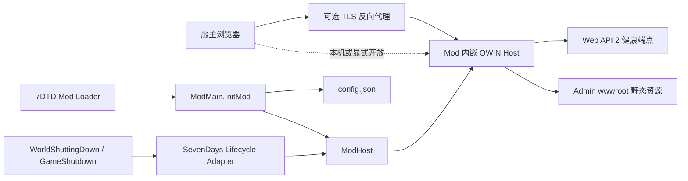

# 7DPanel 系统架构

## 背景与驱动因素

本文档只描述当前已经存在并有代码、配置或验证证据支持的系统架构。当前后端是可构建、可测试的 `net48` 最小运行切片，由 Bootstrap、Hosting、Web Adapter 和 SevenDays Adapter 四个产品项目组成，覆盖 Mod 初始化与关闭、监听配置、Katana OWIN、健康 API 和 Admin 静态资源托管。当前 Admin 是 Vue 3、Vite 和 Nuxt UI 应用，只有 `/` 客户端路由，并通过类型化同源客户端读取 `/api/v1/health`。认证、玩家、日志、SQLite、备份、公告、审计、游戏主线程调度和后台作业均未实现。

产品目标和验收合同见[产品需求文档](PRD.md)，当前验证策略和证据见[测试策略](test.md)。尚未实现的批准后端链路和生产文件职责见[后端目标架构蓝图](architecture/backend-target-blueprint.md)；尚未实现的 Admin 应用边界和依赖方向见[Admin 前端目标架构蓝图](architecture/admin-frontend-target-blueprint.md)。两个 Target 蓝图都不是当前实现证据。

当前切片直接支持 `CAP-01` 的面板存活与状态诚实基础，以及 `NFR-01`、`NFR-02` 的自托管和未知状态不得显示为成功约束。它不代表 `CAP-01` 的完整游戏状态或其他 P0 能力已经完成。

目标运行环境是 7DTD Dedicated Server `v3.0.1-b4` 随附的 Unity Mono 进程。运行时与反编译行为证据来自根目录只读私有子模块 `7dtd-reference/`；该子模块不是产品源码或发布内容。

## 系统边界



- 后端 DLL 和 Admin 构建资源随同一个 Mod 目录部署，并在 7DTD 进程内提供 HTTP 服务。
- 7DTD 拥有 Mod 生命周期；当前 SevenDays Adapter 只把两个关闭事件转换为 `IModRuntime.Stop()`。
- 浏览器只能访问静态资源和健康 API，不能直接访问 7DTD 对象或 Mod 配置文件。
- 当前没有身份、权限、数据库、游戏状态读取或写操作边界；健康 `ok` 不能推导游戏已经就绪或可管理。
- 首版目标仍是单服自托管，但当前切片只验证所在 Mod 进程的 HTTP 存活。

## 组件与职责

| 项目或应用 | 当前职责与实现证据 | 当前依赖 |
|---|---|---|
| `backend/src/Bootstrap/LSTY.SevenDPanel/` | 唯一 `IModApi` 入口、配置文件 I/O、对象组装、Admin 资源根目录选择和 Mod 发布入口 | Hosting、Web Adapter、SevenDays Adapter、游戏编译期程序集 |
| `backend/src/Runtime/LSTY.SevenDPanel.Hosting/` | `ModHost` 状态机、`IModRuntime`、`IPanelWebHost`、监听选项和产品元数据 | .NET Framework BCL |
| `backend/src/Adapters/LSTY.SevenDPanel.Adapters.Web/` | Web API 健康路由、全局 JSON 配置、Katana Self Host、StaticFiles 和 SPA fallback | Hosting、Web API/Katana、游戏提供的 JSON 兼容程序集 |
| `backend/src/Adapters/LSTY.SevenDPanel.Adapters.SevenDays/` | 注册 `WorldShuttingDown`、`GameShutdown`，在初始化阶段启动并在关闭事件中停止 `IModRuntime` | Hosting、`Assembly-CSharp.dll` |
| `frontend/apps/admin/` | 响应式应用壳、唯一 `/` 路由、健康 API Client、`useServerHealth` 和 Overview 状态呈现 | Vue 3、Vue Router、Nuxt UI、Vite |

当前没有 Application、Domain 或 Local Adapter 项目。只有 `LSTY.SevenDPanel.dll` 实现 `IModApi`；`DependencyRulesTests` 校验后端项目引用白名单、Adapter 方向和唯一入口约束。未来项目、目录和抽象只在真实纵向切片需要时按[后端目标架构蓝图](architecture/backend-target-blueprint.md)创建。

### Mod 生命周期

1. `ModMain.InitMod` 读取或创建监听配置，并从 `modInstance.Path` 派生 `<ModDirectory>/wwwroot`。
2. Bootstrap 创建 `ModHost`、`OwinWebHost` 和 `SevenDaysGameLifecycleAdapter`。
3. `RegisterAndStart` 先注册 `WorldShuttingDown` 与 `GameShutdown`，设置已注册标记，再调用 `runtime.Start()`。
4. `ModHost.Start` 创建并启动一个 OWIN Host；重复启动保持幂等，启动异常使状态进入 `Faulted` 并释放候选 Host。
5. 任一关闭事件调用 `ModHost.Stop`。当前实现短暂进入内部 `Draining` 状态后立即释放 OWIN，再进入 `Stopped`；没有可被 HTTP 客户端观察的 draining 响应。

当前适配器不订阅 `GameStartDone`。未来依赖 Unity/7DTD 活对象的组件需要独立游戏就绪边界，但该边界尚未实现，不能从当前健康端点推断。

2026-07-18 的 Windows 7DTD `v3.0.1-b4` 人工 smoke 是旧启动时序的历史基线。2026-07-19 的同版本真实进程 smoke 验证当前时序：OWIN 在启动后 `3.409` 秒启动，早于 `StartGame done` 的 `66.397` 秒；正常关服后进程退出且 18080 端口释放。测试层级和证据限制见[测试策略](test.md)。

### OWIN、Web API 与静态资源

- `OwinWebHost` 使用 `WebApp.Start(url, configure)` 创建宿主，并在 `Dispose` 中释放返回的 `IDisposable`。
- `OwinStartup` 先注册 Web API，再注册 SPA fallback 和 StaticFiles。`/api`、`/api/*`、`/assets`、`/assets/*` 不参与 SPA fallback。
- Admin 资源根目录由 Bootstrap 显式传入。目录缺失时记录日志并保留健康 API 可用；运行时不猜测仓库路径。
- 当前公开 `GET /health` 和 `GET /api/v1/health`，两者都由 `HealthController` 返回产品存活信息。
- Web API 移除 XML formatter，并统一用 `CamelCasePropertyNamesContractResolver` 输出 camelCase JSON。
- 健康响应精确为 `{ status: "ok", product: "7DPanel", version: "0.1.0" }`。`ProductInfo` 是名称和版本来源，测试会与 `ModInfo.xml` 对齐。
- 默认 `bindAddress` 为 `0.0.0.0`，转换为 `http://*:18080/`。当前没有认证或 TLS 终止，远程开放前必须由防火墙限制来源，并优先使用 TLS 反向代理。

### Admin 健康概览

```text
GET /
  -> OWIN StaticFiles -> wwwroot/index.html
  -> Vue Router /
  -> useServerHealth
  -> fetch /api/v1/health
  -> HealthController
```

- `fetchServerHealth` 始终使用相对同源 `/api/v1/health`，验证 `status`、非空 `product` 和非空 `version`，并区分取消、网络、HTTP 与无效响应错误。
- `useServerHealth` 只拥有页面局部状态。首次请求是 loading；成功后是 fresh；没有成功数据的失败是 offline；已有成功数据后失败或 60 秒未获得新样本是 stale。
- 新请求取消旧请求，组件卸载时取消当前请求并清理 stale timer。
- 开发期 Vite proxy 从 `.env.local` 的 `VITE_BACKEND_URL` 读取上游目标；生产代码和构建产物不包含该目标地址。
- 生成的客户端路由表当前只有 `/`。OWIN 会为 `/overview` 返回 `index.html`，但 Vue Router 没有对应页面；该缺口见[测试策略](test.md#已知缺口)。

## 数据与接口

### HTTP 接口

| 方法与路径 | 当前所有者 | 当前语义 |
|---|---|---|
| `GET /health` | `HealthController` | 兼容健康入口，返回面板 HTTP Host 存活信息 |
| `GET /api/v1/health` | `HealthController` | Admin 使用的版本化健康入口，返回同一精确契约 |
| `GET /` | StaticFiles | 返回 Admin `index.html` |
| `GET/HEAD` 无扩展名、非 API 且非 `/assets` 路径 | SPA fallback + StaticFiles | 服务端返回 `index.html`；客户端是否存在该路由由 Vue Router 决定 |
| `/assets/*` | StaticFiles | 返回构建资源；缺失资源保持 404 |
| 未知 `/api/*` | Web API | 保持 404，不回退到 Admin 页面 |

### 本地配置与状态

- `PanelHostConfigurationLoader` 在 Mod 目录读取 `config.json`；文件不存在时写入默认配置。
- `PanelHostOptions` 验证并规范化监听地址和端口。`config.example.json` 与运行时默认值由测试保持一致。
- `config.json`、`.env.local` 和未来 `data/` 都不是发布模板内容。发布脚本不会覆盖已有 `config.json` 或 `data/`。
- 当前没有 SQLite、面板用户、会话、审计、作业、备份目录或其他产品持久状态。

### 当前依赖兼容矩阵

| 领域 | 当前版本/来源 | 验证状态 | 当前约束 |
|---|---|---|---|
| 目标框架 | `.NET Framework 4.8` / `net48` | Release 构建通过 | 仍受游戏 Mono 可用 API 限制 |
| 游戏运行时 | 7DTD `v3.0.1-b4` Mono BCL `4.6.57.0` | Windows 真实进程已验证 | 编译参考来自固定 `7dtd-reference` 版本；运行时使用未修改官方服务端 |
| Web API 2 | Core/Owin/SelfHost `5.3.0`，Client `6.0.0` | Katana 集成测试与真实进程通过 | 仅实现健康 API |
| Katana/OWIN | `Microsoft.Owin`、Hosting、HttpListener、StaticFiles `4.2.3` | 静态托管、路由、启停和真实进程通过 | 当前未引入认证 middleware |
| JSON | 游戏提供的 `Newtonsoft.Json 13.0.2` | 精确 camelCase 响应已在集成测试和真实进程验证 | 不随 Mod 发布另一份 `Newtonsoft.Json.dll` |
| Unsafe | 游戏提供的 `System.Runtime.CompilerServices.Unsafe.dll`，编译包 `6.0.0` 排除 runtime | Release 构建和发布检查通过 | Mod 发布物不携带另一份同名程序集 |
| Admin | Vue `3.5.40`、Vue Router `5.2.0`、Nuxt UI `4.10.0`、Vite `7.3.6`、pnpm `11.13.1` | lint、typecheck、生产构建和 Chromium 人工检查通过 | 精确解析结果以 Admin 锁文件为准；当前没有自动化单元或浏览器 E2E |

未来 SQLite、迁移、队列、DI、日志、身份和其他候选依赖的批准状态只在[后端目标架构蓝图](architecture/backend-target-blueprint.md)中维护，不属于当前依赖矩阵。

## 部署与运维

- 当前发布物包含四个产品 DLL、所需托管依赖、`config.example.json` 和 `wwwroot/`；不包含 SQLite Native 文件、`7dtd-reference/`、游戏提供的程序集、服主 `config.json` 或运行数据。
- `Publish-Mod.ps1` 要求 Admin `dist/index.html` 和资产存在，执行 `dotnet publish` 后只替换目标中的 `wwwroot/`，并再次校验发布资产。
- 发布脚本是增量的，不清空整个 Mod 目录；已有 `config.json` 和 `data/` 保持不变。
- Windows 7DTD `v3.0.1-b4` 已完成开发期真实进程 smoke。Linux 发布与运行尚未验证，不能宣称支持已完成。
- 开发期发布、启停和健康检查入口见[后端脚本指南](../backend/scripts/README.md)。辅助脚本不属于产品运行时。
- 当前关服流程只调用幂等 `ModHost.Stop` 并释放 OWIN；队列排空、数据库关闭和可观察 draining 都尚不存在。

## 质量属性

### 可靠性

- `ModHost` 的重复启停、启动失败回收和停止后禁止重启已有单元测试。
- OWIN 集成测试使用真实 Katana Host 验证端口释放、API/静态资源优先级、SPA fallback、缺失资源和缺失资产目录。
- `DependencyRulesTests` 用源码规则保护当前项目依赖、唯一 `IModApi` 和初始化启动顺序；它不替代真实 ModEvents 回调测试。
- 健康客户端保留最后成功样本并明确标记 stale/offline，不把失败或过期结果显示为 fresh。

### 安全性

- 当前健康 API 和 Admin 静态页面没有认证，默认监听全部网络接口；部署者必须限制网络来源。
- API 不返回配置文件路径或内部异常堆栈。缺失静态资源返回普通 404。
- `.env.local`、`config.json` 和运行数据不进入版本库发布模板或前端生产包。

### 兼容性

- 产品代码以固定版本游戏程序集为编译输入，游戏提供的 `Assembly-CSharp.dll`、`Newtonsoft.Json.dll` 和 Unsafe 程序集不 Copy Local。
- 发布和真实进程测试用于确认编译期参考与官方运行时兼容；反编译源码只提供行为证据。
- Admin 核心图标随静态产物打包，不依赖运行时外部 CDN。

## 决策与权衡

- **Current-only architecture:** 本文件只维护已实现事实；未来边界和候选依赖由 Target 蓝图拥有，避免把批准设计误报为代码。
- **Embedded backend:** 后端与 Mod 同进程，部署简单，但宿主异常会影响游戏服务器。
- **Start HTTP Host in `InitMod`:** 注册关闭事件后立即启动不依赖游戏活对象的 OWIN，使面板在游戏加载期间可访问；代价是必须把 HTTP 存活与未来游戏就绪状态分开。
- **Same-origin Admin hosting:** OWIN 同时提供 Admin 静态资源和 `/api/v1`，生产前端不需要编译后端地址；middleware 顺序必须持续保护 API 所有权。
- **Runtime Newtonsoft.Json:** 使用游戏的 `13.0.2` 避免同名程序集冲突，并在 Web API 管线统一配置 camelCase。
- **Pinned reference submodule:** 使用固定的只读参考提交避免复制反编译材料；协作者需要相应私有仓库访问权限。

### 未解决风险

- SevenDays 生命周期适配器直接依赖静态 `ModEvents`，当前没有可执行的事件回调单元测试；初始化顺序由源码规则、`ModHost` 单测和真实进程 smoke 共同覆盖。
- `GameStartDone` 游戏就绪状态、就绪前 `503`、可观察 draining 和写请求拒绝均是目标设计，尚未实现。
- 默认全接口明文监听且没有认证；在身份与 TLS 边界实现前，不应直接暴露到不受信任网络。
- Linux x64 运行和发布尚无本项目证据。
- 编译使用的 publicized `Assembly-CSharp.dll` 与官方运行时材料职责不同；升级游戏版本时必须重新验证构建和真实进程行为。
