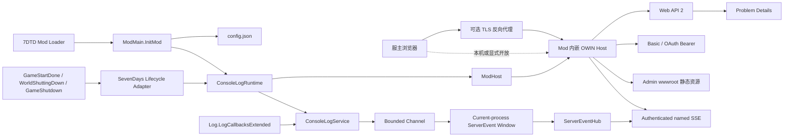

# 7DPanel 系统架构

## 背景与驱动因素

本文档只描述当前已经存在并有代码、配置或验证证据支持的系统架构。当前后端是可构建、可测试的 `net48` 最小运行切片，由 Bootstrap、Hosting、Web Adapter 和 SevenDays Adapter 四个产品项目组成，覆盖 Mod 初始化与关闭、组合运行时生命周期、独立游戏就绪边界、控制台日志采集与当前进程命名事件窗口、监听配置、Katana OWIN、健康 API、统一 Problem Details、临时配置身份、Basic/Bearer 认证、认证生产 SSE、Admin 静态资源托管和尚未接入产品链路的主线程调度原语。当前 Admin 是 Vue 3、Vite 和 Nuxt UI 应用，只有 `/` 客户端路由，并通过类型化同源客户端读取 `/api/v1/health`；前端登录和 SSE 消费尚未实现。SQLite 身份、持久 Bearer Token、玩家、备份、公告、审计、可调用的游戏状态/动作链路和后台作业均未实现；产品不采用 Cookie 认证。

产品目标和验收合同见[产品需求文档](PRD.md)，当前验证策略和证据见[测试策略](test.md)。尚未实现的批准后端链路和生产文件职责见[后端目标架构蓝图](architecture/backend-target-blueprint.md)；尚未实现的 Admin 应用边界和依赖方向见[Admin 前端目标架构蓝图](architecture/admin-frontend-target-blueprint.md)。两个 Target 蓝图都不是当前实现证据。

当前切片直接支持 `CAP-01` 的面板存活与状态诚实基础，以及 `NFR-01`、`NFR-02`、`NFR-04` 的自托管、未知状态不得显示为成功和管理凭证失败关闭约束。它不代表 `CAP-01` 的完整游戏状态、最终 `CAP-05` 身份或其他 P0 能力已经完成。

目标运行环境是 7DTD Dedicated Server `v3.0.1-b4` 随附的 Unity Mono 进程。运行时与反编译行为证据来自根目录只读私有子模块 `7dtd-reference/`；该子模块不是产品源码或发布内容。

## 系统边界



- 后端 DLL 和 Admin 构建资源随同一个 Mod 目录部署，并在 7DTD 进程内提供 HTTP 服务。
- 7DTD 拥有 Mod 生命周期；当前 SevenDays Adapter 把 `GameStartDone` 转换为 `IModRuntime.MarkGameReady()`，并把两个关闭事件转换为 `IModRuntime.Stop()`。
- 默认配置已启用临时 `Owner` 身份，浏览器可用已知 Basic 凭据或由 password grant 签发的短期 Bearer 访问生产事件流；静态资源和健康 API 保持匿名。浏览器不能直接访问 7DTD 对象或 Mod 配置文件。
- 当前临时配置身份只有 `Owner` claims，不是 `CAP-05` 的持久用户、会话或完整权限管理；健康 `ok` 不能推导游戏已经就绪或可管理。
- 首版目标仍是单服自托管，但当前切片只验证所在 Mod 进程的 HTTP 存活。

## 组件与职责

| 项目或应用 | 当前职责与实现证据 | 当前依赖 |
|---|---|---|
| `backend/src/Bootstrap/LSTY.SevenDPanel/` | 唯一 `IModApi` 入口、配置文件 I/O、Microsoft DI 组合根与根 Provider 所有权、Admin 资源根目录选择和 Mod 发布入口 | Hosting、Web Adapter、SevenDays Adapter、`Microsoft.Extensions.DependencyInjection`、游戏编译期程序集 |
| `backend/src/Runtime/LSTY.SevenDPanel.Hosting/` | `ModHost` OWIN 生命周期状态机、独立 `GameReadinessState`、`IModRuntime`、`IPanelRuntimeStatus`、`IPanelWebHost`、监听选项、产品元数据，以及 Web/SevenDays Adapter 之间受限的命名服务器事件契约 | .NET Framework BCL |
| `backend/src/Adapters/LSTY.SevenDPanel.Adapters.Web/` | 健康、token 和生产事件路由；关联标识、Problem Details、认证限流、Basic/OAuth Bearer middleware、scoped SSE session、OWIN/Web API 请求作用域桥接、全局 JSON 配置、Katana Self Host、StaticFiles 和 SPA fallback | Hosting、Web API/Katana、Microsoft DI Abstractions、游戏提供的 JSON 兼容程序集 |
| `backend/src/Adapters/LSTY.SevenDPanel.Adapters.SevenDays/` | 隔离三个静态生命周期事件和 `Log.LogCallbacksExtended`；提供集中的有界控制台日志服务、当前进程 `ServerEventLiveWindow`、每客户端有界 `ServerEventHub`、组合运行时、有界 request/reply 主线程调度器和 `ThreadManager` bridge | Hosting、`Assembly-CSharp.dll`、游戏 `LogLibrary.dll`/Unity 类型、`System.Threading.Channels` |
| `frontend/apps/admin/` | 响应式应用壳、唯一 `/` 路由、健康 API Client、`useServerHealth` 和 Overview 状态呈现 | Vue 3、Vue Router、Nuxt UI、Vite |

当前没有 Application、Domain 或 Local Adapter 项目。只有 `LSTY.SevenDPanel.dll` 实现 `IModApi`；`DependencyRulesTests` 校验后端项目引用白名单、Adapter 方向和唯一入口约束。未来项目、目录和抽象只在真实纵向切片需要时按[后端目标架构蓝图](architecture/backend-target-blueprint.md)创建。

### Mod 生命周期

1. `ModMain.InitMod` 读取或创建监听配置，并从 `modInstance.Path` 派生 `<ModDirectory>/wwwroot`。
2. Bootstrap 通过 `PanelServiceProviderFactory` 显式注册 singleton `ConsoleLogService`、同一实例的 `IServerEventStream`、`ModHost`/`IPanelRuntimeStatus`、`ConsoleLogRuntime`/`IModRuntime` 和 scoped `ServerEventSseSession`，以 `ValidateOnBuild=true`、`ValidateScopes=true` 构建唯一根 Provider；随后才创建 `SevenDaysGameLifecycleAdapter`。完成注册与启动后才发布字段，异常路径 best-effort 清理候选运行时并保留原异常。
3. `RegisterAndStart` 依次通过 `ISevenDaysLifecycleEvents` 注册 `WorldShuttingDown`、`GameShutdown` 和 `GameStartDone`，全部成功后再调用 `runtime.Start()`。注册失败按逆序注销；`runtime.Start()` 抛出时还会 best-effort 调用 `runtime.Stop()`，清理失败不遮蔽原始启动异常。
4. `SevenDaysModEvents` 在 SevenDays Adapter 程序集内保存精确游戏 delegate，返回幂等订阅 token 负责注销，保持 `ModEvents.RegisterHandler` 对调用程序集的识别语义。
5. `ConsoleLogRuntime.Start` 先启动日志服务，再委托 `ModHost.Start` 创建 OWIN Host；`ConsoleLogService` 先启动唯一 consumer，再订阅 `Log.LogCallbacksExtended`。这些运行时资源由根 Provider 按显式注册创建，不使用程序集扫描、业务 service locator 或通用组件注册表。
6. `GameStartDone` 由 `ConsoleLogRuntime` 先转发给 `ModHost`，再把一次 `game-ready` 排入与已接受日志相同的有界顺序通道。任一关闭事件调用幂等 `ServiceProviderRuntime.Stop`：先拒绝新日志、注销静态 delegate、把 `server-stopping` 排在已接受日志之后、限时排空并完成 Hub，再停止 `ModHost` 和释放根 Provider；各阶段失败仍继续回收并聚合报告。并发或晚到的就绪事件不能覆盖 `Stopping`。

2026-07-18 的 Windows 7DTD `v3.0.1-b4` 人工 smoke 是旧启动时序的历史基线。2026-07-19 的同版本真实进程 smoke 验证 OWIN 在 `GameStartDone` 前启动。2026-07-20 在引入事件隔离与就绪状态后再次验证：OWIN 在启动后 `8.576` 秒启动，`StartGame done` 在 `119.732` 秒出现，日志没有 ModEvent 注册或回调错误；正常关服记录 OWIN stopped，进程退出且 18080 端口释放。测试层级和证据限制见[测试策略](test.md)。

### 7DTD 控制台日志采集边界

- `ConsoleLogService` 直接保存精确的 `Log.LogCallbackExtendedDelegate`，把 Unity `LogType` 的数值映射为 Adapter 自有的 `ConsoleLogType`，并由嵌套的幂等 token 注销同一个 delegate。没有额外的 callback/source 接口层；只有该生产订阅方法接触 Unity 类型，进程内模型和单元测试不会加载或复制 Unity 运行时程序集。
- 回调只构造尚未分配 sequence 的不可变 `ConsoleLogEntry` 并调用一次 `ConsoleLogService.TryPublish`。服务使用 `BoundedChannelFullMode.Wait`、`SingleReader = true`、`SingleWriter = false`、`AllowSynchronousContinuations = false`，生产路径只调用非等待的 `TryWrite`，不会逐条创建 `Task.Run` 或执行文件、数据库和网络 I/O。
- 当前默认 queue capacity 为 `1024`，live window capacity 为 `5000`，drain timeout 为 `5s`。一个 tracked consumer 按接受顺序写入固定容量窗口；成功写入窗口的 `console-log`、`game-ready` 和 `server-stopping` 共享从 1 开始的进程内 `long sequence`。窗口按 `afterSequence` 有界读取，只有 `afterSequence < OldestSequence - 1` 才报告 gap。
- 服务用最小的一次性 started/stopped/accepting 状态和内部计数管理 accepted、consumed、dropped-full、rejected-stopping、consumer-failure、当前深度和 high-water，不再为状态、配置或统计创建公开类型。停止时先禁止接收并注销游戏 delegate，再完成 writer 并限时排空；只有存在有效订阅时才在注销后通过现有 Mod 日志输出一次停止摘要，避免摘要递归进入自身。
- 当前窗口只覆盖本次 7DTD 进程，不写 SQLite，也不提供 WebSocket 或公共同步 .NET event。7DTD 每次启动生成的 `output_log_dedi__*.txt` 继续承担原始持久证据。
- `ServerEventHub` 位于窗口之后，通过 Hosting 的只读 `IServerEventStream`/`IServerEventSubscription` 契约向 Web Adapter 提供窗口 replay 和每客户端独立的 256 项有界 mailbox；默认最多 8 个订阅者。慢订阅者 mailbox 溢出只结束自身，不阻塞采集 consumer 或其他订阅者；服务停止会完成全部订阅。
- scoped `ServerEventSseSession` 只允许 Controller 预留一次订阅，随后捕获 `product`、`version`、`hostState`、`gameReadiness` 和 `connectedAtUtc` Welcome 快照，再负责 Welcome、replay/live 去重、gap、15 秒 comment heartbeat、取消、输出关闭和幂等清理。`ServerEventsController` 在响应 body 开始前完成授权、游标校验和订阅预留；容量不足返回 503 Problem Details `stream_capacity_exhausted`。
- 2026-07-20 在实现收缩为 `ConsoleLogService` 和 `ConsoleLogRuntime` 后重新执行 Windows `v3.0.1-b4` smoke：`System.Threading.Channels` 从 Mod 目录加载，停止摘要为 `accepted=185`、`consumed=185`、`droppedFull=0`、`rejectedStopping=0`、`consumerFailures=0`、`highWater=3`，随后 OWIN 停止、进程退出且端口释放。真实负载没有达到容量上限；队满即时拒绝、计数、high-water 上限和排空超时由确定性单元测试覆盖。
- 旧的未认证开发 SSE 和配置开关已删除。2026-07-21 的 Windows `v3.0.1-b4` 真实进程 smoke 已验证 OAuth 程序集加载、Basic/Bearer、Welcome、日志、`game-ready`、`server-stopping`、正常关服和端口释放；临时配置与凭据在结束后删除，服主配置按 SHA-256 逐字节恢复。

### 7DTD 主线程调度边界

- `SevenDaysMainThreadScheduler` 用可配置容量保护自有 FIFO；容量包含排队、运行中以及尚未由 pump 移除的取消/超时 tombstone，不能通过反复取消绕过上限。
- 调度器只向 `ThreadManager.AddSingleTaskMainThread` 投递一个低基数 pump，每个 pump 最多执行一个有效请求；仍有请求时再投递下一 pump，避免在同一帧主动清空项目队列。
- 请求结果区分 `Succeeded`、`Failed`、`Unavailable`、`Canceled`、`TimedOut` 和 `Unknown`。排队取消或超时保证委托未执行；执行开始后的取消、超时或停止返回 `Unknown`，不能据此安全重试有副作用操作。
- 委托异常由调度器捕获，不交给游戏宿主吞掉；`TaskCompletionSource` 使用 `RunContinuationsAsynchronously`，避免调用方 continuation 在游戏主线程内联运行。dispatcher 投递失败会停止调度器并明确拒绝已接受和后续请求。
- 该调度器及 `ThreadManagerMainThreadDispatcher` 已编译并有确定性单元测试，但 Bootstrap 尚未创建或启动它，也没有 Controller、Use Case 或状态查询消费它。生产容量、每帧预算和监控阈值必须先由官方 Windows/Linux 进程性能基线决定；现有 `/api/v1/health` 不承载游戏状态。

### OWIN、Web API 与静态资源

- `OwinWebHost` 使用 `WebApp.Start(url, configure)` 创建宿主，并在 `Dispose` 中释放返回的 `IDisposable`。
- `OwinStartup` 要求 Bootstrap 显式传入根 `IServiceProvider`。当前顺序为请求关联标识、Problem Details 异常边界、认证限流、请求 scope、OAuth authorization server、Active Basic、Active Bearer、Web API、SPA fallback 和 StaticFiles；`/api`、`/api/*`、`/assets`、`/assets/*` 不参与 SPA fallback。
- OWIN middleware 为每个请求创建唯一 `IServiceScope`，其生命周期覆盖完整下游响应；bridging handler 把该 scope 的 non-owning Web API dependency scope 写入请求。正常路径只有 OWIN middleware 释放实际 scope；Web API resolver 的 fallback scope 只用于没有 OWIN scope 的非标准宿主路径。Controller 使用 `ActivatorUtilities` 构造，避免容器与 Web API 双重拥有 Controller。
- Admin 资源根目录由 Bootstrap 显式传入。目录缺失时记录日志并保留健康 API 可用；运行时不猜测仓库路径。
- `RequestCorrelationMiddleware` 只接受不超过 64 个允许字符的 `X-Request-ID`，并让响应 Header 与 Problem Details `traceId` 一致。非 OAuth 协议错误使用 `application/problem+json`；`instance` 只含 Path，未知 `/api/*` 也进入统一错误契约。
- Problem Details 外层通过 non-owning write-tracking stream 区分尚未开始和已经写出的响应；只有前者能被改写为统一 500，SSE 或其他已开始 body 发生异常时只记录 traceId 并结束响应，不追加错误 JSON。
- `POST /api/v1/auth/token` 只支持 password grant，返回进程内短期不透明 Bearer Token；最多保留 128 个未到期 Token。token endpoint 与携带 Basic Header 的事件建连按远端地址限制为每分钟 20 次、最多 1024 个地址 bucket。
- `GET /api/v1/events/stream` 要求 `Owner`、`Admin` 或 `Viewer` 的 Basic/Bearer 身份，拒绝 QueryString Token，并按 Welcome、replay、live 和 heartbeat 顺序输出命名事件。`Last-Event-ID` 只接受非负十进制整数。
- Web API 移除 XML formatter，并统一用 `CamelCasePropertyNamesContractResolver` 输出 camelCase JSON。
- 健康响应精确为 `{ status: "ok", product: "7DPanel", version: "0.1.0" }`。`ProductInfo` 是名称和版本来源，测试会与 `ModInfo.xml` 对齐。
- 默认 `bindAddress` 为 `0.0.0.0`，转换为 `http://*:18080/`。认证默认启用 `username` / `password`，并允许在明文 HTTP 上传输 Basic 和 password grant；这是当前框架搭建阶段按 `NFR-04` 批准的暴露边界。

### Admin 健康概览

```text
GET /
  -> OWIN StaticFiles -> wwwroot/index.html
  -> Vue Router /
  -> useServerHealth
  -> fetch /api/v1/health
  -> HealthController
```

- `fetchServerHealth` 始终使用相对同源 `/api/v1/health`，验证 `status`、非空 `product` 和非空 `version`，并区分取消、网络、HTTP 与无效响应错误。
- `useServerHealth` 只拥有页面局部状态。首次请求是 loading；成功后是 fresh；没有成功数据的失败是 offline；已有成功数据后失败或 60 秒未获得新样本是 stale。
- 新请求取消旧请求，组件卸载时取消当前请求并清理 stale timer。
- 开发期 Vite proxy 从 `.env.local` 的 `VITE_BACKEND_URL` 读取上游目标；生产代码和构建产物不包含该目标地址。
- 生成的客户端路由表当前只有 `/`。OWIN 会为 `/overview` 返回 `index.html`，但 Vue Router 没有对应页面；该缺口见[测试策略](test.md#已知缺口)。

## 数据与接口

### HTTP 接口

| 方法与路径 | 当前所有者 | 当前语义 |
|---|---|---|
| `GET /health` | `HealthController` | 兼容健康入口，返回面板 HTTP Host 存活信息 |
| `GET /api/v1/health` | `HealthController` | Admin 使用的版本化健康入口，返回同一精确契约 |
| `POST /api/v1/auth/token` | OAuth authorization server middleware | 只接受 password grant；协议错误保持 OAuth JSON，成功返回短期进程内 Bearer Token |
| `GET /api/v1/events/stream` | `ServerEventsController` | Basic/Bearer 认证的 Welcome、replay 和多命名 live SSE；建流前错误使用 Problem Details |
| `GET /` | StaticFiles | 返回 Admin `index.html` |
| `GET/HEAD` 无扩展名、非 API 且非 `/assets` 路径 | SPA fallback + StaticFiles | 服务端返回 `index.html`；客户端是否存在该路由由 Vue Router 决定 |
| `/assets/*` | StaticFiles | 返回构建资源；缺失资源保持 404 |
| 未知 `/api/*` | Web API | 返回 404 Problem Details，不回退到 Admin 页面 |

### 本地配置与状态

- `PanelHostConfigurationLoader` 在 Mod 目录读取 `config.json`；文件不存在时写入默认配置。
- `PanelHostOptions` 验证并规范化监听地址和端口。`config.example.json` 与运行时默认值由测试保持一致。
- 当前框架搭建阶段的 `authentication` 默认启用，使用已知配置身份 `username` / `password` 和 30 分钟 Token 生命周期；服主可以在 `config.json` 中替换凭据，用户名和密码仍必须非空，Token 生命周期限制为 5 到 1440 分钟。无效认证配置失败关闭但不替换有效监听配置，受保护 API 不会退化为匿名访问。
- `allowInsecureHttp` 当前默认 true，与默认 `http` 监听共同允许明文 HTTP 上的 Basic 和 password grant；这是当前阶段按 `NFR-04` 接受的运行假设，启动日志只输出不含凭据的风险警告。首个 `Owner` 与 SQLite/Header Bearer 身份切片必须整体删除配置身份、已知默认凭据和明文远程认证例外。
- `config.json`、`.env.local` 和未来 `data/` 都不是发布模板内容。发布脚本不会覆盖已有 `config.json` 或 `data/`。
- 当前没有 SQLite、面板用户、会话、审计、作业、备份目录或其他产品持久状态。

### 当前依赖兼容矩阵

| 领域 | 当前版本/来源 | 验证状态 | 当前约束 |
|---|---|---|---|
| 目标框架 | `.NET Framework 4.8` / `net48` | Release 构建通过 | 仍受游戏 Mono 可用 API 限制 |
| C# 编译基线 | C# `11.0`，启用 Nullable Reference Types 和 Implicit Usings | Release Rebuild 以零警告通过 | 语言分析与全局 using 只影响编译期；生产运行时仍为游戏 Mono |
| 游戏运行时 | 7DTD `v3.0.1-b4` Mono BCL `4.6.57.0` | Windows 真实进程已验证 | 编译参考来自固定 `7dtd-reference` 版本；运行时使用未修改官方服务端 |
| Web API 2 | Core/Owin `5.3.0`，Client `6.0.0` | 健康、Problem Details 和认证命名 SSE 通过 Katana 自动化与 Windows 真实进程 | 实现健康、统一错误和生产事件流；Linux Mono 仍待验证 |
| Katana/OWIN | `Microsoft.Owin`、Hosting、HttpListener、StaticFiles `4.2.3` | 静态托管、路由、认证、流式响应和启停通过 Katana 自动化与 Windows 真实进程 | 认证位于受保护 Web API 前，静态 Admin 和健康端点保持匿名 |
| OWIN 认证 | `Microsoft.Owin.Security.OAuth 4.2.3` + 自有 Basic middleware | 凭据、Token store、限流、无宿主 data protector 回退和认证 SSE 通过自动化；OAuth DLL、Basic/Bearer 通过 Windows Mono | 显式拒绝 authorization-code/refresh/self-contained ticket format，避免 self-host 默认 DPAPI；不支持 refresh token、JWT、QueryString Token 或通配 CORS，配置身份只是临时 `Owner` |
| 组合根依赖注入 | `Microsoft.Extensions.DependencyInjection 6.0.2`、Abstractions `6.0.0` | Provider 验证、scope/bridge/释放自动化、发布清单和 Windows Mono 真实进程通过 | implementation 只属于 Bootstrap，Web Adapter 只直接引用 Abstractions；根 Provider 后于 OWIN/运行时释放 |
| JSON | 游戏提供的 `Newtonsoft.Json 13.0.2` | 精确 camelCase 响应已在集成测试和真实进程验证 | 不随 Mod 发布另一份 `Newtonsoft.Json.dll` |
| Async interfaces | 游戏提供的 `Microsoft.Bcl.AsyncInterfaces 6.0.0.0`，编译包 `6.0.0` 排除 runtime | Release 构建、发布排除和 Windows Mono 真实进程通过 | Mod 不发布另一份同名程序集；DI 6.x 与宿主版本对齐 |
| Unsafe | 游戏提供的 `System.Runtime.CompilerServices.Unsafe.dll`，编译包 `6.0.0` 排除 runtime | Release 构建和发布检查通过 | Mod 发布物不携带另一份同名程序集 |
| 有界日志通道 | `System.Threading.Channels 8.0.0`、`System.Threading.Tasks.Extensions 4.5.4` | Release Rebuild、单元测试、发布清单和 Windows Mono 真实进程通过 | 发布 Channels 及所需 Tasks.Extensions；编译统一到游戏提供的 Unsafe 6.0，且不复制 Unsafe、LogLibrary 或 Unity 程序集 |
| Admin | Vue `3.5.40`、Vue Router `5.2.0`、Nuxt UI `4.10.0`、TypeScript `6.0.3`、Vite `8.1.5`（Rolldown/Oxc）、`@types/node` `24.x`、pnpm `11.13.1`；开发/CI 基线为 Node.js `24+`，package engines 保留 `^20.19.0 || ^22.13.0 || >=24.0.0` | lint、typecheck、生产构建、Vite 8 真实 OWIN smoke 和 Chromium 人工检查通过 | Node.js 只用于开发和构建，生产静态托管不需要 Node.js；`@types/node` 仅服务于 `vite.config.ts` 的 Node 侧 `tsconfig`，typecheck 同时覆盖应用和 Node 配置；精确解析结果以 Admin 锁文件为准，当前没有自动化单元或浏览器 E2E |

未来 SQLite、迁移、通用后台工作队列、公开日志查询/流、身份和其他候选依赖的批准状态只在[后端目标架构蓝图](architecture/backend-target-blueprint.md)中维护，不属于当前依赖矩阵。

## 部署与运维

- 当前发布物包含四个产品 DLL、所需托管依赖、`config.example.json` 和 `wwwroot/`；不包含 SQLite Native 文件、`7dtd-reference/`、游戏提供的程序集、服主 `config.json` 或运行数据。
- `Publish-Mod.ps1` 要求 Admin `dist/index.html` 和资产存在，执行 `dotnet publish` 后移除并拒绝游戏提供的同名程序集，要求 Microsoft DI implementation/Abstractions、`Microsoft.Owin.Security.OAuth.dll`、Channels 与 Tasks.Extensions 存在，只替换目标中的 `wwwroot/`，并再次校验发布资产。
- 发布脚本是增量的，不清空整个 Mod 目录；已有 `config.json` 和 `data/` 保持不变。
- Windows 7DTD `v3.0.1-b4` 已完成开发期真实进程 smoke。Linux 发布与运行尚未验证，不能宣称支持已完成。
- 开发期发布、启停和健康检查入口见[后端脚本指南](../backend/scripts/README.md)。辅助脚本不属于产品运行时。
- 当前生产关服流程调用幂等 `ServiceProviderRuntime.Stop`，先由 `ConsoleLogRuntime` 注销并排空 `ConsoleLogService`、调用 `ModHost.Stop` 释放 OWIN，再释放根 Provider。主线程调度器尚未接入 composition root，因此主线程工作排空、数据库关闭和可观察 HTTP draining 仍不存在。

## 质量属性

### 可靠性

- `ModHost` 的启停/就绪状态、重复启停、停止后禁止重启和游戏就绪终态已有单元测试；`ConsoleLogRuntime` 另验证日志服务先启动、先停止并转发就绪状态。
- OWIN 集成测试使用真实 Katana Host 验证端口释放、API/静态资源优先级、SPA fallback、缺失资源、缺失资产目录、关联标识、统一 404、Basic/Bearer challenge、OAuth password grant 与协议错误、限流 429、拒绝 QueryString Token，以及生产 SSE 的 Welcome、命名 replay、gap、无效游标、建流前 503 和断开释放。
- `SevenDaysGameLifecycleAdapterTests` 通过可替换事件边界执行三个回调，并覆盖订阅顺序、逆序回滚、异常保留与订阅所有权；真实静态 `ModEvents` wrapper 仍由官方进程 smoke 提供兼容证据。
- 控制台日志测试覆盖六字段 entry、sequence/淘汰/gap、回调线程与 consumer 隔离、队满拒绝、保序消费、单项失败、订阅失败、停止排空和注销后摘要；生产 `Log.LogCallbacksExtended` delegate 与 Channels 加载由官方进程 smoke 验证。
- 主线程调度器的确定性测试覆盖 FIFO、单 pump、容量、tombstone、排队与运行中取消/超时、停止、委托异常以及 dispatcher/deadline 失败。
- `DependencyRulesTests` 用源码规则保护当前项目依赖、Adapter 方向、唯一 `IModApi` 和 Bootstrap candidate 发布顺序。
- 健康客户端保留最后成功样本并明确标记 stale/offline，不把失败或过期结果显示为 fresh。

### 安全性

- 健康 API 和 Admin 静态页面保持匿名；生产事件流要求 Basic 或 Bearer。默认监听全部网络接口并提供已知凭据，当前阶段接受任何可访问 18080 端口的客户端作为临时 `Owner` 认证；服主仍可自行收窄监听、网络来源或替换凭据。
- 非 OAuth API 错误不返回配置文件路径、QueryString、凭据或内部异常堆栈；OAuth 协议错误保留标准 `error`/`error_description` body。
- `.env.local`、`config.json` 和运行数据不进入版本库发布模板或前端生产包。

### 兼容性

- 产品代码以固定版本游戏程序集为编译输入，游戏提供的 `Assembly-CSharp.dll`、`LogLibrary.dll`、`UnityEngine.CoreModule.dll`、`Newtonsoft.Json.dll` 和 Unsafe 程序集不 Copy Local。
- 发布和真实进程测试用于确认编译期参考与官方运行时兼容；反编译源码只提供行为证据。
- Admin 核心图标随静态产物打包，不依赖运行时外部 CDN。

## 决策与权衡

- **Current-only architecture:** 本文件只维护已实现事实；未来边界和候选依赖由 Target 蓝图拥有，避免把批准设计误报为代码。
- **Embedded backend:** 后端与 Mod 同进程，部署简单，但宿主异常会影响游戏服务器。
- **Start HTTP Host in `InitMod`:** 注册关闭事件后立即启动不依赖游戏活对象的 OWIN，使面板在游戏加载期间可访问；代价是必须把 HTTP 存活与未来游戏就绪状态分开。
- **Same-origin Admin hosting:** OWIN 同时提供 Admin 静态资源和 `/api/v1`，生产前端不需要编译后端地址；middleware 顺序必须持续保护 API 所有权。
- **Runtime Newtonsoft.Json:** 使用游戏的 `13.0.2` 避免同名程序集冲突，并在 Web API 管线统一配置 camelCase。
- **Consolidated bounded console log service:** 游戏同步日志回调只创建一个 entry 并执行一次 `TryWrite`；一个服务集中拥有订阅、Channel、consumer、窗口接线、停止和内部计数，避免为单一实现增加 source/sink/options/state/statistics 层。有界容量和单 consumer 防止下游延迟、无限内存与逐日志任务膨胀，代价是过载时普通日志允许有证据地丢弃。
- **Constrained named server events:** 只允许当前有真实生产者和消费者的 `console-log`、`game-ready` 与 `server-stopping` 进入同一 sequence/window/Hub；`welcome` 和 `gap` 是连接级控制事件。该边界不反射扫描 `ModEvents`，也不升级为领域 Event Bus。
- **Transitional configuration identity:** 已知默认配置凭据支持当前 Basic/password-grant 验证和临时 `Owner`，使生产 SSE 能先建立认证边界；它不提供持久用户、密码摘要或持久 Token。后续必须由 Target 蓝图中的 SQLite 身份和 Header Bearer 边界整体替换，产品不采用 Cookie 认证，Token 持久化、刷新和浏览器恢复策略仍待对应身份切片设计。
- **Pinned reference submodule:** 使用固定的只读参考提交避免复制反编译材料；协作者需要相应私有仓库访问权限。

### 未解决风险

- `GameStartDone` readiness 已进入每连接 Welcome 和一次 `game-ready` 事件，但尚无可重复查询的认证服务器状态端点；就绪前 `503` 和写请求 draining 拒绝仍是目标设计。
- 主线程调度器尚未接入生命周期和产品用例，生产容量、帧预算、指标以及官方 Windows/Linux 主线程往返证据仍缺失。
- 控制台日志已有认证 SSE，但没有 REST 查询、跨重启游标或持久化；Windows 正常负载没有触发容量饱和，真实容量饱和与 Linux Mono 基线仍缺失。
- 默认全接口明文监听并启用已知凭据；任何能够访问 18080 端口的客户端都可以作为临时 `Owner` 认证，这是当前框架搭建阶段明确接受、但在持久身份切片进入发布范围前必须移除的暴露风险。
- Linux x64 运行和发布尚无本项目证据。
- 编译使用的 publicized `Assembly-CSharp.dll` 与官方运行时材料职责不同；升级游戏版本时必须重新验证构建和真实进程行为。
