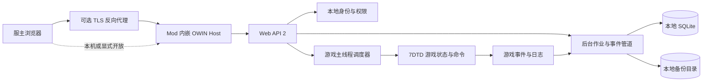

# 7DPanel 系统架构

## Context and Drivers

本文档描述 7DPanel 首版的目标架构。当前 `7dtd-panel-backend/`、`7dtd-panel-frontend/` 和 `7dtd-marketing/` 尚无实现文件，因此本文档不代表功能已经完成。

架构风险的验证层级、环境和发布门槛见[测试策略](test.md)。

架构由 [产品需求文档](PRD.md) 驱动：

- `CAP-01` 要求自托管服务器接入和可信状态展示。
- `CAP-02` 要求玩家管理、日志和操作结果可追踪。
- `CAP-03` 要求计划备份以及重启后恢复。
- `CAP-04` 要求公告和有限的事件自动化。
- `CAP-05` 要求本地身份、角色权限和审计。
- `NFR-01` 要求核心能力不依赖产品方云服务。
- `NFR-02` 要求高风险确认、失败可见且未知状态不得显示为成功。

目标运行环境是 7DTD Dedicated Server `v3.0.1-b4` 随附的 Unity Mono 进程。运行时证据位于 `7dtd-reference/v3.0.1-b4/runtime/`，反编译行为证据位于 `7dtd-reference/v3.0.1-b4/server-decompiled/`。一个不属于本仓库的历史 Mod 项目曾在同类进程中验证 Web API 2、Katana、SQLite 和相关依赖；该结论只用于筛选候选依赖，不能替代本项目的进程内 smoke test，其生命周期和认证设计也不是本项目的目标实现。

## System Boundaries



- 7DPanel 后端、网页静态资源和游戏适配器随 Mod DLL 部署在服主自己的服务器上。
- 7DTD 进程拥有游戏世界、玩家对象、控制台、保存系统和 Mod 生命周期。
- 7DPanel 拥有面板用户、会话、角色、审计、自动化配置、备份目录和恢复状态。
- 浏览器不得直接调用 7DTD 对象或访问 SQLite、存档目录和 Mod 配置文件。
- 首版只管理当前 Mod 所在的单台 7DTD 服务器，不引入云端控制面或多服代理。

## Components and Responsibilities

### Mod 生命周期协调器

目标位置：`7dtd-panel-backend/src/`。

- `InitMod` 加载配置和本地数据、检查待恢复标记、注册 Mod 事件，但不启动完整 Web 服务。
- `GameStartDone` 在确认当前实例是服务端后启动 OWIN、事件管道和计划任务。
- `WorldShuttingDown` 先拒绝新请求、停止计划任务、结束待处理操作，再释放 OWIN Host。
- `GameShutdown` 调用同一个幂等关闭流程作为兜底。
- OWIN Host 的 `IDisposable` 必须由生命周期协调器持有，禁止仅保存在局部变量中。

依据：游戏自带 `Webserver.WebServer` 同样在 `GameStartDone` 初始化，并在 `WorldShuttingDown` 断开；`IModApi` 本身只有 `InitMod`，没有配对卸载方法。

### OWIN Host 与 Web API

- Katana Self Host 在 Mono 进程内提供 HTTP 服务，并托管 Web API 2 和编译后的前端静态资源。
- API 控制器只处理协议、输入验证、权限检查和结果映射，不直接访问 Unity/7DTD 对象。
- 默认监听回环地址。开放到局域网或公网必须显式配置；公网场景推荐由反向代理终止 TLS。
- 关服开始后健康端点报告 `draining`，写操作返回服务不可用，不能接受稍后仍可能执行的游戏操作。

### 身份、权限与审计

- 7DPanel 使用独立本地身份库，不复用 `serveradmin.xml` 中采用无盐 MD5 的原生 Web 用户密码。
- 首次启动且没有用户时，生成一次性初始化码并输出到服务端控制台；成功创建首个 `Owner` 后立即失效。
- 首版角色为 `Owner`、`Admin` 和 `Viewer`。权限检查在进入主线程队列前完成。
- 浏览器会话使用服务端保存的随机不透明标识；Cookie 必须为 `HttpOnly`、适用时为 `Secure`，并采用严格的同站策略。
- 所有改变游戏、玩家、配置、备份或恢复状态的操作，无论成功、失败或被拒绝，都写入审计记录。
- Cookie 认证下的状态变更请求必须验证 CSRF Token。密码摘要使用带独立随机盐、可升级参数的 PBKDF2-HMAC-SHA256；参数和算法版本随摘要保存。

### 游戏主线程调度器

- OWIN 请求运行在线程池，不能直接读写 Unity 或 7DTD 活对象。
- 调度器提供 `ExecuteAsync<T>` 语义，通过 `ThreadManager.AddSingleTaskMainThread` 执行短任务，并用 `TaskCompletionSource<T>` 返回结果或异常。
- 队列必须有容量上限和每帧工作预算，避免游戏提供的 `MainThreadScheduler.ProcessTasks()` 在单帧清空无界请求而拖慢服务器。
- 请求取消或超时只取消尚未开始的工作；已经开始的游戏操作不得被线程中止。
- 主线程任务只返回不可变 DTO 或值类型快照，禁止把 Unity/7DTD 对象交回 OWIN 线程。
- 关服时停止接收任务，并将所有尚未开始的请求完成为明确的服务关闭结果。

### 后台作业与事件管道

- 备份压缩、日志搜索、SQLite I/O、审计持久化和校验在受控后台工作线程执行。
- 游戏日志和事件回调只复制最小 DTO 并放入有界队列，回调内不执行数据库、网络或压缩操作。
- 公告和自动化由后台调度器触发，但最终游戏动作仍通过主线程调度器执行。
- 每个作业持久化 `queued/running/succeeded/failed/cancelled` 状态、时间和失败原因，支持 `NFR-02` 的状态诚实要求。

### 备份与恢复

备份是单实例状态机：

```text
Queued -> Saving -> Committing -> Snapshotting -> Verifying -> Succeeded
                                                      `-----> Failed
```

1. 主线程调用玩家和世界保存入口，并取得覆盖本次保存的提交令牌。
2. 使用游戏保存系统的完成信号等待异步提交结束，不阻塞游戏主线程。
3. 后台复制到临时快照目录、生成清单和校验和，再压缩备份。
4. 校验通过后原子发布备份目录和目录记录；失败产物不得出现在可恢复列表中。

恢复必须重启服务器：

1. `Owner` 选择已校验备份并确认关服影响。
2. 系统原子写入待恢复标记，记录备份标识、请求者和校验信息，然后发起安全关服。
3. 下次 `InitMod`、世界加载前校验标记和备份，保留当前存档的回滚副本，再应用恢复。
4. 成功或失败结果持久化；失败时优先回滚，且不得删除原备份。
5. OWIN 在下次 `GameStartDone` 恢复后向用户展示最终结果。

## Data and Interfaces

### HTTP 接口

- REST API 服务状态、玩家管理、公告、备份、恢复、用户和审计操作。
- 日志流采用服务器推送通道；断线重连以单调递增游标补取仍在保留窗口内的记录。
- 所有响应使用统一错误结构，至少包含稳定错误码、用户可见信息和关联审计标识。
- 状态响应包含采样时间和新鲜度，过期数据不能显示为当前正常状态。

### 本地数据

SQLite 拥有以下持久状态：

- 面板用户、角色、会话和初始化状态。
- 管理员操作与自动化执行审计。
- 公告、定时任务和固定触发器配置。
- 备份目录、校验状态和待恢复记录。

备份归档、临时快照和恢复回滚副本存储在数据库外的受控目录。SQLite 只保存路径标识和元数据，不保存大型归档内容。配置文件保存监听地址、数据目录和非敏感运行参数；密码、会话和初始化码不得以明文持久化。

### 依赖兼容矩阵

| 领域 | 决定版本/来源 | 状态 | 依据与约束 |
|---|---|---|---|
| 目标框架 | `.NET Framework 4.8` / `net48` | Adopted | 旧项目已在 Mod 中运行；编译目标不代表可任意使用游戏 Mono 未实现的 API。 |
| 游戏运行时 | 7DTD `v3.0.1-b4` Mono BCL `4.6.57.0`，`netstandard 2.1.0.0` | Verified | `7dtd-reference/v3.0.1-b4/runtime/` 实际程序集元数据。 |
| Web API 2 | `Microsoft.AspNet.WebApi.OwinSelfHost 5.3.0` | Adopted | 旧项目运行验证。 |
| Katana/OWIN | `Microsoft.Owin.* 4.2.3` | Adopted | Hosting、HttpListener、StaticFiles 和 Security OAuth 已在旧项目运行验证。 |
| JSON | 游戏自带 `Newtonsoft.Json 13.0.2` | Adopted | 新项目直接引用游戏程序集且不随 Mod 复制另一版本，避免旧项目 `13.0.4` 与游戏程序集同名同版本绑定的不确定性。 |
| 身份传输 | 基于 `Microsoft.Owin 4.2.3` 的本地会话中间件 | Adopted | 不沿用 OAuth password grant 和 `AllowInsecureHttp=true`；不增加外部身份服务。 |
| 数据库 | `Microsoft.Data.Sqlite 10.0.9` | Adopted | 旧项目运行验证。 |
| SQLite Native | `SQLitePCLRaw.lib.e_sqlite3 2.1.11` | Adopted | 旧项目包含 Windows/Linux 原生资产处理。 |
| 数据库迁移 | `dbup-core 6.1.1`、`dbup-sqlite 6.0.4` | Adopted | 旧项目运行验证，迁移脚本嵌入 Mod 程序集。 |
| 后台队列 | `System.Threading.Channels 10.0.9` | Adopted | 旧项目运行验证；所有队列必须配置容量和关闭行为。 |
| 依赖注入 | `Microsoft.Extensions.DependencyInjection 10.0.9` | Adopted | 旧项目运行验证；生命周期由 Mod 关闭流程释放。 |
| 日志 | `NLog 6.1.3` | Adopted | 旧项目运行验证；不得替代产品审计记录。 |

每次升级 7DTD、Mono 或矩阵中的包时，必须重新执行进程内 smoke test：程序集加载、OWIN 启停、路由与 JSON、认证会话、SQLite 建库/迁移/CRUD、主线程往返和正常关服释放。

## Deployment and Operations

- 发布物是包含 Mod DLL、依赖 DLL、平台 SQLite Native 文件、配置模板和编译后前端资源的自托管目录。
- Windows x64 和 Linux x64 分别发布；平台原生文件不得混用，非目标 RID 资产在发布阶段移除。
- 默认监听回环地址，不提供默认账号密码。一次性初始化码只输出到本地服务端控制台。
- 外部访问推荐使用 HTTPS 反向代理。若用户显式启用明文远程 HTTP，面板必须持续显示安全警告，且 `Secure` Cookie 不能被错误宣称为已启用。
- 数据库、配置、审计和备份目录必须位于 Mod 可写数据目录，不放入随升级覆盖的程序文件目录。
- 关服顺序是：停止接入、拒绝新主线程任务、停止计划任务、排空有时限的审计/事件队列、释放 OWIN、关闭数据库和日志。

## Quality Attributes

### Reliability

- 生命周期操作、关服、备份和恢复均为幂等状态机。
- API 超时不等于游戏操作失败；响应必须区分未开始、已开始但结果未知、成功和失败。
- 待恢复标记、备份目录记录和用户初始化状态使用原子文件或数据库事务更新。

### Performance

- 主线程只执行有预算的短操作，不进行压缩、数据库查询或网络等待。
- 日志、审计和自动化队列有界；过载时记录丢弃数量或拒绝请求，不允许无限占用内存。
- 列表和日志接口分页或使用游标，不一次返回无界数据。

### Security

- 最小权限角色、服务端会话、CSRF 防护、登录限速和高风险二次确认是发布门槛。
- 初始化码和会话标识使用密码学安全随机数，只持久化摘要，并具有有效期和单次使用语义。
- API 不返回存档绝对路径、密码摘要、会话摘要或内部异常堆栈。

### Compatibility

- 产品代码以游戏实际 `Managed` 程序集为编译和验证基线，而非 dnSpy 生成工程中的本机 SDK HintPath。
- 对 7DTD 内部类型的访问集中在游戏适配层；版本升级时优先替换适配层，不让控制器和数据层直接依赖游戏类型。

## Decisions and Trade-offs

- **Embedded backend:** 后端与 Mod 同进程，部署简单且能直接使用游戏事件，但任何未处理异常、阻塞或内存泄漏都可能影响游戏服务器。
- **Start after `GameStartDone`:** 比旧项目在 `InitMod` 直接启动更晚，但确保游戏单例就绪并与游戏自带 WebServer 模式一致。
- **Independent identity store:** 不复用原生 MD5 Web 用户，换取更安全、清晰的角色模型，但需要自行负责会话、密码迁移和恢复访问。
- **Typed game adapters:** 玩家和公告操作优先使用类型化服务；通用控制台保留为受限高级能力，避免命令字符串成为主要业务接口。
- **Runtime Newtonsoft.Json:** 选择游戏的 `13.0.2` 减少程序集冲突，但新代码不能依赖仅存在于 `13.0.4` 的行为。
- **Restart-based restore:** 牺牲在线恢复便利性，换取存档文件不被游戏同时打开时的可恢复性。

### Unresolved Risks

- 在线保存提交完成后，游戏可能在后台快照复制期间继续修改存档。必须通过故障注入验证归档一致性；若无法证明，则首版备份需要短暂维护窗口或平台文件系统快照。
- 必须验证 `InitMod` 阶段应用待恢复备份时，所有目标存档文件尚未被游戏打开；失败时保持待恢复记录和回滚副本。
- `Assembly-CSharp.dll` 的旧项目引用与 v3.0.1-b4 原始运行时哈希不同，可能来自 publicize 处理。发布构建必须引用兼容的编译期公共化程序集，但运行测试必须使用未修改的官方服务端程序集。
