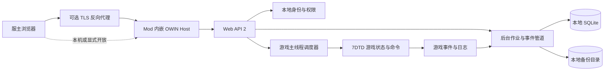

# 7DPanel 系统架构

## 背景与驱动因素

本文档描述 7DPanel 首版的目标架构。当前 `backend/` 已将可构建、可测试的 `net48` 最小运行切片拆分为 Bootstrap、Hosting、Web Adapter 和 SevenDays Adapter 四个产品项目，覆盖 Mod 生命周期、Katana `/health`、配置加载和适配器注册；其余后端产品能力尚未实现。当前 `frontend/apps/admin/` 已建立可构建的 Vue 3、Vite 和 Nuxt UI 应用壳，概览页通过类型化同源客户端调用 `/api/v1/health`，由 composable 管理 loading、fresh、stale 和 offline 状态；开发期 Vite 代理支持本地后端，生产代码只使用相对路径。Admin 构建产物由 Mod 的 OWIN StaticFiles 管线从 `wwwroot` 提供，认证和其他业务功能尚未实现。`frontend/apps/marketing/` 尚无框架工程。因此本文档不代表完整产品已经完成。

架构风险的验证层级、环境和发布门槛见[测试策略](test.md)。

后端尚未实现能力的批准目标链路、项目边界和生产文件职责见
[后端目标架构蓝图](architecture/backend-target-blueprint.md)。该蓝图不代表当前实现；本文件和
实际代码、配置及测试证据仍是当前系统事实的依据。

Admin 管理面板尚未实现部分的批准应用边界、状态所有权、运行链路和静态资源发布职责见
[Admin 前端目标架构蓝图](architecture/admin-frontend-target-blueprint.md)。该蓝图不代表目标链路已经实现；
当前工程事实以本文件、实际代码、锁文件和验证结果为准。

架构由 [产品需求文档](PRD.md) 驱动：

- `CAP-01` 要求自托管服务器接入和可信状态展示。
- `CAP-02` 要求玩家管理、日志和操作结果可追踪。
- `CAP-03` 要求计划备份以及重启后恢复。
- `CAP-04` 要求公告和有限的事件自动化。
- `CAP-05` 要求本地身份、角色权限和审计。
- `NFR-01` 要求核心能力不依赖产品方云服务。
- `NFR-02` 要求高风险确认、失败可见且未知状态不得显示为成功。

目标运行环境是 7DTD Dedicated Server `v3.0.1-b4` 随附的 Unity Mono 进程。运行时与反编译行为证据由根目录私有子模块 `7dtd-reference/` 中的 `v3.0.1-b4/runtime/` 和 `v3.0.1-b4/server-decompiled/` 提供；子模块固定到产品仓库记录的已审查提交，不属于产品源码或发布物。一个不属于本仓库的历史 Mod 项目曾在同类进程中验证 Web API 2、Katana、SQLite 和相关依赖；该结论只用于筛选候选依赖，不能替代本项目的进程内 smoke test，其生命周期和认证设计也不是本项目的目标实现。

## 系统边界



- 7DPanel 后端、网页静态资源和游戏适配器随 Mod DLL 部署在服主自己的服务器上。
- 7DTD 进程拥有游戏世界、玩家对象、控制台、保存系统和 Mod 生命周期。
- 7DPanel 拥有面板用户、会话、角色、审计、自动化配置、备份目录和恢复状态。
- 浏览器不得直接调用 7DTD 对象或访问 SQLite、存档目录和 Mod 配置文件。
- 首版只管理当前 Mod 所在的单台 7DTD 服务器，不引入云端控制面或多服代理。

## 组件与职责

当前最小切片的物理编译边界如下；目录是 VS Code 的导航结构，不依赖 Visual Studio Solution Folder：

| 项目 | 当前职责与实现证据 | 当前依赖 |
|---|---|---|
| `backend/src/Bootstrap/LSTY.SevenDPanel/` | 唯一 `IModApi` 入口、配置文件 I/O、具体对象组装和 Mod 发布内容 | Hosting、Web Adapter、SevenDays Adapter、游戏编译期程序集 |
| `backend/src/Runtime/LSTY.SevenDPanel.Hosting/` | `ModHost` 状态机、运行时生命周期契约和已验证的监听选项 | 仅 .NET Framework BCL，不引用 Core 或 Adapter |
| `backend/src/Adapters/LSTY.SevenDPanel.Adapters.Web/` | `Inbound/Http` 承接 Web API 路由和健康端点，`Outbound/Hosting` 实现 Katana Self Host | Hosting、Web API/Katana、游戏提供的 JSON 兼容程序集 |
| `backend/src/Adapters/LSTY.SevenDPanel.Adapters.SevenDays/` | 当前由 `Inbound/Lifecycle` 在 Bootstrap 初始化期间注册 `WorldShuttingDown` 和 `GameShutdown`，随后启动 `IModRuntime`；后续同时承载以 `GameStartDone` 为就绪边界的游戏事件输入与游戏能力输出 | Hosting、`Assembly-CSharp.dll` |

`Application`、`Domain` 和 Local Adapter 尚未创建；它们只在首个需要对应边界的纵向业务切片中创建。只有 `LSTY.SevenDPanel.dll` 实现 `IModApi`，其余产品 DLL 由同一 Mod 目录加载。

Adapter 项目按外部边界命名为 `Web`、`SevenDays` 和 `Local`，项目内第一层使用 `Inbound` 或 `Outbound` 表达调用方向，再按 `Http`、`Lifecycle`、`Players`、`Persistence` 等能力分组。不得在 Adapter 根目录建立混合方向的 `Common`；确有共享需求时必须放入方向和所有权均明确的能力目录。当前 `DependencyRulesTests` 会校验项目引用白名单、Inbound/Outbound 不得交叉引用，以及只有 Bootstrap 可以实现 `IModApi`。

目标 Application 中的 `Common` 只允许稳定的跨能力语义、至少两个真实消费者、没有更明确 Feature 所有者且不依赖外部技术的类型。单一能力模型、扩展方法和通用字符串工具不得进入；后台执行作为独立的 Application 能力建模，不藏入 `Common`。

### Mod 生命周期协调器

当前入口项目：`backend/src/Bootstrap/LSTY.SevenDPanel/LSTY.SevenDPanel.csproj`。

- `InitMod` 加载配置并组装对象图，先注册 `WorldShuttingDown` 和 `GameShutdown` 关闭事件，再启动不依赖游戏活对象的 OWIN Host。
- `GameStartDone` 是未来游戏运行时就绪边界，只启动依赖 Unity/7DTD 活对象的组件；当前生命周期适配器不订阅该事件，也不会在此时重复启动 OWIN。
- `WorldShuttingDown` 先拒绝新请求、停止计划任务、结束待处理操作，再释放 OWIN Host。
- `GameShutdown` 调用同一个幂等关闭流程作为兜底。
- OWIN Host 的 `IDisposable` 必须由生命周期协调器持有，禁止仅保存在局部变量中。
- 后续运行组件通过 Bootstrap 注入的有序 `IHostedComponent` 集合交给 `ModHost`；`ModHost` 只按顺序启动、反向停止这些命令型契约，不包含数据库连接、队列消费或重试策略的具体实现。

当前实现证据：Bootstrap 的 `ModMain.cs` 实现 `IModApi.InitMod`，创建 Hosting 的 `ModHost` 和 SevenDays Adapter `Inbound/Lifecycle` 中的 `SevenDaysGameLifecycleAdapter`，然后调用 `RegisterAndStart`；适配器只依赖 `IModRuntime`，按“注册两个关闭处理 -> 标记已注册 -> `runtime.Start()`”的顺序启动，并在 `WorldShuttingDown` 和 `GameShutdown` 调用幂等停止。`ModHost` 使用 `Created/Starting/Running/Draining/Stopped/Faulted` 状态并保持 OWIN Host。

2026-07-18 的 Windows 7DTD `v3.0.1-b4` 开发期人工 smoke 是旧启动时序的历史基线：Mod Loader 加载 Bootstrap、Hosting、Web Adapter 和 SevenDays Adapter 四个产品程序集，只发现一个 `IModApi`；`GameStartDone` 后 `/health` 返回 7DPanel `0.1.0`；Telnet 正常关服后 OWIN 停止、进程与 18080 端口释放，并可再次启动。

2026-07-19 的同版本真实进程 smoke 验证了当前时序：OWIN 在进程启动后 `3.409` 秒启动，早于 `StartGame done` 的 `66.397` 秒；`/api/v1/health` 返回精确 camelCase 契约，生产 Admin 在桌面和 `390x844` 视口显示 Fresh，正常关服后进程退出且 18080 端口释放。两次证据都只覆盖当前生命周期和健康概览切片，不代表 SQLite、玩家主线程动作、Linux 或完整产品能力已验证。

依据：`IModApi` 只有 `InitMod`，没有配对卸载方法，因此在启动前注册两个关闭事件。游戏自带 `Webserver.WebServer` 在 `GameStartDone` 初始化，说明该事件适合作为未来游戏活对象就绪边界，但面板 HTTP 存活不依赖该边界。

### OWIN Host 与 Web API

- Katana Self Host 在 Mono 进程内提供 HTTP 服务，并托管 Web API 2。当前最小切片公开 `/health` 和 `/api/v1/health`，并从 `<ModDirectory>/wwwroot` 提供 Admin `index.html` 与哈希资源；认证和业务 API 尚未接入。
- Web Adapter `Outbound/Hosting` 中的 `OwinWebHost` 通过 `WebApp.Start(url, ...)` 创建宿主，并在 `Dispose` 中释放 `IDisposable`；`Inbound/Http` 中的 `OwinStartup` 和 `HealthController` 承接 HTTP 管线与健康路由。带资产根目录的启动入口先注册 Web API，再注册 StaticFiles 和仅面向 `GET/HEAD` 文档路由的 SPA fallback，`/api/*` 永远不会回退到 `index.html`；资产目录缺失时保留 API 并记录日志。Bootstrap 的 `PanelHostConfigurationLoader` 从 Mod 目录读取或创建 `config.json`，并把 `modInstance.Path/wwwroot` 传入 Web Adapter；Hosting 的 `PanelHostOptions` 只负责验证并规范化监听选项。默认 `bindAddress` 为 `0.0.0.0`，内部转换为 HttpListener 通配前缀并监听 `http://*:18080/`。
- `OwinStartup.ConfigureApi` 为 Web API 2 的 `JsonFormatter.SerializerSettings.ContractResolver` 统一配置 `CamelCasePropertyNamesContractResolver`；`status: "ok"` 只表示 7DPanel HTTP Host 可以响应，不表示 7DTD 已完成 `GameStartDone` 或游戏依赖能力可用。
- `ProductInfo.Name` 和 `ProductInfo.Version` 是健康响应使用的产品元数据来源；测试要求其版本与 Bootstrap 发布的 `ModInfo.xml` 保持一致，禁止从任一 Adapter 程序集反射产品版本。
- `config.example.json` 随发布物更新；`config.json` 和 `data/` 属于服主运行数据，不进入项目发布模板，也不提供前端或 API 动态编辑。监听配置在进程启动时读取，修改后重启服务端生效。
- `PanelHostOptions` 的常量是运行时默认值来源，`PanelHostConfig.CreateDefault()` 复用这些常量；测试会比较生成的默认配置与 `config.example.json`，防止示例模板和安全回退值发生漂移。
- API 控制器只处理协议、输入验证、权限检查和结果映射，不直接访问 Unity/7DTD 对象。
- 默认监听所有网络接口。部署方必须通过主机防火墙或云安全组限制来源；公网场景推荐由反向代理终止 TLS。
- 关服开始后健康端点报告 `draining`，写操作返回服务不可用，不能接受稍后仍可能执行的游戏操作。

### 身份、权限与审计

- 7DPanel 使用独立本地身份库，不复用 `serveradmin.xml` 中采用无盐 MD5 的原生 Web 用户密码。
- 首次启动且没有用户时，使用密码学安全随机数生成 8 位初始化凭证。控制台以四位分组格式同时输出手动初始化码和携带同一凭证的初始化链接；凭证摘要及 30 分钟到期时间作为一条初始化状态保存，不持久化明文。
- 手动输入先移除分组连字符并按不区分大小写的规范形式验证。链接和手动输入共享同一验证与消费路径；创建首个 `Owner`、消费初始化状态和创建首个会话由 Identity 能力定义的原子 Store Port 在同一 SQLite 短事务中完成，保证并发请求最多成功一次。Application 不接触连接或事务对象。
- 每次服务启动都先检查 `Owner` 是否存在；不存在时生成新的初始化状态并原子替换旧状态。本地服务端控制台提供同一重新生成操作，且只在不存在 `Owner` 时生效。创建首个 `Owner` 后，启动流程和控制台操作都不得再次生成凭证。
- 首版角色为 `Owner`、`Admin` 和 `Viewer`。授权由具体动作权限驱动，角色映射到权限集合，权限检查在进入主线程队列前完成；未来玩家身份不得复用 `Viewer`。
- 浏览器会话使用服务端保存的随机不透明标识；Cookie 必须为 `HttpOnly`、适用时为 `Secure`，并采用严格的同站策略。
- 所有改变游戏、玩家、配置、备份或恢复状态的操作，无论成功、失败或被拒绝，都写入审计记录。
- Cookie 认证下的状态变更请求必须验证 CSRF Token。密码摘要使用带独立随机盐、可升级参数的 PBKDF2-HMAC-SHA256；参数和算法版本随摘要保存。

玩家登录、积分交易和网页商城不属于首版身份边界。未来若扩展，`Player` 应作为独立身份与授权域，积分余额由专用交易账本维护，管理审计不能替代余额账本。

### 游戏主线程调度器

- OWIN 请求运行在线程池，不能直接读写 Unity 或 7DTD 活对象。
- 调度器提供 `ExecuteAsync<T>` 语义，通过 `ThreadManager.AddSingleTaskMainThread` 执行短任务，并用 `TaskCompletionSource<T>` 返回结果或异常。
- 队列必须有容量上限和每帧工作预算，避免游戏提供的 `MainThreadScheduler.ProcessTasks()` 在单帧清空无界请求而拖慢服务器。
- 请求取消或超时只取消尚未开始的工作；已经开始的游戏操作不得被线程中止。
- 主线程任务只返回不可变 DTO 或值类型快照，禁止把 Unity/7DTD 对象交回 OWIN 线程。
- 关服时停止接收任务，并将所有尚未开始的请求完成为明确的服务关闭结果。

### 后台作业与事件管道

- 后台工作使用单一生命周期所有者、有界命令管线：游戏事件、Scheduler 或 Use Case 投递不可变 Work Item，唯一 Consumer 组件读取后通过有界执行槽交给显式 Dispatcher，每个 Work Item 只调用一个 Application Use Case；长时间备份不得阻塞全部短事件处理，首版不引入广播式发布订阅、通用 Event Bus 或运行时反射注册。
- Work Item 只携带不可变标识和值，不捕获 Unity/7DTD 活对象、数据库连接或委托。游戏日志和事件回调完成快照和投递后立即返回，不执行数据库、网络或压缩操作。
- Background Consumer 和唯一 Background Scheduler 是独立 `IHostedComponent`；具体自动化与备份 Trigger 没有生命周期，只负责判断到期项并投递工作。
- 停止时先注销游戏事件并停止 Scheduler 生产，再完成队列写端，由 Consumer 在截止时间内排空；队列饱和、关闭和单项失败必须产生明确结果，不能终止消费循环。
- 持久作业先写入 Job Store 再投递，启动时重新发现 `queued/running` 作业并按幂等规则恢复；瞬时游戏事件不承诺跨进程保存，但过载拒绝必须可观测。
- 公告和自动化最终产生的游戏动作仍通过主线程调度器执行。
- 每个作业持久化 `queued/running/succeeded/failed/cancelled` 状态、时间和失败原因，支持 `NFR-02` 的状态诚实要求。

### 备份与恢复

备份是单实例状态机：

```text
Queued -> Saving -> Committing -> Snapshotting -> Verifying -> Succeeded
                                                      `-----> Failed
```

1. 主线程调用玩家和世界保存入口，并取得覆盖本次保存的提交令牌。
2. 使用游戏保存系统的完成信号等待异步提交结束，不阻塞游戏主线程。
3. 后台复制到临时快照目录、生成清单和校验和，再压缩备份。
4. 校验通过后原子发布备份目录和目录记录；失败产物不得出现在可恢复列表中。

恢复必须重启服务器：

1. `Owner` 选择已校验备份并确认关服影响。
2. 系统原子写入待恢复标记，记录备份标识、请求者和校验信息，然后发起安全关服。
3. 下次 `InitMod`、世界加载前校验标记和备份，保留当前存档的回滚副本，再应用恢复。
4. 成功或失败结果持久化；失败时优先回滚，且不得删除原备份。
5. OWIN 在下次 `InitMod` 启动；恢复结果只有在游戏运行时就绪并完成处理后才能向用户展示。

## 数据与接口

### HTTP 接口

- REST API 服务状态、玩家管理、公告、备份、恢复、用户和审计操作。
- 日志流采用服务器推送通道；断线重连以单调递增游标补取仍在保留窗口内的记录。
- 所有响应使用统一错误结构，至少包含稳定错误码、用户可见信息和关联审计标识。
- 状态响应包含采样时间和新鲜度，过期数据不能显示为当前正常状态。

### 本地数据

SQLite 拥有以下持久状态：

- 面板用户、角色、权限映射、会话和初始化状态。
- 管理员操作与自动化执行审计。
- 公告、定时任务和固定触发器配置。
- 备份目录、校验状态和待恢复记录。

备份归档、临时快照和恢复回滚副本存储在数据库外的受控目录。SQLite 只保存路径标识和元数据，不保存大型归档内容。配置文件保存监听地址、数据目录和非敏感运行参数；密码、会话和初始化码不得以明文持久化。

SQLite 初始化时启用并验证 WAL，在每个连接设置经集成测试确定的 `busy_timeout`。低频能力型原子操作在对应 Store 内使用短事务；高频日志和审计写入通过有界、串行的写入协调器降低写锁竞争，并区分不可丢持久写入与可丢日志通道。高风险动作的审计意图必须等待持久化确认后才进入游戏主线程；可丢弃日志过载时可以拒绝或丢弃并累计计数，且不得饿死审计，审计和作业状态不得静默丢弃。

SQLite、待恢复文件标记、备份归档和游戏动作不构成一个数据库事务。跨边界流程使用持久状态、幂等步骤和失败补偿；全局事务运行器不得向 Application 暴露连接、事务对象或隐式数据库上下文。

### 依赖兼容矩阵

| 领域 | 决定版本/来源 | 状态 | 依据与约束 |
|---|---|---|---|
| 目标框架 | `.NET Framework 4.8` / `net48` | Adopted | 旧项目已在 Mod 中运行；编译目标不代表可任意使用游戏 Mono 未实现的 API。 |
| 游戏运行时 | 7DTD `v3.0.1-b4` Mono BCL `4.6.57.0`，`netstandard 2.1.0.0` | Verified | 外部私有 `IceCoffee1024/7dtd-reference` 仓库中 `v3.0.1-b4/runtime/` 的实际程序集元数据。 |
| Web API 2 | `Microsoft.AspNet.WebApi.OwinSelfHost 5.3.0` | Adopted | 旧项目运行验证。 |
| Katana/OWIN | `Microsoft.Owin.* 4.2.3` | Adopted | Hosting、HttpListener、StaticFiles 和 Security OAuth 已在旧项目运行验证。 |
| JSON | 游戏自带 `Newtonsoft.Json 13.0.2` | Adopted | 新项目直接引用游戏程序集且不随 Mod 复制另一版本，避免旧项目 `13.0.4` 与游戏程序集同名同版本绑定的不确定性。 |
| 身份传输 | 基于 `Microsoft.Owin 4.2.3` 的本地会话中间件 | Adopted | 不沿用 OAuth password grant 和 `AllowInsecureHttp=true`；不增加外部身份服务。 |
| 数据库 | `Microsoft.Data.Sqlite 10.0.9` | Adopted | 旧项目运行验证。 |
| SQLite Native | `SQLitePCLRaw.lib.e_sqlite3 2.1.11` | Adopted | 旧项目包含 Windows/Linux 原生资产处理。 |
| 数据库迁移 | `dbup-core 6.1.1`、`dbup-sqlite 6.0.4` | Adopted | 旧项目运行验证，迁移脚本嵌入 Mod 程序集。 |
| 后台队列 | `System.Threading.Channels 10.0.9` | Adopted | 旧项目运行验证；所有队列必须配置容量和关闭行为。 |
| 依赖注入 | `Microsoft.Extensions.DependencyInjection 10.0.9` | Adopted | 旧项目运行验证；生命周期由 Mod 关闭流程释放。 |
| 日志 | `NLog 6.1.3` | Adopted | 旧项目运行验证；不得替代产品审计记录。 |

每次升级 7DTD、Mono 或矩阵中的包时，必须重新执行进程内 smoke test：程序集加载、OWIN 启停、路由与 JSON、认证会话、SQLite 建库/迁移/CRUD、主线程往返和正常关服释放。

后端工程通过 `SevenDaysGameVersion` 和 `SevenDaysReferenceRoot` MSBuild 属性选择编译基线，默认固定为 `v3.0.1-b4` 子模块路径。构建命令可以使用 `/p:` 显式覆盖；不得使用浮动的 `latest` 路径。`Assembly-CSharp.dll` 和游戏提供的 `Newtonsoft.Json.dll` 设置为非 Copy Local，只作为编译期输入。

## 部署与运维

- 发布物是包含 Mod DLL、依赖 DLL、平台 SQLite Native 文件、`config.example.json` 和 `wwwroot/` 编译后前端资源的自托管目录；`Publish-Mod.ps1` 在发布时校验 `frontend/apps/admin/dist/index.html` 与哈希资源后复制资源，不包含服主的 `config.json` 或 `data/`。
- 发布物组装必须显式排除 `7dtd-reference/` 及其全部内容；子模块只服务于开发期兼容性分析和验证。若未来编译阶段读取其中的参考程序集，必须在构建输入清单中单独声明，且不得将参考资料复制进发布目录。
- Windows x64 和 Linux x64 分别发布；平台原生文件不得混用，非目标 RID 资产在发布阶段移除。
- 默认监听所有网络接口，不提供默认账号密码。8 位初始化码及携带同一凭证的初始化链接只输出到本地服务端控制台，应用日志和审计不得再次记录完整凭证；部署方承担在初始化前限制网络访问的责任。
- 外部访问推荐使用 HTTPS 反向代理。若用户显式启用明文远程 HTTP，面板必须持续显示安全警告，且 `Secure` Cookie 不能被错误宣称为已启用。
- 数据库、实际配置、审计和备份目录必须位于 Mod 可写数据目录，不放入随升级覆盖的程序文件模板；发布更新不得删除或覆盖这些运行数据。
- 开发期服务端发布、启停和健康检查由[后端脚本指南](../backend/scripts/README.md)管理；这些辅助脚本不属于产品运行时或发布物。
- 关服顺序是：停止接入、拒绝新主线程任务、按反向注册顺序停止生产型组件、完成队列写端、由 Consumer 在截止时间内排空审计和后台工作、释放 OWIN、关闭数据库和日志。

## 质量属性

### 可靠性

- 生命周期操作、关服、备份和恢复均为幂等状态机。
- API 超时不等于游戏操作失败；响应必须区分未开始、已开始但结果未知、成功和失败。
- 待恢复标记、备份目录记录和用户初始化状态使用原子文件或数据库事务更新。
- 数据库、文件系统和游戏副作用之间不声明虚假的全局原子性；中断后必须能从持久状态继续、补偿或报告明确失败。

### 性能

- 主线程只执行有预算的短操作，不进行压缩、数据库查询或网络等待。
- 日志、审计和自动化队列有界；可丢弃日志过载时记录丢弃数量，审计和作业状态必须背压、拒绝或明确失败，不允许静默丢失或无限占用内存。
- 列表和日志接口分页或使用游标，不一次返回无界数据。

### 安全性

- 最小权限角色、服务端会话、CSRF 防护、登录限速和高风险二次确认是发布门槛。
- 初始化凭证和会话标识使用密码学安全随机数，只持久化摘要；初始化凭证具有 30 分钟有效期和单次原子消费语义。
- API 不返回存档绝对路径、密码摘要、会话摘要或内部异常堆栈。

### 兼容性

- 产品代码以游戏实际 `Managed` 程序集为编译和验证基线，而非 dnSpy 生成工程中的本机 SDK HintPath。
- 对 7DTD 内部类型的访问集中在游戏适配层；版本升级时优先替换适配层，不让控制器和数据层直接依赖游戏类型。

## 决策与权衡

- **Explicit Architecture:** 后端使用 Ports and Adapters 的调用方向、Clean Architecture 的依赖规则和按真实不变量选择性采用的 DDD/CQRS；不把示例目录、Aggregate Root、通用 Repository、Event Bus 或 Mediator 作为默认要求。目标设计细节见[后端目标架构蓝图](architecture/backend-target-blueprint.md)。
- **Embedded backend:** 后端与 Mod 同进程，部署简单且能直接使用游戏事件，但任何未处理异常、阻塞或内存泄漏都可能影响游戏服务器。
- **Start HTTP Host in `InitMod`:** 注册关闭事件后立即启动不依赖游戏活对象的 OWIN，使静态页面和面板存活 API 在游戏加载期间即可访问；`GameStartDone` 单独作为未来游戏依赖组件和 API 的就绪边界，就绪前返回 `503` 和稳定错误码。
- **Independent identity store:** 不复用原生 MD5 Web 用户，换取更安全、清晰的角色模型，但需要自行负责会话、密码迁移和恢复访问。
- **Typed game adapters:** 玩家和公告操作优先使用类型化服务；通用控制台保留为受限高级能力，避免命令字符串成为主要业务接口。
- **Runtime Newtonsoft.Json:** 选择游戏的 `13.0.2` 减少程序集冲突，但新代码不能依赖仅存在于 `13.0.4` 的行为。
- **Restart-based restore:** 牺牲在线恢复便利性，换取存档文件不被游戏同时打开时的可恢复性。
- **Bounded background command pipeline:** 使用唯一 Consumer 生命周期组件、显式 Dispatcher、有界 Channel 和有界执行槽换取可预测背压、排空和失败隔离；代价是新增工作项必须显式登记映射。
- **Capability-scoped atomic stores:** 同一能力内的 SQLite 原子性由业务语义明确的 Store 封装，不提供全局事务运行器；跨数据库、文件和游戏副作用采用状态机与补偿。
- **Pinned reference submodule:** 使用根目录 `7dtd-reference/` 固定兼容性证据的具体提交，避免产品源码复制反编译材料；代价是协作者必须同时拥有两个私有仓库的访问权限。

### 未解决风险

- 在线保存提交完成后，游戏可能在后台快照复制期间继续修改存档。必须通过故障注入验证归档一致性；若无法证明，则首版备份需要短暂维护窗口或平台文件系统快照。
- 必须验证 `InitMod` 阶段应用待恢复备份时，所有目标存档文件尚未被游戏打开；失败时保持待恢复记录和回滚副本。
- `Assembly-CSharp.dll` 的旧项目引用与 v3.0.1-b4 原始运行时哈希不同，可能来自 publicize 处理。发布构建必须引用兼容的编译期公共化程序集，但运行测试必须使用未修改的官方服务端程序集。
