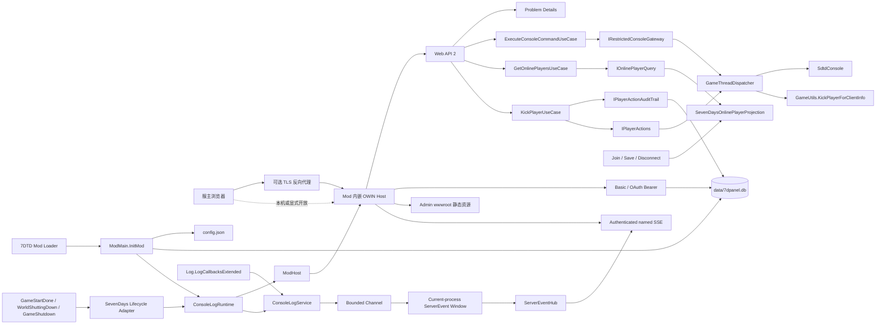

# 7DPanel 系统架构

## 背景与驱动因素

本文档只描述当前已经存在并有代码、配置或验证证据支持的系统架构。当前后端是可构建、可测试的 `net48` 最小运行切片，由 Bootstrap、Hosting、Application、Web Adapter、SevenDays Adapter 和 SQLite Persistence Adapter 六个产品项目组成，覆盖 Mod 初始化与关闭、组合运行时生命周期、独立游戏就绪边界、控制台日志采集与当前进程命名事件窗口、监听配置、Katana OWIN、健康 API、统一 Problem Details、配置引导 `Owner`、SQLite 持久用户与 Bearer Token、Basic/Bearer 认证、认证生产 SSE、Admin 静态资源托管，以及认证后通过游戏主线程执行白名单只读 `version` 命令、通过游戏事件维护在线玩家精简投影和以类型化原生 API 踢出在线玩家的 Application 纵向切片。踢出动作在 Application 持有专属 single-flight 和持久审计生命周期，在游戏主线程重新校验实体与平台身份，并通过 SQLite 保存 `Pending` 到可信终态。当前 Admin 是 Vue 3、Vite、Nuxt UI 和 Pinia 应用，提供 `/login`、受保护的 `/` 与 `/players`；它通过共享同源 Fetch 边界消费健康、password grant 和在线玩家 API，并只在 Pinia 内存中保存 Bearer 会话。前端 SSE 和控制台命令消费尚未实现。`Admin`/`Viewer` 用户管理、封禁、禁言、传送、审计查询页面、备份、公告、任意或改变状态的控制台命令、其他游戏状态/动作链路和后台作业仍未实现；产品不采用 Cookie、CSRF Token 或 refresh token。

产品目标和验收合同见[产品需求文档](PRD.md)，当前验证策略和证据见[测试策略](test.md)。尚未实现的批准后端链路和生产文件职责见[后端目标架构蓝图](architecture/backend-target-blueprint.md)；尚未实现的 Admin 应用边界和依赖方向见[Admin 前端目标架构蓝图](architecture/admin-frontend-target-blueprint.md)。两个 Target 蓝图都不是当前实现证据。

当前切片直接支持 `CAP-01` 的面板存活与状态诚实基础、`CAP-02` 的在线玩家快照、Owner 踢出与首个受限只读控制台命令，以及 `CAP-05` 的踢出审计写入基础，并落实 `NFR-01`、`NFR-02`、`NFR-04` 的自托管、未知结果不得显示为成功和管理凭证失败关闭约束。它不代表 `CAP-01` 的完整游戏状态、`CAP-02` 的其他玩家动作/日志页面、`CAP-05` 的审计查询或完整身份管理，以及其他 P0 能力已经完成。

目标运行环境是 7DTD Dedicated Server `v3.0.1-b4` 随附的 Unity Mono 进程。运行时与反编译行为证据来自根目录只读私有子模块 `7dtd-reference/`；该子模块不是产品源码或发布内容。

## 系统边界



- 后端 DLL 和 Admin 构建资源随同一个 Mod 目录部署，并在 7DTD 进程内提供 HTTP 服务。
- 7DTD 拥有 Mod 生命周期；当前 SevenDays Adapter 把 `GameStartDone` 转换为 `IModRuntime.MarkGameReady()`，并把两个关闭事件转换为 `IModRuntime.Stop()`。
- 默认配置提供唯一引导 `Owner` 的启动同步来源；Basic 与 password grant 实际验证 SQLite 中固定 `Subject=owner` 的当前用户，短期不透明 Bearer Token 跨进程持久化。静态资源和健康 API 保持匿名，浏览器不能直接访问 7DTD 对象、Mod 配置文件或数据库。
- 当前身份切片只有 `Owner` claims 和引导同步，不提供 `Admin`/`Viewer` 管理、Cookie、refresh token 或完整权限管理；健康 `ok` 不能推导游戏已经就绪或可管理。
- 首版目标仍是单服自托管，但当前切片只验证所在 Mod 进程的 HTTP 存活。

## 组件与职责

| 项目或应用 | 当前职责与实现证据 | 当前依赖 |
|---|---|---|
| `backend/src/Bootstrap/LSTY.SevenDPanel/` | 唯一 `IModApi` 入口、进程期 `Assembly.Location` 兼容补丁、配置文件 I/O、Microsoft DI 组合根与根 Provider 所有权、数据库路径、Admin 资源根目录选择和 Mod 发布入口 | Application、Hosting、Web Adapter、SevenDays Adapter、Persistence Adapter、`Microsoft.Extensions.DependencyInjection`、游戏提供的 `0_TFP_Harmony` 和编译期程序集 |
| `backend/src/Runtime/LSTY.SevenDPanel.Hosting/` | `ModHost` OWIN 生命周期状态机、独立 `GameReadinessState`、`IModRuntime`、`IPanelRuntimeStatus`、`IPanelWebHost`、监听选项、产品元数据、认证 Store 端口，以及 Web/SevenDays Adapter 之间受限的命名服务器事件契约 | .NET Framework BCL |
| `backend/src/Core/LSTY.SevenDPanel.Application/` | `ExecuteConsoleCommandUseCase` 对输入执行精确 `version` 白名单；`GetOnlinePlayersUseCase` 返回不可变玩家快照；`KickPlayerUseCase` 拥有前置校验、踢出专属 single-flight、审计意图先行、动作结果映射和 `Pending -> Succeeded/Failed/Unknown` 协调 | .NET Framework BCL；当前不依赖 Domain |
| `backend/src/Adapters/LSTY.SevenDPanel.Adapters.Web/` | 健康、token、生产事件、受限控制台命令、Owner-only 在线玩家查询与踢出路由；关联标识、Problem Details、认证限流、Basic/OAuth Bearer middleware、scoped SSE session、OWIN/Web API 请求作用域桥接、全局 JSON 配置、Katana Self Host、StaticFiles 和 SPA fallback | Application、Hosting、Web API/Katana、Microsoft DI Abstractions、游戏提供的 JSON 兼容程序集 |
| `backend/src/Adapters/LSTY.SevenDPanel.Adapters.SevenDays/` | 隔离静态生命周期、日志和玩家事件；提供有界日志/事件服务、组合运行时、事件驱动在线玩家投影、独立只读控制台 Gateway、`SevenDaysPlayerActions` 类型化踢出 Adapter，以及轻量 `GameThreadDispatcher` | Application、Hosting、`Assembly-CSharp.dll`、游戏 `LogLibrary.dll`/Unity 类型、`System.Threading.Channels` |
| `backend/src/Adapters/LSTY.SevenDPanel.Adapters.Persistence.Sqlite/` | `data/7dpanel.db` 短连接工厂、WAL、DbUp migration、PBKDF2 引导用户、不透明 Token Store，以及永久玩家动作审计和遗留 `Pending` 启动恢复 | Application、Hosting、Dapper、DbUp、Microsoft.Data.Sqlite、SQLitePCLRaw/e_sqlite3 |
| `frontend/apps/admin/` | 响应式应用壳、`/login`、受保护的 `/` 与 `/players`、显式 Pinia Router guard、内存 Bearer 会话、共享同源 HTTP 边界、健康与在线玩家 Feature、局部查询状态及 Owner 踢出确认流程 | Vue 3、Vue Router、Pinia、Nuxt UI、Vite |

当前已由控制台命令纵向切片创建 Application 项目，但尚无 Domain 项目；SQLite Persistence Adapter 是首个 Local Adapter。只有 `LSTY.SevenDPanel.dll` 实现 `IModApi`；`DependencyRulesTests` 校验后端项目引用白名单、Adapter 方向、六个产品 DLL 的发布门禁和唯一入口约束。未来项目、目录和抽象只在真实纵向切片需要时按[后端目标架构蓝图](architecture/backend-target-blueprint.md)创建。

### Mod 生命周期

1. `ModMain.InitMod` 先保存非空 `ModInstance`，使用游戏提供的 `0_TFP_Harmony` 只应用 `AssemblyLocationPatch`，并在读取配置或创建运行时前验证 Bootstrap 程序集的 `Assembly.Location` 非空。补丁只在原结果为空且 `Mod.ContainsAssembly` 确认程序集属于当前 Mod 时返回 `<ModDirectory>/<AssemblyName>.dll`；候选启动失败会撤销本 Harmony id 的补丁。
2. `ModMain.InitMod` 读取或创建监听配置，并从 `modInstance.Path` 派生 `<ModDirectory>/data` 与 `<ModDirectory>/wwwroot`。
3. Bootstrap 通过 `PanelServiceProviderFactory` 显式注册 SQLite connection factory、DbUp bootstrapper、同一实例的 credential/token Store、singleton `ConsoleLogService`、同一实例的 `IServerEventStream`、控制台 Gateway/用例、同一实例的 `SevenDaysOnlinePlayerProjection`/`IOnlinePlayerQuery`、`GetOnlinePlayersUseCase`、`ModHost`/`IPanelRuntimeStatus`、组合在线玩家投影与日志服务的 `IModRuntime` 和 scoped `ServerEventSseSession`，以 `ValidateOnBuild=true`、`ValidateScopes=true` 构建唯一根 Provider；随后才创建 `SevenDaysGameLifecycleAdapter`。完成注册与启动后才发布字段，异常路径 best-effort 清理候选运行时并保留原异常。
4. `RegisterAndStart` 依次通过 `ISevenDaysLifecycleEvents` 注册 `WorldShuttingDown`、`GameShutdown` 和 `GameStartDone`，全部成功后再调用 `runtime.Start()`。注册失败按逆序注销；`runtime.Start()` 抛出时还会 best-effort 调用 `runtime.Stop()`，清理失败不遮蔽原始启动异常。
5. `SevenDaysModEvents` 在 SevenDays Adapter 程序集内保存精确游戏 delegate，返回幂等订阅 token 负责注销，保持 `ModEvents.RegisterHandler` 对调用程序集的识别语义。
6. `ConsoleLogRuntime.Start` 先启动日志服务，再委托 `ModHost.Start`；其 Host factory 直接通过 `Microsoft.Data.Sqlite` 打开数据库，由 `SQLitePCLRaw.bundle_e_sqlite3` 的标准 Batteries 初始化 provider 并基于已恢复的程序集位置解析目标平台 native asset，再验证 WAL、执行 DbUp migration、同步引导 `Owner`，全部成功后才创建 OWIN Host。当前代码不包含自定义 native loader、ResourceManager shim、`SQLite3Provider_dynamic_cdecl.Setup` 或 `raw.SetProvider`。迁移或同步失败由 `ModHost` 记录并进入 `Faulted`，不启动监听也不把异常抛回 7DTD 初始化。`ConsoleLogService` 先启动唯一 consumer，再订阅 `Log.LogCallbacksExtended`。这些运行时资源由根 Provider 按显式注册创建，不使用程序集扫描、业务 service locator 或通用组件注册表。
7. `GameStartDone` 由 `ConsoleLogRuntime` 先转发给 `ModHost`，再把一次 `game-ready` 排入与已接受日志相同的有界顺序通道。任一关闭事件调用幂等 `ServiceProviderRuntime.Stop`：先拒绝新日志、注销静态 delegate、把 `server-stopping` 排在已接受日志之后、限时排空并完成 Hub，再停止 `ModHost` 和释放根 Provider；各阶段失败仍继续回收并聚合报告。并发或晚到的就绪事件不能覆盖 `Stopping`。

2026-07-18 的 Windows 7DTD `v3.0.1-b4` 人工 smoke 是旧启动时序的历史基线。2026-07-19 的同版本真实进程 smoke 验证 OWIN 在 `GameStartDone` 前启动。2026-07-20 在引入事件隔离与就绪状态后再次验证：OWIN 在启动后 `8.576` 秒启动，`StartGame done` 在 `119.732` 秒出现，日志没有 ModEvent 注册或回调错误；正常关服记录 OWIN stopped，进程退出且 18080 端口释放。测试层级和证据限制见[测试策略](test.md)。

### 7DTD 控制台日志采集边界

- `ConsoleLogService` 直接保存精确的 `Log.LogCallbackExtendedDelegate`，把 Unity `LogType` 的数值映射为 Adapter 自有的 `ConsoleLogType`，并由嵌套的幂等 token 注销同一个 delegate。没有额外的 callback/source 接口层；只有该生产订阅方法接触 Unity 类型，进程内模型和单元测试不会加载或复制 Unity 运行时程序集。
- 回调只构造尚未分配 sequence 的不可变 `ConsoleLogEntry` 并调用一次 `ConsoleLogService.TryPublish`。服务使用 `BoundedChannelFullMode.Wait`、`SingleReader = true`、`SingleWriter = false`、`AllowSynchronousContinuations = false`，生产路径只调用非等待的 `TryWrite`，不会逐条创建 `Task.Run` 或执行文件、数据库和网络 I/O。
- 当前默认 queue capacity 为 `1024`，live window capacity 为 `5000`，drain timeout 为 `5s`。一个 tracked consumer 按接受顺序写入固定容量窗口；成功写入窗口的 `console-log`、`game-ready` 和 `server-stopping` 共享从 1 开始的进程内 `long sequence`。窗口按 `afterSequence` 有界读取，只有 `afterSequence < OldestSequence - 1` 才报告 gap。
- 服务用最小的一次性 started/stopped/accepting 状态和内部计数管理 accepted、consumed、dropped-full、rejected-stopping、consumer-failure、当前深度和 high-water，不再为状态、配置或统计创建公开类型。停止时先禁止接收并注销游戏 delegate，再完成 writer 并限时排空；只有存在有效订阅时才在注销后通过现有 Mod 日志输出一次停止摘要，避免摘要递归进入自身。
- 当前窗口只覆盖本次 7DTD 进程，不写 SQLite，也不提供 WebSocket 或公共同步 .NET event。7DTD 每次启动生成的 `output_log_dedi__*.txt` 继续承担原始持久证据。
- `ServerEventHub` 位于窗口之后，通过 Hosting 的只读 `IServerEventStream`/`IServerEventSubscription` 契约向 Web Adapter 提供窗口 replay 和每客户端独立的 256 项有界 mailbox；默认最多 8 个订阅者。慢订阅者 mailbox 溢出只结束自身，不阻塞采集 consumer 或其他订阅者；服务停止会完成全部订阅。
- scoped `ServerEventSseSession` 只允许 Controller 完成一次持久身份复验和一次订阅预留，随后捕获 `product`、`version`、`hostState`、`gameReadiness` 和 `connectedAtUtc` Welcome 快照，再负责 Welcome、replay/live 去重、gap、15 秒 comment heartbeat、Token/用户状态周期复验、取消、输出关闭和幂等清理。Bearer Token 到期、撤销或用户禁用后，连接最迟在下一复验边界关闭；容量不足返回 503 Problem Details `stream_capacity_exhausted`。
- 2026-07-20 在实现收缩为 `ConsoleLogService` 和 `ConsoleLogRuntime` 后重新执行 Windows `v3.0.1-b4` smoke：`System.Threading.Channels` 从 Mod 目录加载，停止摘要为 `accepted=185`、`consumed=185`、`droppedFull=0`、`rejectedStopping=0`、`consumerFailures=0`、`highWater=3`，随后 OWIN 停止、进程退出且端口释放。真实负载没有达到容量上限；队满即时拒绝、计数、high-water 上限和排空超时由确定性单元测试覆盖。
- 旧的未认证开发 SSE 和配置开关已删除。2026-07-21 的 Windows `v3.0.1-b4` 真实进程 smoke 已验证 OAuth 程序集加载、Basic/Bearer、Welcome、日志、`game-ready`、`server-stopping`、正常关服和端口释放；临时配置与凭据在结束后删除，服主配置按 SHA-256 逐字节恢复。

### 在线玩家投影与 7DTD 主线程调度边界

- `POST /api/v1/console/commands` 要求 `Owner` 或 `Admin`，并在 `GameReadinessState.Ready` 前返回 503 Problem Details `game_not_ready`。Application 用例只接受大小写不敏感、去除首尾空白后的精确 `version`，类型化 Gateway 只暴露 `ExecuteVersionAsync`；其他字符串在接触游戏 Adapter 前返回 400 `console_command_not_supported`。
- 7DPanel 对所有经过 `SdtdConsole.ExecuteSync`、`SdtdConsole.ExecuteAsync`、内部 `executeCommand` 或 `SdtdConsole.Output` 的控制台命令统一采用游戏主线程串行边界，不按具体命令是否只读放宽。`SdtdConsole` 在实例级复用命令分词列表和当前命令输出列表，`ExecuteSync` 只在调用线程同步进入 `executeCommand`，不负责线程切换；7DTD 自有的 `ExecuteAsync` 则把多线程生产请求交给 `SdtdConsole.Update` 串行消费。7DPanel 因此不得从 OWIN 工作线程直接调用 `ExecuteSync`，Gateway 自身的 single-flight 也不能替代该边界，因为它无法排除 Telnet、游戏内置 Web、GUI 或其他 Mod 同时使用同一控制台实例。
- `SevenDaysRestrictedConsoleGateway` 用进程内 single-flight 门禁保证同一时刻最多一个版本命令进入 `GameThreadDispatcher`；并发请求立即返回 503 `console_command_busy`，不会增长 7DTD 主线程队列。它在游戏主线程内复制 `SdtdConsole.ExecuteSync` 的共享输出列表，再把不可变结果交回 Application。
- `GET /api/v1/players/online` 只允许 `Owner`，游戏未就绪时返回 503 `game_not_ready`。`SevenDaysOnlinePlayerProjection` 在 `PlayerJoinedGame` 记录实体、主身份和连接时间，在 `SavePlayerData` 同步复制批准字段并更新不可变 observation，在 `PlayerDisconnected` 仅移除实体与主身份仍匹配的 membership 和 observation。查询只复制当前投影并按 entity id 排序，不访问游戏活对象或投递主线程任务；单次 Save 复制失败保留旧 observation，由后续 Save 事件自然重试。
- 每个 observation 的 `ObservedAtUtc` 随 `PlayerSnapshot` 进入 Application 和 HTTP 玩家 DTO。查询不计算统一年龄、不产生列表级时间或 stale 标记，也不因旧 observation 或缺少首次 observation 拒绝结果；调用者可以按各自场景解释玩家数据年龄。查询不执行周期刷新、请求时回源或主线程协调。
- `POST /api/v1/players/{entityId}/kick` 只允许 `Owner`。`KickPlayerUseCase` 在写入 `Pending` 审计前获取踢出专属 single-flight；busy 请求不创建审计，审计意图失败不调用游戏动作。`SevenDaysPlayerActions` 只在 Dispatcher 委托内按 `entityId` 重新读取连接并比较 `combinedId + platform`，匹配后调用 `GameUtils.KickPlayerForClientInfo` 的 `ManualKick` 路径；它不拼接控制台命令，也不把 `ClientInfo` 暴露给 Application。
- 审计 migration `002_PlayerActionAudit.sql` 永久保存操作 id、固定 `kick` 类型、操作者、目标身份、trim 后原因、请求/完成时间、`Pending/Succeeded/Failed/Unknown` 和稳定失败码。终态更新只允许命中当前 `Pending` 一次；终态写入不可确认时保留 `Pending` 并返回未知结果，启动恢复使用 `process_interrupted` 标记遗留记录。
- `GameThreadDispatcher` 已在游戏主线程时直接执行，否则通过 `ThreadManager.AddSingleTaskMainThread` 投递。每个请求用原子 `Pending -> Running -> Completed` 状态竞争：排队取消或 5 秒启动截止时间到达会完成 Task 并保证委托不执行；一旦进入 `Running`，取消或截止时间不再伪造失败，而是等待同步游戏操作的真实结果或异常。
- 委托异常由 Dispatcher 写入 Task；`TaskCompletionSource` 使用 `RunContinuationsAsynchronously`，避免调用方 continuation 在游戏主线程内联运行。当前 Dispatcher 不拥有通用队列、容量、逐帧 pump 或独立 Start/Stop 生命周期；只读版本命令和踢出用例各自拥有局部 single-flight，在线玩家投影不使用 Dispatcher。未来新增其他玩家动作或生产者前仍必须按其真实负载和副作用重新确定背压、审计、幂等及关服语义。只有完全绕过 `SdtdConsole`，且不访问 Unity 对象、游戏主线程拥有的集合或其他未证明线程安全状态的类型化操作，才能依据其实际依赖单独决定是否需要主线程。
- 2026-07-21 Windows `v3.0.1-b4` 真实进程 smoke 在 `GameStartDone` 前取得 9 次 `game_not_ready`，就绪后命令返回 HTTP 200 和 5 行真实输出，首行为 `Game version: V 3.0.1 (b4) Compatibility Version: V 3.0.1`；随后 Telnet 正常关服且监听释放。前一轮启动因 EOS `NoConnection` 在游戏就绪前退出，保留为外部失败证据；后续重试通过且服主三字段配置的 71 字节与 SHA-256 均未改变。

### OWIN、Web API 与静态资源

- `OwinWebHost` 使用 `WebApp.Start(url, configure)` 创建宿主，并在 `Dispose` 中释放返回的 `IDisposable`。
- `OwinStartup` 要求 Bootstrap 显式传入根 `IServiceProvider`。当前顺序为请求关联标识、Problem Details 异常边界、认证限流、请求 scope、OAuth authorization server、Active Basic、Active Bearer、Web API、SPA fallback 和 StaticFiles；`/api`、`/api/*`、`/assets`、`/assets/*` 不参与 SPA fallback。
- OWIN middleware 为每个请求创建唯一 `IServiceScope`，其生命周期覆盖完整下游响应；bridging handler 把该 scope 的 non-owning Web API dependency scope 写入请求。正常路径只有 OWIN middleware 释放实际 scope；Web API resolver 的 fallback scope 只用于没有 OWIN scope 的非标准宿主路径。Controller 使用 `ActivatorUtilities` 构造，避免容器与 Web API 双重拥有 Controller。
- Admin 资源根目录由 Bootstrap 显式传入。目录缺失时记录日志并保留健康 API 可用；运行时不猜测仓库路径。
- `RequestCorrelationMiddleware` 只接受不超过 64 个允许字符的 `X-Request-ID`，并让响应 Header 与 Problem Details `traceId` 一致。非 OAuth 协议错误使用 `application/problem+json`；`instance` 只含 Path，未知 `/api/*` 也进入统一错误契约。
- Problem Details 外层通过 non-owning write-tracking stream 区分尚未开始和已经写出的响应；只有前者能被改写为统一 500，SSE 或其他已开始 body 发生异常时只记录 traceId 并结束响应，不追加错误 JSON。
- `POST /api/v1/auth/token` 只支持 password grant，返回数据库只保存 secret hash 的短期不透明 Bearer Token；Token 跨 7DTD 进程重启保留，最多保留 128 个未到期 Token。token endpoint 与携带 Basic Header 的事件建连按远端地址限制为每分钟 20 次、最多 1024 个地址 bucket。
- `GET /api/v1/events/stream` 要求 `Owner`、`Admin` 或 `Viewer` 的 Basic/Bearer 身份，拒绝 QueryString Token，并按 Welcome、replay、live 和 heartbeat 顺序输出命名事件。`Last-Event-ID` 只接受非负十进制整数。
- `POST /api/v1/console/commands` 接受 `{ "command": "version" }`，成功返回 `{ command, output }`；缺少命令、未支持命令、游戏未就绪、single-flight 忙和主线程启动超时均使用稳定 Problem Details，且未经认证的请求不会进入用例。
- `GET /api/v1/players/online` 返回 `{ players }`；每个玩家包含 entity id、名称、最后有效观察时间、原生/可选跨平台身份、ping、level 和 health，不返回 IP、位置、封禁、战斗统计或离线历史。无玩家是 200 空数组；可读投影始终返回 200，仅游戏未就绪返回 503 `game_not_ready`。
- `POST /api/v1/players/{entityId}/kick` 接受预期主平台身份、1 至 200 字符原因和精确 `confirmed: true`；操作者只来自认证主体。成功仅返回 operation id、`succeeded`、主线程目标快照和 UTC 时间；离线、身份变化、busy、超时及审计不可用使用稳定 Problem Details。请求取消继续作为宿主控制流传播，不被统一异常边界伪造成 500。
- Web API 移除 XML formatter，并统一用 `CamelCasePropertyNamesContractResolver` 输出 camelCase JSON。
- 健康响应精确为 `{ status: "ok", product: "7DPanel", version: "0.1.0" }`。`ProductInfo` 是名称和版本来源，测试会与 `ModInfo.xml` 对齐。
- 默认 `bindAddress` 为 `0.0.0.0`，转换为 `http://*:18080/`。认证默认启用 `username` / `password`，并允许在明文 HTTP 上传输 Basic 和 password grant；这是当前框架搭建阶段按 `NFR-04` 批准的暴露边界。

### Admin 健康、登录与在线玩家

```text
GET /
  -> OWIN StaticFiles -> wwwroot/index.html
  -> Vue Router /
  -> useServerHealth
  -> fetch /api/v1/health
  -> HealthController
```

- `fetchServerHealth` 始终使用相对同源 `/api/v1/health`，验证 `status`、非空 `product` 和非空 `version`，并区分取消、网络、HTTP 与无效响应错误。
- `useServerHealth` 只拥有页面局部状态。首次请求是 loading；成功后是 fresh；没有成功数据的失败是 offline；已有成功数据后失败或 60 秒未获得新样本是 stale。
- 新请求取消旧请求，组件卸载时取消当前请求并清理 stale timer。
- 开发期 Vite proxy 从 `.env.local` 的 `VITE_BACKEND_URL` 读取上游目标；生产代码和构建产物不包含该目标地址。
- `createAdminRouter` 显式接收与应用相同的 Pinia 实例；未认证访问带 `requiresAuth` 的 `/` 或 `/players` 时跳转 `/login`，已认证访问 `/login` 时跳转安全返回目标或 `/players`。安全返回目标只接受生成路由表中存在的站内路径。
- Auth Setup Store 只保存 Token 与到期时间，按到期时间清理会话并计算 `Authorization` Header；不安装持久化插件。密码只存在于登录表单局部 state 和请求调用栈，提交结束后清空。
- `shared/api/requestJson` 固定相对 `/api/v1/` 路径和 `credentials: 'omit'`，统一取消、超时、JSON 与 Problem Details 映射。Auth Feature 自己映射 password grant，Players Feature 自己验证玩家 DTO；玩家快照和轮询状态不进入 Pinia。
- `useOnlinePlayers` 首次进入立即请求，每 10 秒刷新；页面隐藏时暂停，恢复后立即刷新；请求使用 single-flight 与取消。任何通过严格 DTO 校验的成功响应进入 Fresh；Admin 以 90 秒作为自己的行级展示策略，只对旧 observation 标记“数据可能已过期”。401 或本地会话到期清除会话并回到登录页；403 映射 Forbidden、暂停自动轮询但保留手动刷新；有旧快照的刷新失败映射 Stale 并提示正在显示上次结果，无旧快照映射 Offline。
- 玩家桌面表格和移动列表只负责呈现并向 `OnlinePlayersView` 上抛完整玩家快照。`useKickPlayer` 在页面局部维护单次 HTTP 提交、`AbortController` 和稳定反馈；确认对话框固定目标，原因 trim 后限制为 1 至 200 字符，提交期间不可关闭。成功关闭并通知后刷新；离线、身份变化和 403 关闭旧目标；busy、未就绪、超时和审计意图不可用保留输入；网络或审计终态不可确认显示未知且不自动重试。
- 生成的客户端路由表当前包含 `/`、`/login` 和 `/players`。OWIN 会为其他无扩展名路径返回 `index.html`，但不存在的客户端路由仍不会成为有效页面。

## 数据与接口

### HTTP 接口

| 方法与路径 | 当前所有者 | 当前语义 |
|---|---|---|
| `GET /health` | `HealthController` | 兼容健康入口，返回面板 HTTP Host 存活信息 |
| `GET /api/v1/health` | `HealthController` | Admin 使用的版本化健康入口，返回同一精确契约 |
| `POST /api/v1/auth/token` | OAuth authorization server middleware | 只接受 password grant；协议错误保持 OAuth JSON，成功返回 SQLite 持久的不透明 Bearer Token |
| `GET /api/v1/events/stream` | `ServerEventsController` | Basic/Bearer 认证的 Welcome、replay 和多命名 live SSE；建流前错误使用 Problem Details |
| `GET /api/v1/players/online` | `PlayersController` | Owner-only 当前在线玩家事件投影；每个玩家返回自己的 `observedAtUtc`，空服务器返回 200 空数组 |
| `POST /api/v1/players/{entityId}/kick` | `PlayersController` | Owner-only 类型化踢出；主线程身份重验、持久审计和同步可信结果 |
| `GET /` | StaticFiles | 返回 Admin `index.html` |
| `GET/HEAD` 无扩展名、非 API 且非 `/assets` 路径 | SPA fallback + StaticFiles | 服务端返回 `index.html`；客户端是否存在该路由由 Vue Router 决定 |
| `/assets/*` | StaticFiles | 返回构建资源；缺失资源保持 404 |
| 未知 `/api/*` | Web API | 返回 404 Problem Details，不回退到 Admin 页面 |

### 本地配置与状态

- `PanelHostConfigurationLoader` 在 Mod 目录读取 `config.json`；文件不存在时写入默认配置。
- `PanelHostOptions` 验证并规范化监听地址和端口。`config.example.json` 与运行时默认值由测试保持一致。
- 当前过渡阶段的 `authentication` 默认启用，使用已知引导凭据 `username` / `password` 和 30 分钟 Token 生命周期；服主可以在 `config.json` 中替换凭据，用户名和密码仍必须非空，Token 生命周期限制为 5 到 1440 分钟。每次启动按稳定 `Subject=owner` 同步唯一 SQLite 用户；凭据不变时保留 Token，用户名或密码变化时同事务更新并撤销该 Owner 的 Token。无效认证配置失败关闭但不替换有效监听配置，受保护 API 不会退化为匿名访问。
- `allowInsecureHttp` 当前默认 true，与默认 `http` 监听共同允许明文 HTTP 上的 Basic 和 password grant；这是当前阶段按 `NFR-04` 接受的运行假设，启动日志只输出不含凭据的风险警告。用户管理能力能够安全维护至少一个 `Owner` 后，必须删除配置引导、已知默认凭据和明文远程认证例外。
- `config.json`、`.env.local` 和运行时 `data/` 都不是发布模板内容。发布脚本不会覆盖已有 `config.json` 或 `data/`。
- 当前持久状态只有 `data/7dpanel.db` 中的引导用户、DbUp migration journal、访问 Token 和永久玩家踢出审计；尚无审计查询模型、通用作业或备份记录。

### 当前依赖兼容矩阵

| 领域 | 当前版本/来源 | 验证状态 | 当前约束 |
|---|---|---|---|
| 目标框架 | `.NET Framework 4.8` / `net48` | Release 构建通过 | 仍受游戏 Mono 可用 API 限制 |
| C# 编译基线 | C# `11.0`，启用 Nullable Reference Types 和 Implicit Usings | Release Rebuild 以零警告通过 | 语言分析与全局 using 只影响编译期；生产运行时仍为游戏 Mono |
| 游戏运行时 | 7DTD `v3.0.1-b4` Mono BCL `4.6.57.0` | Windows 真实进程已验证 | 编译参考来自固定 `7dtd-reference` 版本；运行时使用未修改官方服务端 |
| Mod 内存程序集定位 | 游戏提供的 `0_TFP_Harmony/0Harmony.dll`，程序集 `2.13.0.0` | Release 构建、源码顺序规则、本地发布排除和 Windows `v3.0.1-b4` 真实进程通过；Linux 待验证 | Bootstrap 以 `Private=false` 编译引用且 7DPanel 不发布 Harmony；补丁只修正当前 Mod 内原值为空的 `Assembly.Location`，必须先于 SQLite/OWIN 组合 |
| Web API 2 | Core/Owin `5.3.0`，Client `6.0.0` | 健康、Problem Details 和认证命名 SSE 通过 Katana 自动化与 Windows 真实进程 | 实现健康、统一错误和生产事件流；Linux Mono 仍待验证 |
| Katana/OWIN | `Microsoft.Owin`、Hosting、HttpListener、StaticFiles `4.2.3` | 静态托管、路由、认证、流式响应和启停通过 Katana 自动化与 Windows 真实进程 | 认证位于受保护 Web API 前，静态 Admin 和健康端点保持匿名 |
| OWIN 认证 | `Microsoft.Owin.Security.OAuth 4.2.3` + 自有 Basic middleware | 持久凭据/Token bridge、限流、无宿主 data protector 回退和 SSE 周期复验通过自动化；password grant、Bearer Welcome 与跨进程 Token 已通过 Windows Mono smoke | 显式拒绝 authorization-code/refresh/self-contained ticket format；不支持 refresh token、JWT、QueryString Token、Cookie 或通配 CORS |
| 组合根依赖注入 | `Microsoft.Extensions.DependencyInjection 8.0.1`、Abstractions `8.0.2` | Provider 验证、scope/bridge/释放自动化和发布清单通过；当前版本已由 Windows Mono 加载并完成两轮启停 | implementation 只属于 Bootstrap，Web Adapter 只直接引用 Abstractions；根 Provider 后于 OWIN/运行时释放 |
| JSON | 游戏提供的 `Newtonsoft.Json 13.0.2` | 精确 camelCase 响应已在集成测试和真实进程验证 | 不随 Mod 发布另一份 `Newtonsoft.Json.dll` |
| SQLite 持久化 | Dapper `2.1.79`、DbUp Core `6.0.15`、DbUp SQLite `6.0.4`、Microsoft.Data.Sqlite `10.0.9`、SQLitePCLRaw bundle/native `2.1.12` | migration/store 集成测试、Release 构建、Windows/Linux x64 本地发布清单和 Windows `v3.0.1-b4` 标准 Batteries 真实进程通过；Linux Mono 待验证 | 短连接、WAL、5 秒 default timeout、逐 migration 事务；Bootstrap 发布五个 Framework64 宿主兼容程序集，Persistence Adapter 显式布置两个 RID native asset，并由标准 bundle 初始化，不保留 shim、绝对路径加载或显式 provider 绑定 |
| Async interfaces | Mod 发布 `Microsoft.Bcl.AsyncInterfaces 10.0.10`（程序集 `10.0.0.10`） | Release 构建、发布清单和 Windows x64 Mono 真实进程加载通过 | 不再依赖游戏目录中的 6.x 文件；发布脚本要求 Mod 目录存在固定新版 |
| Unsafe | Mod 发布 `System.Runtime.CompilerServices.Unsafe 6.1.2`（程序集 `6.0.3.0`） | Release 构建、发布清单和 Windows x64 Mono 真实进程加载通过 | 不再排除 runtime；发布脚本要求 Mod 目录存在固定新版 |
| 有界日志通道 | `System.Threading.Channels 8.0.0`、`System.Threading.Tasks.Extensions 4.6.3` | Release 构建、自动化和本地发布清单通过；Channels 既有 Windows Mono 证据仍有效，依赖升级需重跑 smoke | 发布 Channels、Tasks.Extensions 和 Unsafe；仍不复制 LogLibrary 或 Unity 程序集 |
| Admin | Vue `3.5.40`、Vue Router `5.2.0`、Pinia `3.0.4`、Nuxt UI `4.10.0`、TypeScript `6.0.3`、Vite `8.1.5`（Rolldown/Oxc）、Vitest `4.1.6`、Vue Test Utils、happy-dom、Playwright `1.61.1`、`@types/node` `24.x`、pnpm `11.13.1`；开发/CI 基线为 Node.js `24+`，package engines 保留 `^20.19.0 || ^22.13.0 || >=24.0.0` | lint、typecheck、182 项 Vitest、生产构建通过；Playwright 真实 Owner suite 已建立但本轮未执行；旧健康切片具备 Vite 8 真实 OWIN smoke 和 Chromium 人工证据 | Node.js 只用于开发、构建和测试，生产静态托管不需要 Node.js；前端生产代码不包含 Playwright/Vitest；本轮没有真实浏览器踢出、`390x844` 真实渲染或真实动作结果证据 |

未来通用后台工作队列、公开日志查询/流、完整角色/用户管理和其他候选依赖的批准状态只在[后端目标架构蓝图](architecture/backend-target-blueprint.md)中维护，不属于当前依赖矩阵。

## 部署与运维

- 当前发布物包含六个产品 DLL、Dapper/DbUp/Microsoft.Data.Sqlite、固定新版 Bcl/Unsafe、`SQLitePCLRaw.batteries_v2.dll` 及其 Linux `dllmap` 配置、core/dynamic provider、Mod 根目录中的 `Microsoft.CSharp.dll`、`System.Reflection.Emit.dll`、`System.Dynamic.dll`、`System.ComponentModel.DataAnnotations.dll`、`System.Runtime.InteropServices.RuntimeInformation.dll` 五个 Framework64 宿主兼容程序集、Windows/Linux x64 RID native、`config.example.json` 和 `wwwroot/`。Mod 根目录不包含 native `e_sqlite3.dll`、`0Harmony.dll`、System.Data.SQLite/SQLite.Interop、`7dtd-reference/`、游戏提供的 JSON/Unity/LogLibrary 程序集、服主 `config.json` 或运行数据；运行环境使用单独的游戏 `0_TFP_Harmony` Mod。
- `Publish-Mod.ps1` 要求 Admin `dist/index.html` 和资产存在，执行 `dotnet publish` 后递归移除并拒绝游戏提供的 Harmony/JSON/Unity/LogLibrary 同名程序集和旧 System.Data.SQLite/SQLite.Interop 资产，移除 Mod 根目录的 native SQLite，要求标准 Batteries、五个 Framework64 兼容程序集、Windows/Linux x64 RID native、持久化、DI、OAuth、Channels 和 Bcl/Unsafe 依赖存在，只替换目标中的 `wwwroot/`，并再次校验发布资产。
- 发布脚本是增量的，不清空整个 Mod 目录；已有 `config.json` 和 `data/` 保持不变。
- 2026-07-21 较早的 Windows 7DTD `v3.0.1-b4` smoke 使用现已删除的自定义 loader 和 SQLitePCLRaw `2.1.11`，只保留为历史兼容证据。
- 同日当前标准 Batteries/SQLitePCLRaw `2.1.12` 二进制完成 Windows `v3.0.1-b4` 真实进程 smoke：游戏从独立 `0_TFP_Harmony` 加载 `0Harmony`，`Assembly.Location` 补丁在 `3.071s` 成功并先于 `3.388s` database upgrade，OWIN 在 `7.775s` 启动，`StartGame done` 在 `65.392s` 出现。健康端点返回精确三字段 200；Basic/Bearer SSE 均以 Welcome 开始，Bearer replay 包含 `console-log` 和 `game-ready`，关服连接收到 `server-stopping`。正常停止摘要为 `accepted=188`、`consumed=188`、无丢弃或 consumer failure，OWIN 停止、进程退出且端点不可达；兼容性错误扫描为 0。Linux 真实进程仍待验证。
- 开发期发布、启停和健康检查入口见[后端脚本指南](../backend/scripts/README.md)。辅助脚本不属于产品运行时。
- 当前生产关服流程调用幂等 `ServiceProviderRuntime.Stop`，先由 `ConsoleLogRuntime` 注销并排空 `ConsoleLogService`、调用 `ModHost.Stop` 释放 OWIN，再释放根 Provider；SQLite connection factory 随 Provider 释放并清空连接池。`GameThreadDispatcher` 没有独立生命周期；OWIN 请求取消可阻止尚未开始的版本命令，已经开始的同步命令会返回真实结果。通用游戏动作排空和可观察 HTTP draining 仍未实现。

## 质量属性

### 可靠性

- `ModHost` 的启停/就绪状态、重复启停、停止后禁止重启和游戏就绪终态已有单元测试；`ConsoleLogRuntime` 另验证日志服务先启动、先停止并转发就绪状态。
- OWIN 集成测试使用真实 Katana Host 验证端口释放、API/静态资源优先级、SPA fallback、缺失资源、缺失资产目录、关联标识、统一 404、Basic/Bearer challenge、OAuth password grant 与协议错误、限流 429、拒绝 QueryString Token，以及生产 SSE 的 Welcome、命名 replay、gap、无效游标、建流前 503 和断开释放。
- `SevenDaysGameLifecycleAdapterTests` 通过可替换事件边界执行三个回调，并覆盖订阅顺序、逆序回滚、异常保留与订阅所有权；真实静态 `ModEvents` wrapper 仍由官方进程 smoke 提供兼容证据。
- 控制台日志测试覆盖六字段 entry、sequence/淘汰/gap、回调线程与 consumer 隔离、队满拒绝、保序消费、单项失败、订阅失败、停止排空和注销后摘要；生产 `Log.LogCallbacksExtended` delegate 与 Channels 加载由官方进程 smoke 验证。
- 主线程 Dispatcher 的确定性测试覆盖排队取消/启动超时保证不执行，以及执行开始后取消/超时不能替换真实结果；Application 测试覆盖命令白名单、玩家不可变快照、逐玩家观察时间和查询转发，SevenDays 投影测试覆盖 Join/Save/Disconnect、身份条件删除、排序、可空跨平台身份、停止拒写与清空、旧 observation 原样返回及失败复制保留旧 observation，Katana 测试覆盖命令与玩家 API 的认证、就绪、逐玩家 `observedAtUtc` 和稳定 Problem Details。
- `DependencyRulesTests` 用源码规则保护当前项目依赖、Adapter 方向、唯一 `IModApi` 和 Bootstrap candidate 发布顺序。
- SQLite 集成测试覆盖 migration 幂等、WAL、引导 Owner 同步、凭据轮换撤销、Token 跨 Store/connection factory 重建、到期、严格 128 容量和明文不落盘；SSE 可控时钟测试覆盖失效后停止写出。
- 健康客户端保留最后成功样本并明确标记 stale/offline，不把失败或过期结果显示为 fresh。

### 安全性

- 健康 API 和 Admin 静态页面保持匿名；生产事件流要求 Basic 或 Bearer。默认监听全部网络接口并提供已知引导凭据，当前阶段接受任何可访问 18080 端口的客户端作为持久 `Owner` 认证；服主仍可自行收窄监听、网络来源或替换凭据。
- 非 OAuth API 错误不返回配置文件路径、QueryString、凭据或内部异常堆栈；OAuth 协议错误保留标准 `error`/`error_description` body。
- `.env.local`、`config.json` 和运行数据不进入版本库发布模板或前端生产包。

### 兼容性

- 产品代码以固定版本游戏程序集为编译输入，游戏提供的 `Assembly-CSharp.dll`、`LogLibrary.dll`、`UnityEngine.CoreModule.dll` 和 `Newtonsoft.Json.dll` 不 Copy Local；Bcl AsyncInterfaces 与 Unsafe 改由 Mod 固定并发布新版。
- 发布和真实进程测试用于确认编译期参考与官方运行时兼容；反编译源码只提供行为证据。
- Admin 核心图标随静态产物打包，不依赖运行时外部 CDN。

## 决策与权衡

- **Current-only architecture:** 本文件只维护已实现事实；未来边界和候选依赖由 Target 蓝图拥有，避免把批准设计误报为代码。
- **Embedded backend:** 后端与 Mod 同进程，部署简单，但宿主异常会影响游戏服务器。
- **Start HTTP Host in `InitMod`:** 注册关闭事件后立即启动不依赖游戏活对象的 OWIN，使面板在游戏加载期间可访问；代价是必须把 HTTP 存活与未来游戏就绪状态分开。
- **Same-origin Admin hosting:** OWIN 同时提供 Admin 静态资源和 `/api/v1`，生产前端不需要编译后端地址；middleware 顺序必须持续保护 API 所有权。
- **Runtime Newtonsoft.Json:** 使用游戏的 `13.0.2` 避免同名程序集冲突，并在 Web API 管线统一配置 camelCase。
- **Consolidated bounded console log service:** 游戏同步日志回调只创建一个 entry 并执行一次 `TryWrite`；一个服务集中拥有订阅、Channel、consumer、窗口接线、停止和内部计数，避免为单一实现增加 source/sink/options/state/statistics 层。有界容量和单 consumer 防止下游延迟、无限内存与逐日志任务膨胀，代价是过载时普通日志允许有证据地丢弃。
- **Constrained named server events:** 只允许当前有真实生产者和消费者的 `console-log`、`game-ready` 与 `server-stopping` 进入同一 sequence/window/Hub；`welcome` 和 `gap` 是连接级控制事件。该边界不反射扫描 `ModEvents`，也不升级为领域 Event Bus。
- **Configuration-seeded persistent owner:** `config.json` 在过渡阶段只为固定 `Subject=owner` 提供引导数据；Basic/password grant 和不透明 Header Bearer 均以 SQLite 当前状态为准。该方案保持现有服主入口并支持跨重启 Token，代价是用户管理落地前配置仍是 Owner 凭据变更来源；产品不采用 Cookie、CSRF Token 或 refresh token。
- **Pinned reference submodule:** 使用固定的只读参考提交避免复制反编译材料；协作者需要相应私有仓库访问权限。

### 未解决风险

- `GameStartDone` readiness 已进入每连接 Welcome 和一次 `game-ready` 事件，但尚无可重复查询的认证服务器状态端点；就绪前 `503` 和写请求 draining 拒绝仍是目标设计。
- Owner 踢出链路已有 Application、SQLite、SevenDays、Katana 和 Admin 自动化，但尚未在 Windows `v3.0.1-b4` 真实进程验证拒绝原因、约 0.5 秒延迟断开、在线列表变化与 SQLite 审计一致性。关服竞态、帧预算、指标和 Linux 主线程证据仍缺失，不能从自动化或只读 `version` 证据推导真实状态变更验收已经完成。
- 控制台日志已有认证 SSE，但没有 REST 查询、跨重启游标或持久化；Windows 正常负载没有触发容量饱和，真实容量饱和与 Linux Mono 基线仍缺失。
- 默认全接口明文监听并启用已知引导凭据；任何能够访问 18080 端口的客户端都可以作为持久 `Owner` 认证，这是当前过渡阶段明确接受、但在用户管理进入发布范围后必须移除的暴露风险。
- 当前标准 Batteries 的 Microsoft.Data.Sqlite/`e_sqlite3` 和进程期 `Assembly.Location` 补丁已通过本地 net48 构建、测试、双平台发布清单和 Windows 官方 7DTD 进程 smoke；Linux 官方进程 smoke 仍缺失。
- Linux x64 已有本地发布布局证据，但没有本项目官方进程运行证据。
- 编译使用的 publicized `Assembly-CSharp.dll` 与官方运行时材料职责不同；升级游戏版本时必须重新验证构建和真实进程行为。
